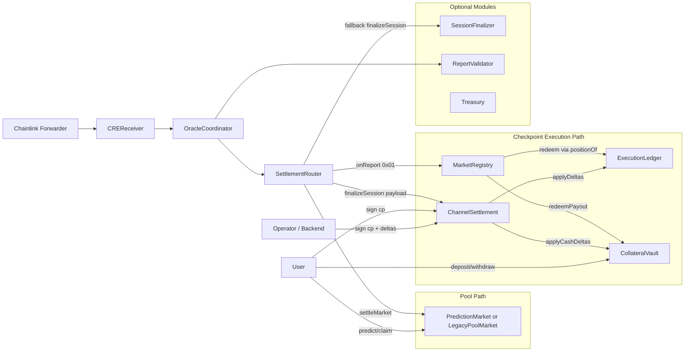
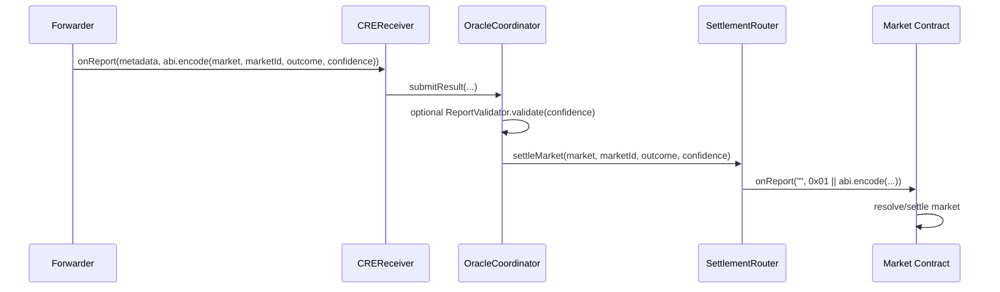
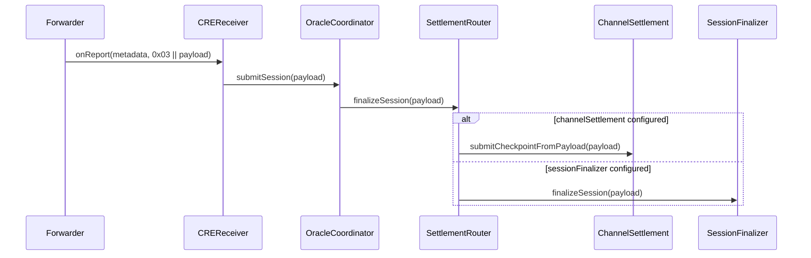
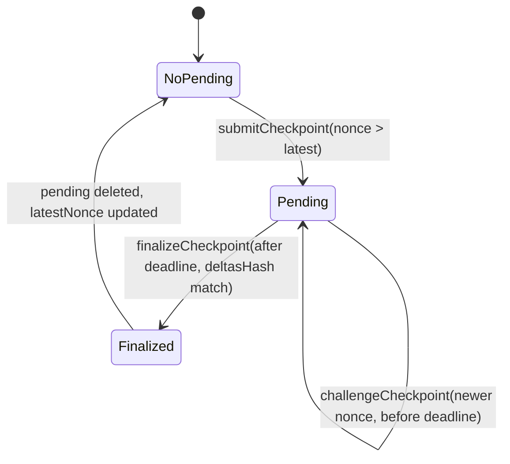

// SPDX-License-Identifier: MIT
pragma solidity 0.8.24;

/**
# RetroPick / ShadowPool: Current Smart Contract System Documentation

Generated from code in `packages/contracts`.
Reference style follows `.docs/architecture.md`, but this document reflects the **current implementation** in source and tests.

## 1) Scope and Snapshot

This package currently contains two parallel runtime paths:

1. Pool path (legacy/demo):
- `PredictionMarket` or `LegacyPoolMarket` stores pools, receives bets, settles, and pays winners directly.

2. Checkpoint execution path (ShadowPool-aligned):
- `MarketRegistry` + `ExecutionLedger` + `CollateralVault` + `ChannelSettlement`
- Offchain signed checkpoints apply deltas onchain, then resolved markets redeem from ledger balances.

Oracle ingress is shared through:
- `CREReceiver` -> `OracleCoordinator` -> `SettlementRouter`

---

## 2) Contract Inventory and Roles

| Contract | Domain | Primary Role |
|---|---|---|
| `PredictionMarket` | Core | Pool-based market lifecycle, CRE receiver-compatible settlement, direct claim payouts |
| `LegacyPoolMarket` | Core | Same model as `PredictionMarket`, optional demo variant |
| `MarketRegistry` | Core | Typed market registry + resolution + redeem from execution ledger |
| `MarketFactory` | Core/Ingress | CRE receiver for market creation inputs (v1/v2), metadata + signature checks |
| `SettlementRouter` | Core/Router | Dispatch oracle outcomes to markets; dispatch session payloads to `ChannelSettlement` or `SessionFinalizer` |
| `SessionFinalizer` | Core/Yellow legacy | Signature-verified session payout in ERC20 |
| `Treasury` | Core module | Optional escrow module for approved markets |
| `CREReceiver` | Oracle | Forwarder-validated oracle entrypoint |
| `OracleCoordinator` | Oracle | Receiver-gated coordinator for result/session forwarding |
| `ReportValidator` | Oracle | Optional confidence threshold gate |
| `ChannelSettlement` | Execution | Checkpoint submit/challenge/finalize, applies position/cash deltas |
| `ExecutionLedger` | Execution | Canonical per-user per-outcome position storage |
| `CollateralVault` | Execution | Single custody balances, lock/unlock, apply cash deltas, redeem payouts |
| `ReceiverTemplate` | Interface/base | Shared CRE forwarder and workflow identity enforcement |

---

## 3) System Architecture



---

## 4) Oracle and CRE Report Routing

### 4.1 Outcome settlement flow



### 4.2 Session/checkpoint routing flow



---

## 5) Checkpoint Settlement Lifecycle

`ChannelSettlement` uses EIP-712 (`ShadowPool`, version `1`) over `Checkpoint`.

### State machine



### Enforcement implemented

- Nonce monotonicity per `(marketId, sessionId)` key.
- Challenge window: `30 minutes`.
- `deltasHash` must match checkpoint.
- Operator signature must recover to `operator`.
- User signatures must recover for provided `users[]` list.

### Finalization effects

1. `ExecutionLedger.applyDeltas` updates signed position deltas.
2. Non-zero cash deltas are compacted and sent to `CollateralVault.applyCashDeltas`.
3. `latestNonceByKey` updated; pending checkpoint deleted.

---

## 6) Market Models

### `PredictionMarket` and `LegacyPoolMarket`

- Supports market types: `Binary`, `Categorical`, `Timeline`.
- Users can place a **single** prediction per market.
- Pool payout formula:

`payout = userStake * totalPool / winningPool`

- Settlement source:
  - Direct CRE `onReport` path (`0x01` prefix), or
  - Routed via `SettlementRouter`.

### `MarketRegistry` (execution-ledger model)

- Tracks market metadata and winning outcome.
- No pool accounting.
- `redeem(marketId)` pulls winner shares from `ExecutionLedger.positionOf` and pays equal token amount via `CollateralVault.redeemPayout`.

Implication: in this path, economic accounting is represented in offchain pricing + checkpoint deltas, not onchain pool math.

---

## 7) Storage and Data Model

### Shared typed primitives

- `ShadowTypes.Checkpoint`:
  - `marketId`, `sessionId`, `nonce`, `validAfter`, `validBefore`, `stateHash`, `deltasHash`, `riskHash`
- `ShadowTypes.Delta`:
  - `user`, `outcomeIndex`, `sharesDelta`, `cashDelta`

### Key storage maps

- `ExecutionLedger`:
  - `_positions[keccak256(user, marketId, outcomeIndex)] => int256`
- `CollateralVault`:
  - `_freeBalance[user]`
  - `_lockedBalance[keccak256(user, marketId, sessionId)]`
- `ChannelSettlement`:
  - `latestNonceByKey[keccak256(marketId, sessionId)]`
  - `pendingByKey[...] => Pending`
- `MarketFactory`:
  - `usedExternalIds[bytes32]`
  - `marketMetadata[marketId]`

---

## 8) Trust Boundaries and Access Control

### Strongly controlled

- `OracleCoordinator.submitResult/submitSession`: only `creReceiver`.
- `SettlementRouter.settleMarket/finalizeSession`: only `oracleCoordinator`.
- `CollateralVault.lock/unlock/applyCashDeltas`: only `channelSettlement`.
- `ExecutionLedger.applyDeltas`: only `channelSettlement`.
- `MarketRegistry.onReport`: only `settlementRouter`.

### Owner-administered

- Router wiring, coordinator wiring, factory bounds, market-factory address configuration, channel operator.

### Signature-based control

- `ChannelSettlement` EIP-712 checkpoint signatures.
- `SessionFinalizer` backend signature + per-user signatures.
- `MarketFactory` optional requestedBy signature (if signature bytes provided).

---

## 9) Critical Implementation Findings (Current Code)

1. `MarketRegistry.resolve(...)` has no access restriction.
- Any address can directly resolve any unsettled market.

2. `Treasury.setMarketApproved(...)` has no access restriction.
- Any address can approve/disapprove markets.

3. `ReportValidator.setMinConfidence(...)` has no access restriction.
- Any address can change min confidence threshold.

4. `ChannelSettlement` user-signature coverage is list-based, not delta-user-enforced.
- It verifies signatures for `users[]`, but does not enforce that all `deltas[i].user` are included in `users[]`.
- A checkpoint can include delta entries for addresses absent from signed-user list.

5. Pool-market token is hardcoded.
- `PredictionMarket` and `LegacyPoolMarket` use constant token address `0x3600...0000`.
- Tests rely on `vm.etch` at that address.

6. `SettlementRouter.finalizeSession` emits placeholder event.
- Emits `MarketSettled(address(0),0,0,0)` for session finalization path, reducing event observability.

---

## 10) Test Coverage Map

- `OracleFlow.t.sol`
  - Validates CREReceiver -> Coordinator -> Router -> PredictionMarket settlement.

- `YellowSessionFlow.t.sol`
  - Validates session payload route (`0x03`) and signature-checked payouts in `SessionFinalizer`.

- `CheckpointFlow.t.sol`
  - Validates checkpoint hash checks, nonce monotonicity, operator/user sig checks, challenge/finalize windows, and vault/ledger effects.

- `MarketTypes.t.sol`
  - Validates typed market creation through `MarketFactory` v2 and typed prediction pool updates.

---

## 11) Deployment Wiring (Required)

```mermaid
flowchart TD
  A[Deploy ExecutionLedger] --> B[Deploy CollateralVault]
  B --> C[Deploy ChannelSettlement(vault, ledger, operator)]
  C --> D[Set ledger.channelSettlement = C]
  C --> E[Set vault.channelSettlement = C]
  A --> F[Deploy MarketRegistry(vault, ledger)]
  F --> G[Set vault.marketRegistry = F]

  H[Deploy SettlementRouter] --> I[Deploy OracleCoordinator]
  I --> J[Deploy CREReceiver(forwarder, coordinator)]
  H --> K[Set router.oracleCoordinator = I]
  I --> L[Set coordinator.creReceiver = J]
  I --> M[Set coordinator.settlementRouter = H]
  H --> N[Set router.channelSettlement = C]
  F --> O[Set marketRegistry.settlementRouter = H]
```

Operational note:
- If using `MarketFactory`, set `marketFactory` in target market contract (`PredictionMarket` or `MarketRegistry`) and configure `ReceiverTemplate` constraints for expected forwarder/workflow metadata.

---

## 12) ReceiverTemplate Security Model

`ReceiverTemplate.onReport` supports layered checks:

1. Forwarder sender gate (`sForwarderAddress`).
2. Optional workflow ID gate.
3. Optional author gate.
4. Optional workflow name gate, only valid if author gate enabled.

If forwarder is set to zero, ingress is intentionally insecure (`SecurityWarning` emitted).

---

## 13) Suggested Hardening Priorities

1. Add access control to `MarketRegistry.resolve`.
2. Add `onlyOwner` to `Treasury.setMarketApproved` and `ReportValidator.setMinConfidence`.
3. In `ChannelSettlement`, enforce delta-user/signature consistency:
- each unique `deltas[i].user` must be present in `users[]` and signed.
4. Replace hardcoded pool token with constructor-injected immutable token.
5. Emit dedicated session/checkpoint events in `SettlementRouter.finalizeSession`.

---

## 14) Summary

Current implementation is a hybrid system:
- A straightforward pool-market path (`PredictionMarket`/`LegacyPoolMarket`) and
- A checkpoint-driven execution path (`MarketRegistry` + `ChannelSettlement` + `ExecutionLedger` + `CollateralVault`).

The routing and modularity are strong, test coverage validates major flows, and signature-based settlement is present. The highest priority work is tightening several permission controls and strengthening signature coverage semantics in checkpoint submission.
*/
contract CurrentSmartContractDoc {}
