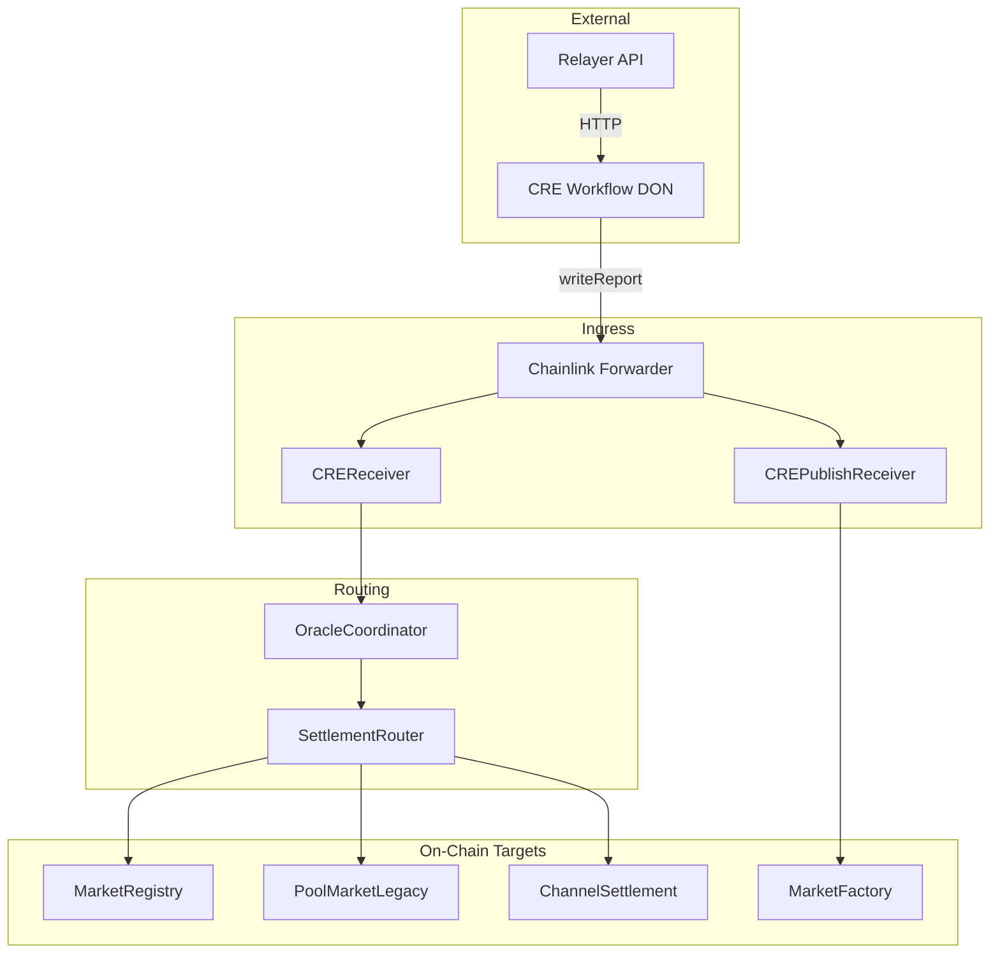
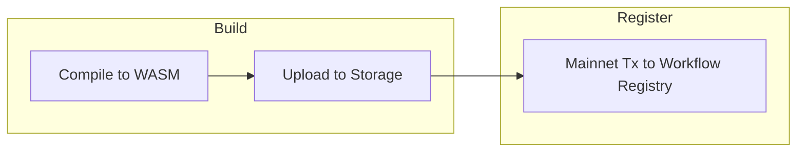
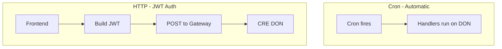

# CRE Deployment and Interaction Guide

Full guide for deploying the RetroPick CRE workflow to the Chainlink DON (Decentralized Oracle Network), verifying deployment, and interacting with it via cron and HTTP triggers.

---

## Table of Contents

1. [Overview](#1-overview)
2. [Prerequisites](#2-prerequisites)
3. [Pre-Deploy Checklist](#3-pre-deploy-checklist)
4. [Deployment Steps](#4-deployment-steps)
5. [Verifying Deployment](#5-verifying-deployment)
6. [Interacting with Deployed CRE](#6-interacting-with-deployed-cre)
7. [Configuration Reference](#7-configuration-reference)
8. [Updating a Deployed Workflow](#8-updating-a-deployed-workflow)
9. [Troubleshooting](#9-troubleshooting)
10. [Related Docs](#10-related-docs)

---

## 1. Overview

### What CRE Is

**Chainlink CRE (Request-and-Execute)** runs workflows on a **DON (Decentralized Oracle Network)**. Each node executes the workflow independently; results are cryptographically verified and aggregated via Byzantine Fault Tolerant consensus. Reports are delivered on-chain through the Chainlink Forwarder to CREReceiver and CREPublishReceiver.

### Deploy vs Simulate

| Mode | Command | Use Case |
|------|---------|----------|
| **Simulate** | `cre workflow simulate ./apps/workflow -T demo-settings ...` | Local testing; no DON; simple HTTP POST for triggers |
| **Deploy** | `cre workflow deploy ./apps/workflow --target production-settings` | Register onchain, upload WASM, run on DON; HTTP requires JWT auth |

### Architecture



---

## 2. Prerequisites

| Requirement | Source | Notes |
|-------------|--------|-------|
| **CRE CLI** | [Chainlink CLI](https://docs.chain.link/cre/reference/cli) | Run `cre --version` |
| **CRE account** | `cre login` or `CRE_API_KEY` | Run `cre whoami` to verify |
| **Early Access** | `cre account access` | Required for deploy; request if needed |
| **Funded wallet (Mainnet ETH)** | For Workflow Registry tx | Gas for `UpsertWorkflow` on Ethereum Mainnet |
| **Linked key** | `cre account link-key` | EOA or multi-sig |
| **Bun 1.2.21+** | [README.md](README.md) | Runtime for workflow |
| **project.yaml with ethereum-mainnet** | [project.yaml](../../project.yaml) | **Required for deploy** — registry tx uses Mainnet |

### Critical: project.yaml for Deployment

Deployment submits a transaction to the **Workflow Registry on Ethereum Mainnet**. The current `project.yaml` may only have `ethereum-testnet-sepolia`. Add `ethereum-mainnet` under your deploy target:

```yaml
production-settings:
  rpcs:
    - chain-name: ethereum-mainnet
      url: https://eth.llamarpc.com   # or Infura/Alchemy
    - chain-name: ethereum-testnet-sepolia
      url: https://ethereum-sepolia-rpc.publicnode.com
```

---

## 3. Pre-Deploy Checklist

- [ ] **workflow.yaml** has `workflow-name` for target (e.g. `my-workflow-production` in [workflow.yaml](workflow.yaml))
- [ ] **config.production.json** (or staging) has valid:
  - `relayerUrl`, `creReceiverAddress`, `evms`, `marketFactoryAddress`
  - See [docs/Configuration.md](docs/Configuration.md)
- [ ] **.env** has `CRE_ETH_PRIVATE_KEY`, `RPC_URL`; optional: `DEEPSEEK_API_KEY`, `GEMINI_API_KEY` for AI resolution
- [ ] **Contracts** deployed and wired per [CREDeploymentWiring.md](../../packages/contracts/docs/abi/docs/cre/CREDeploymentWiring.md)
- [ ] **Relayer** running with `CHANNEL_SETTLEMENT_ADDRESS`, `OPERATOR_PRIVATE_KEY`, `RPC_URL`

---

## 4. Deployment Steps

### Step 1: Compile Workflow

From monorepo root:

```bash
cd sc-cre-workflow-chainlink
cd apps/workflow && bun install   # runs cre-setup, produces tmp.wasm
```

### Step 2: Add ethereum-mainnet to project.yaml

Ensure `production-settings` (or your deploy target) includes `ethereum-mainnet` in `rpcs` (see Section 2).

### Step 3: Deploy

From monorepo root:

```bash
cre workflow deploy ./apps/workflow --target production-settings --env apps/workflow/.env
```

**Flags:**

| Flag | Description |
|------|-------------|
| `--yes` | Skip confirmation prompts |
| `--unsigned` | Multi-sig: output raw tx instead of broadcasting |
| `--verbose` | Enable DEBUG logs |

### Step 4: Capture Output

The CLI prints deployment details. **Save the Workflow ID** (64-character hex) — required for HTTP trigger:

```
Details:
   Workflow ID:    a1b2c3d4e5f67890a1b2c3d4e5f67890a1b2c3d4e5f67890a1b2c3d4e5f67890
   Binary URL:     https://storage.cre.../binary.wasm
   Config URL:     https://storage.cre.../config
   Transaction hash: 0x...
```

### Deployment Flow Diagram



---

## 5. Verifying Deployment

- **CRE UI:** [cre.chain.link/workflows](https://cre.chain.link/workflows) — workflow status, execution history, Workflow ID
- **Block explorer:** Workflow Registry at `0x4Ac54353FA4Fa961AfcC5ec4B118596d3305E7e5` on [Ethereum Mainnet](https://etherscan.io/address/0x4ac54353fa4fa961afcc5ec4b118596d3305e7e5)
- **Activate/Pause:** CRE UI or CLI; workflows can be paused

---

## 6. Interacting with Deployed CRE

### 6.1 Cron Triggers (Automatic)

Cron handlers run on the DON schedule. No frontend action required.

| Handler | Config | Purpose |
|---------|--------|---------|
| onCheckpointSubmit | `cronSchedule` | Poll relayer, build payload, writeReport |
| onCheckpointFinalize | `cronScheduleFinalize` | POST /cre/finalize/:sessionId |
| onCheckpointCancel | `cronScheduleCancel` | POST /cre/cancel/:sessionId |
| onDiscoveryCron | `cronSchedule` | Fetch feeds, analyze, create/draft |
| onScheduleResolver | `cronSchedule` | Poll marketIds, resolve markets |
| onDraftProposer | `cronSchedule` | Polymarket → MarketDraftBoard.proposeDraft |

### 6.2 HTTP Trigger (Create Market, Publish-from-Draft)

**Important:** Deployed workflows use **JWT authentication**. Simulation uses simple POST; production does not.

**Gateway URL:** `https://01.gateway.zone-a.cre.chain.link`

**Request format (JSON-RPC 2.0):**

```json
{
  "jsonrpc": "2.0",
  "id": "req-123",
  "method": "workflows.execute",
  "params": {
    "input": {
      "question": "Will BTC hit 100k?",
      "resolveTime": 1735689600,
      "requestedBy": "0x..."
    },
    "workflow": {
      "workflowID": "<64-char-hex-from-deploy-output>"
    }
  }
}
```

**Headers:** `Content-Type: application/json`, `Authorization: Bearer <JWT>`

**JWT requirements:** Signed by the private key of an **authorized** EVM address. The workflow's HTTP trigger must have `authorizedKeys` configured. See [Chainlink: Triggering Deployed Workflows](https://docs.chain.link/cre/guides/workflow/using-triggers/http-trigger/triggering-deployed-workflows).

**authorizedKeys:** The workflow uses `httpCapability.trigger({})` with empty config. For production HTTP auth, add `authorizedKeys` with creator/frontend EVM addresses. Verify Chainlink CRE SDK docs for `HTTPCapability.trigger({ authorizedKeys: ["0x..."] })`.

**Payload mapping:** `params.input` = the payload documented in [integration/frontend/03-workflow-http.md](integration/frontend/03-workflow-http.md):

- **Create market:** `{ question, resolveTime?, category?, requestedBy? }`
- **Publish-from-draft:** `{ draftId, creator, params, claimerSig }`

### 6.3 Frontend Integration for HTTP Trigger

The frontend cannot send a raw POST with JSON body. It must:

1. Build JSON-RPC body with `params.input` = create/publish payload
2. Compute SHA256 digest of body (keys sorted lexicographically)
3. Create JWT (header.payload.signature) with `digest`, `iss` (EVM address), `iat`, `exp`, `jti`
4. POST to gateway with `Authorization: Bearer <jwt>`

**Alternative:** Use [cre-http-trigger](https://docs.chain.link/cre/guides/workflow/using-triggers/http-trigger/local-testing-tool) local proxy for testing (auto JWT).

### Interaction Flow Diagram



---

## 7. Configuration Reference

| File | Purpose |
|------|---------|
| [workflow.yaml](workflow.yaml) | workflow-name, workflow-path, config-path per target |
| [config.production.json](config.production.json) | relayerUrl, creReceiverAddress, evms, feeds, etc. |
| [project.yaml](../../project.yaml) | rpcs (ethereum-mainnet required for deploy), account |
| `.env` | CRE_ETH_PRIVATE_KEY, RPC_URL, DEEPSEEK_API_KEY, GEMINI_API_KEY |

---

## 8. Updating a Deployed Workflow

Redeploy with the same workflow name. The new version replaces the previous one. Active/paused status is preserved.

```bash
cre workflow deploy ./apps/workflow --target production-settings --env apps/workflow/.env --yes
```

---

## 9. Troubleshooting

| Issue | Fix |
|-------|-----|
| `no RPC URLs found` for ethereum-mainnet | Add ethereum-mainnet to project.yaml rpcs |
| `Early Access` required | Run `cre account access`, request access |
| `Key not linked` | Run `cre account link-key` |
| `Insufficient funds` | Fund wallet with Mainnet ETH |
| HTTP 401 / Auth failure | JWT invalid or signer not in authorizedKeys |
| Relayer unhealthy | Check relayerUrl, relayer logs |
| `Missing creReceiverAddress` | Set in config; use deployed CREReceiver address |

---

## 10. Related Docs

- [Chainlink: Deploying Workflows](https://docs.chain.link/cre/guides/operations/deploying-workflows)
- [Chainlink: Triggering Deployed Workflows](https://docs.chain.link/cre/guides/workflow/using-triggers/http-trigger/triggering-deployed-workflows)
- [CREDeploymentWiring.md](../../packages/contracts/docs/abi/docs/cre/CREDeploymentWiring.md) — contract wiring
- [README.md](README.md) — local setup, demo, staging simulation
- [integration/frontend/03-workflow-http.md](integration/frontend/03-workflow-http.md) — payload schemas (simulation format; production uses JSON-RPC wrapper)
