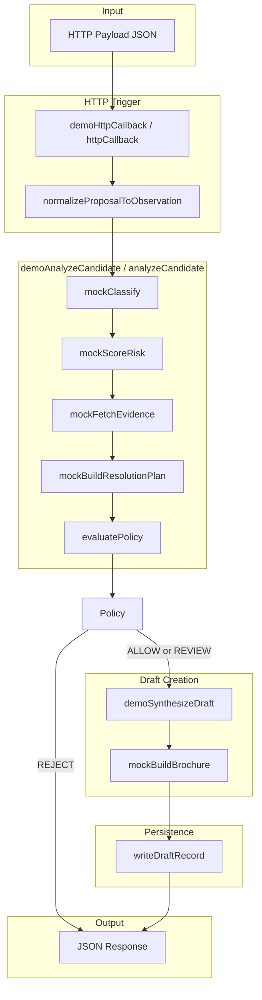
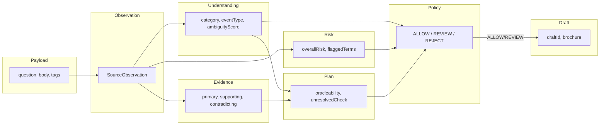

# Demo Flow Explanation — What Happens When You Run Each Proposal

This document explains in detail what happens when you run the three proposal flows (`proposal-safe`, `proposal-review`, `proposal-reject`). Each flow is traced from the HTTP payload through every system in the pipeline.

---

## 1. Pipeline Overview (Text)

```
HTTP Payload (JSON)
    → HTTP Trigger (demoHttpCallback / httpCallback)
    → normalizeProposalToObservation (payload → SourceObservation)
    → demoAnalyzeCandidate (or analyzeCandidate in production)
        → mockClassify (observation → UnderstandingOutput)
        → mockScoreRisk (observation, understanding → RiskScores)
        → mockFetchEvidence (observation, understanding → EvidenceBundle)
        → mockBuildResolutionPlan (understanding, evidence → ResolutionPlan)
        → evaluatePolicy (observation, understanding, risk, resolutionPlan → PolicyDecision)
        → demoSynthesizeDraft (if not REJECT)
        → mockBuildBrochure (if not REJECT)
    → writeDraftRecord (if ALLOW or REVIEW)
    → JSON response
```

All demo systems are **deterministic mocks** — no LLM, no external APIs.

---

## 2. Pipeline Flowchart



**Flow summary:**
- **REJECT:** `evaluatePolicy` → JSON response (no draft, no brochure, no persistence)
- **ALLOW or REVIEW:** `evaluatePolicy` → `demoSynthesizeDraft` → `mockBuildBrochure` → `writeDraftRecord` → JSON response (with `draftId`, `status`, `brochure`)

---

## 3. Flowchart Step-by-Step Explanation

| Step | Component | Input | Output | Purpose |
|------|-----------|-------|--------|---------|
| **1** | **HTTP Trigger** | Raw JSON bytes | Decoded payload | `demoHttpCallback` (demo) or `httpCallback` (production) receives the HTTP request. Routes to proposal preview or publish-from-draft. |
| **2** | **normalizeProposalToObservation** | `{ question, title?, body?, tags?, ... }` | `SourceObservation` | Converts HTTP payload into a canonical observation: `sourceType`, `title`, `body`, `externalId`, `observedAt`, `tags`, `eventTime`. |
| **3** | **mockClassify** | `SourceObservation` | `UnderstandingOutput` | Keyword-based classifier: maps text → `category` (crypto_asset, politics, crypto_product, etc.), `eventType`, `ambiguityScore`, `marketabilityScore`. No LLM. |
| **4** | **mockScoreRisk** | observation + understanding | `RiskScores` | Heuristic risk: politics/sports→0.95, rumor tag→0.55, vague wording→0.45, crypto+date→0.2. Produces `overallRisk`, `flaggedTerms`. |
| **5** | **mockFetchEvidence** | observation + understanding | `EvidenceBundle` | Static evidence by category: crypto_asset→CoinGecko, crypto_product→announcement+contradicting, politics→election. No external fetches. |
| **6** | **mockBuildResolutionPlan** | understanding + evidence | `ResolutionPlan` | Deterministic plan: politics/sports→low oracleability (0.3), unresolved=false; others→0.85, unresolved=true. |
| **7** | **evaluatePolicy** | observation, understanding, risk, resolutionPlan | `PolicyDecision` | Rule engine: banned categories→REJECT; risk/ambiguity/oracleability thresholds→REVIEW; else→ALLOW. |
| **8** | **demoSynthesizeDraft** | observation, understanding, risk, evidence, resolutionPlan, policy | `DraftArtifact` | Creates draft with `draftId`, `canonicalQuestion`, `outcomes`, `explanation`. ETH $6000 fixture gets fixed ID. Only runs if policy ≠ REJECT. |
| **9** | **mockBuildBrochure** | draft + evidence | `MarketBrief` | Template-based brochure: title, explanation, evidence summary. Adds caveat if policy is REVIEW. |
| **10** | **writeDraftRecord** | draft, brochure, policy | `DraftRecord` | Persists to in-memory repo. ALLOW→`PENDING_CLAIM`; REVIEW→`REVIEW_REQUIRED`. Only runs if policy is ALLOW or REVIEW. |
| **11** | **JSON Response** | — | HTTP response body | Returns `{ ok, policy, understanding, resolutionPlan, draft?, draftId?, status?, brochure? }`. |

---

## 4. Data Flow Diagram (Simplified)



---

## 5. Text Pipeline (Reference)

```
HTTP Payload (JSON)
    → HTTP Trigger (demoHttpCallback / httpCallback)
    → normalizeProposalToObservation (payload → SourceObservation)
    → demoAnalyzeCandidate (or analyzeCandidate in production)
        → mockClassify (observation → UnderstandingOutput)
        → mockScoreRisk (observation, understanding → RiskScores)
        → mockFetchEvidence (observation, understanding → EvidenceBundle)
        → mockBuildResolutionPlan (understanding, evidence → ResolutionPlan)
        → evaluatePolicy (observation, understanding, risk, resolutionPlan → PolicyDecision)
        → demoSynthesizeDraft (if not REJECT)
        → mockBuildBrochure (if not REJECT)
    → writeDraftRecord (if ALLOW or REVIEW)
    → JSON response
```

All demo systems are **deterministic mocks** — no LLM, no external APIs. Outcomes are driven by keyword rules in the payload.

---

## 2. Flow A — proposal-safe.json (ALLOW)

### Payload

```json
{
  "question": "Will ETH exceed $6000 by December 31, 2026?",
  "body": "Threshold market based on public market data",
  "sourceType": "http_proposal"
}
```

### Step-by-Step Process

#### 2.1 HTTP Trigger

- Receives payload, decodes JSON.
- Extracts `question` (or `title`) → `"Will ETH exceed $6000 by December 31, 2026?"`
- Builds `SourceObservation`: `sourceType: "http"`, `title`, `body`, `externalId`, `observedAt`, etc.

#### 2.2 mockClassify (Classifier)

- **Input:** `title` + `body` = `"Will ETH exceed $6000 by December 31, 2026? Threshold market based on public market data"`
- **Rules:** `eth`, `price`, `$` → `crypto_asset`; `price_threshold`
- **Output:**
  - `category`: `"crypto_asset"`
  - `eventType`: `"price_threshold"`
  - `candidateQuestion`: same as title
  - `ambiguityScore`: `0.2` (no vague words like "soon", "maybe")
  - `marketabilityScore`: `0.85` (not politics/sports)

#### 2.3 mockScoreRisk (Risk Scorer)

- **Input:** observation + understanding
- **Rules:** `crypto_asset` + `$` + digits (`6000`, `2026`) → low risk
- **Output:**
  - `overallRisk`: `0.2`
  - `categoryRisk`: `0.2`
  - `flaggedTerms`: `[]`

#### 2.4 mockFetchEvidence (Evidence Provider)

- **Input:** observation + understanding
- **Rules:** `crypto_asset` → CoinGecko + public market data
- **Output:** `EvidenceBundle` with primary sources (CoinGecko, public dataset), trust scores 0.9, 0.85

#### 2.5 mockBuildResolutionPlan

- **Input:** understanding + evidence
- **Rules:** `crypto_asset` → deterministic resolution
- **Output:**
  - `oracleabilityScore`: `0.85`
  - `unresolvedCheckPassed`: `true`
  - `resolutionMode`: `"deterministic"`

#### 2.6 evaluatePolicy (Policy Engine)

- **Checks (in order):**
  - Category not banned ✓
  - No hard-banned terms ✓
  - Valid market type ✓
  - No gambling language ✓
  - `unresolvedCheckPassed` ✓
  - `oracleabilityScore` (0.85) ≥ 0.8 ✓
  - `ambiguityScore` (0.2) < 0.45 ✓
  - `overallRisk` (0.2) < 0.35 ✓
- **Result:** `ALLOW` — `ruleHits: ["AUTO_ALLOW"]`

#### 2.7 demoSynthesizeDraft

- Creates `DraftArtifact` with deterministic `draftId` (for ETH $6000 fixture: `0x3c37c2c1...`).
- `canonicalQuestion`, `outcomes: ["Yes","No"]`, `explanation`, `evidenceLinks`.

#### 2.8 mockBuildBrochure

- Builds `MarketBrief`: title, explanation, evidence summary, resolution explanation, no caveats (ALLOW).

#### 2.9 writeDraftRecord

- `policy.status === "ALLOW"` → `status: "PENDING_CLAIM"`
- Persists draft to in-memory repo with `draftId`, `brochure`, `expiresAt` (7 days).

### Final Response

```json
{
  "ok": true,
  "policy": { "status": "ALLOW", "reasons": ["Candidate passed..."], "ruleHits": ["AUTO_ALLOW"] },
  "understanding": { "category": "crypto_asset", "candidateQuestion": "Will ETH exceed $6000 by December 31, 2026?", ... },
  "resolutionPlan": { "resolutionMode": "deterministic", "oracleabilityScore": 0.85, ... },
  "draft": { "draftId": "0x3c37...", "canonicalQuestion": "...", "outcomes": ["Yes","No"], ... },
  "draftId": "0x3c37c2c1d9bfd2bfe058983a55ac0c0f609f2e7706be7db6175f4075120fc494",
  "status": "PENDING_CLAIM",
  "brochure": { "title": "...", "explanation": "...", "evidenceSummary": [...], ... }
}
```

**Summary:** Clear crypto price question, low risk, high oracleability → **ALLOW** → draft created, **PENDING_CLAIM** (ready for creator to claim and publish).

---

## 3. Flow B — proposal-review.json (REVIEW)

### Payload

```json
{
  "question": "Will MetaMask token soon?",
  "body": "Community rumors suggest a possible token launch",
  "tags": ["rumor"],
  "sourceType": "http_proposal"
}
```

### Step-by-Step Process

#### 3.1 HTTP Trigger

- Extracts `question` → `"Will MetaMask token soon?"`
- Builds `SourceObservation` with `tags: ["rumor"]`.

#### 3.2 mockClassify

- **Rules:** `token`, `launch` → `crypto_product`; `product_launch`
- **Vague wording:** `"soon"` → `ambiguityScore`: `0.5`
- **Output:** `category: "crypto_product"`, `ambiguityScore: 0.5`

#### 3.3 mockScoreRisk

- **Rules:**
  - `tags` includes `"rumor"` → `overallRisk = max(0.2, 0.55) = 0.55`, `flaggedTerms: ["rumor"]`
  - `"soon"` → `overallRisk = max(0.55, 0.45) = 0.55`, `flaggedTerms: ["rumor","vague_wording"]`
- **Output:** `overallRisk: 0.55`, `manipulationRisk: 0.55`

#### 3.4 mockFetchEvidence

- **Rules:** `crypto_product` → official announcement, GitHub, community; includes contradicting source ("No official announcement").

#### 3.5 mockBuildResolutionPlan

- **Rules:** `crypto_product` (not politics/sports) → deterministic
- **Output:** `oracleabilityScore: 0.85`, `unresolvedCheckPassed: true`

#### 3.6 evaluatePolicy

- **Checks:**
  - Category not banned ✓
  - `overallRisk` (0.55) > `maxOverallRiskAllow` (0.35) → **OVERALL_RISK_REVIEW**
  - `ambiguityScore` (0.5) > `maxAmbiguityAllow` (0.45) → **AMBIGUITY_REVIEW**
- **Result:** `REVIEW` — `ruleHits: ["OVERALL_RISK_REVIEW","AMBIGUITY_REVIEW"]`

#### 3.7 demoSynthesizeDraft

- Creates draft (non-ETH-6000 → `draftId` from `keccak256` of `externalId:observedAt:question`).

#### 3.8 mockBuildBrochure

- `policy.status === "REVIEW"` → `caveats: ["This draft requires manual review before publication."]`

#### 3.9 writeDraftRecord

- `policy.status === "REVIEW"` → `status: "REVIEW_REQUIRED"`
- Persists draft with brochure that includes the caveat.

### Final Response

```json
{
  "ok": true,
  "policy": { "status": "REVIEW", "reasons": ["Overall risk above auto-allow threshold", "Medium ambiguity"], "ruleHits": ["OVERALL_RISK_REVIEW","AMBIGUITY_REVIEW"] },
  "understanding": { "category": "crypto_product", "candidateQuestion": "Will MetaMask token soon?", ... },
  "draft": { "draftId": "0x...", ... },
  "draftId": "0x...",
  "status": "REVIEW_REQUIRED",
  "brochure": { "caveats": ["This draft requires manual review before publication."], ... }
}
```

**Summary:** Rumor tag + vague "soon" → higher risk and ambiguity → **REVIEW** → draft created, **REVIEW_REQUIRED** (human must approve before publish).

---

## 4. Flow C — proposal-reject.json (REJECT)

### Payload

```json
{
  "question": "Will candidate X win the next election?",
  "sourceType": "http_proposal"
}
```

### Step-by-Step Process

#### 4.1 HTTP Trigger

- Extracts `question` → `"Will candidate X win the next election?"`
- Builds `SourceObservation`.

#### 4.2 mockClassify

- **Rules:** `election`, `candidate` → `politics`; `election_outcome`
- **Output:** `category: "politics"`, `marketabilityScore: 0.3` (politics = low marketability)

#### 4.3 mockScoreRisk

- **Rules:** `politics` → `overallRisk: 0.95`, `categoryRisk: 1`, `flaggedTerms: ["politics"]`

#### 4.4 mockFetchEvidence

- **Rules:** `politics` → election results source.

#### 4.5 mockBuildResolutionPlan

- **Rules:** `politics` → low oracleability, unresolved
- **Output:** `oracleabilityScore: 0.3`, `unresolvedCheckPassed: false`, `resolutionMode: "human_review"`

#### 4.6 evaluatePolicy

- **First check:** `BANNED_CATEGORIES` includes `"politics"` → **REJECT**
- **Result:** `REJECT` — `ruleHits: ["CATEGORY_BANNED"]`, `reasons: ["Banned category: politics"]`
- No further checks (early exit).

#### 4.7 No Draft, No Brochure

- `policy.status === "REJECT"` → `demoAnalyzeCandidate` does not create `draft` or `marketBrief`.
- `writeDraftRecord` is **not** called — no claimable draft is created.

### Final Response

```json
{
  "ok": true,
  "policy": { "status": "REJECT", "reasons": ["Banned category: politics"], "ruleHits": ["CATEGORY_BANNED"] },
  "understanding": { "category": "politics", "candidateQuestion": "Will candidate X win the next election?", ... },
  "resolutionPlan": { "oracleabilityScore": 0.3, "unresolvedCheckPassed": false, ... },
  "draft": undefined
}
```

**No** `draftId`, `status`, or `brochure` — the proposal is rejected and no draft exists to claim.

**Summary:** Politics is a **banned category** → **REJECT** → no draft, audit-only (decision is logged but no claimable draft).

---

## 5. System Reference

| System | Role | Key Rules (Demo) |
|--------|------|------------------|
| **mockClassify** | Map payload text → category, event type, ambiguity | `election/candidate`→politics, `token/launch`→crypto_product, `eth/price/$`→crypto_asset; `soon/maybe`→ambiguity 0.5 |
| **mockScoreRisk** | Compute risk scores | `politics/sports`→0.95; `rumor` tag→0.55; `soon`→0.45; crypto+date→0.2 |
| **mockFetchEvidence** | Provide evidence bundle by category | Static maps: crypto_asset→CoinGecko, crypto_product→announcement+contradicting, politics→election |
| **mockBuildResolutionPlan** | Build resolution plan | politics/sports→oracleability 0.3, unresolved=false; others→0.85, unresolved=true |
| **evaluatePolicy** | Decide ALLOW/REVIEW/REJECT | Banned categories→REJECT; overallRisk>0.35 or ambiguity>0.45→REVIEW; else→ALLOW |
| **demoSynthesizeDraft** | Create draft artifact | ETH $6000→fixed draftId; others→keccak256-based ID |
| **mockBuildBrochure** | Build market brief | REVIEW→caveat "requires manual review" |
| **writeDraftRecord** | Persist draft, set status | ALLOW→PENDING_CLAIM; REVIEW→REVIEW_REQUIRED; REJECT→no write |

---

## 6. Policy Thresholds (Reference)

| Threshold | Value | Meaning |
|-----------|-------|---------|
| `maxOverallRiskAllow` | 0.35 | Above this → REVIEW |
| `maxAmbiguityAllow` | 0.45 | Above this → REVIEW |
| `minOracleabilityAllow` | 0.8 | Below this (with other triggers) → REVIEW |
| `minOracleabilityReview` | 0.65 | Below this → REJECT |
| Banned categories | politics, sports, war_violence | → REJECT |
| Review-only categories | regulatory, entertainment | → REVIEW |

---

## 7. Quick Summary

| Fixture | Question | Category | Risk | Policy | Draft Status |
|---------|----------|----------|------|--------|--------------|
| proposal-safe | ETH $6000 by date | crypto_asset | 0.2 | ALLOW | PENDING_CLAIM |
| proposal-review | MetaMask token soon | crypto_product | 0.55 (rumor, vague) | REVIEW | REVIEW_REQUIRED |
| proposal-reject | candidate X election | politics | 0.95 | REJECT | (none) |
