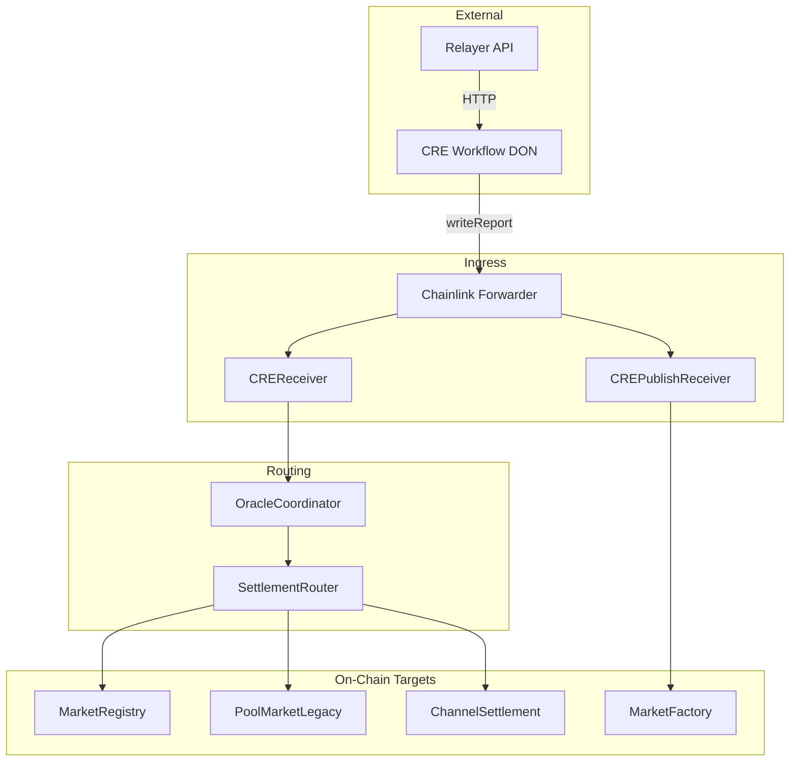
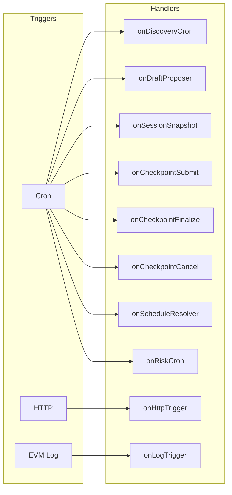
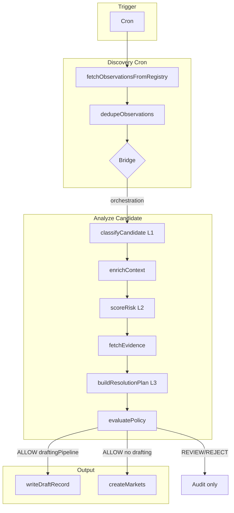
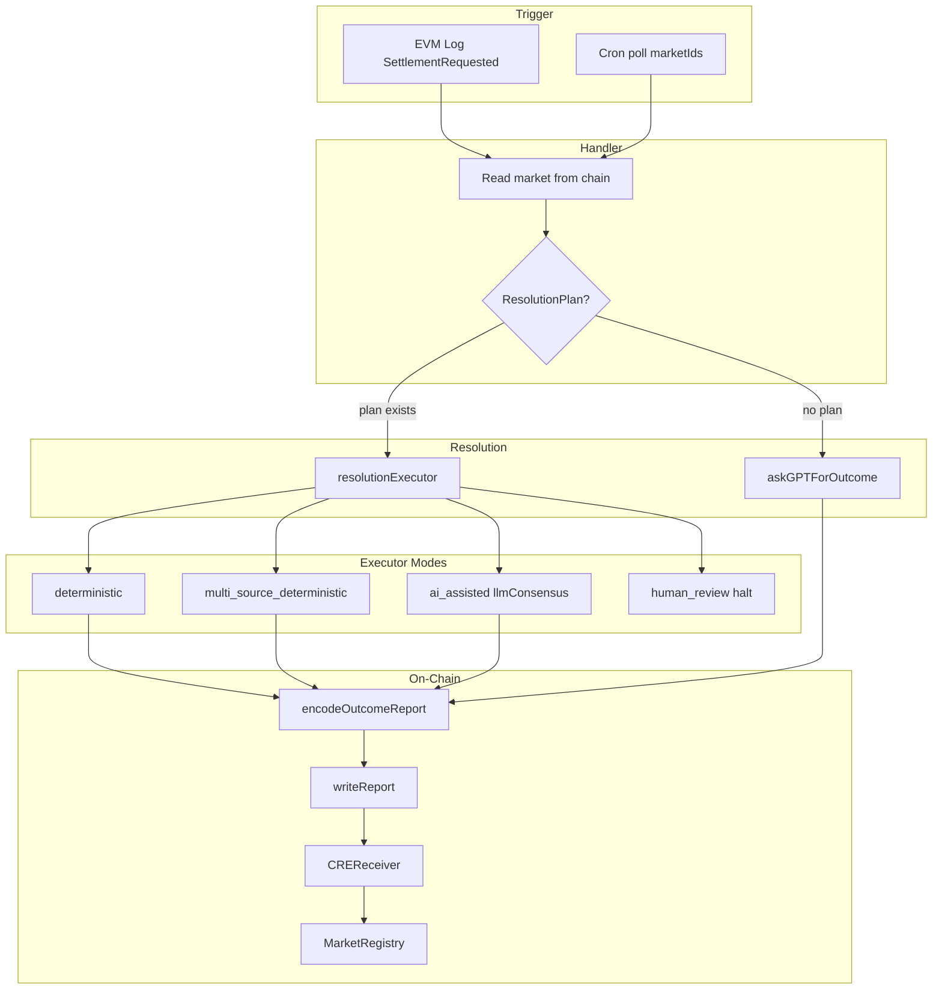
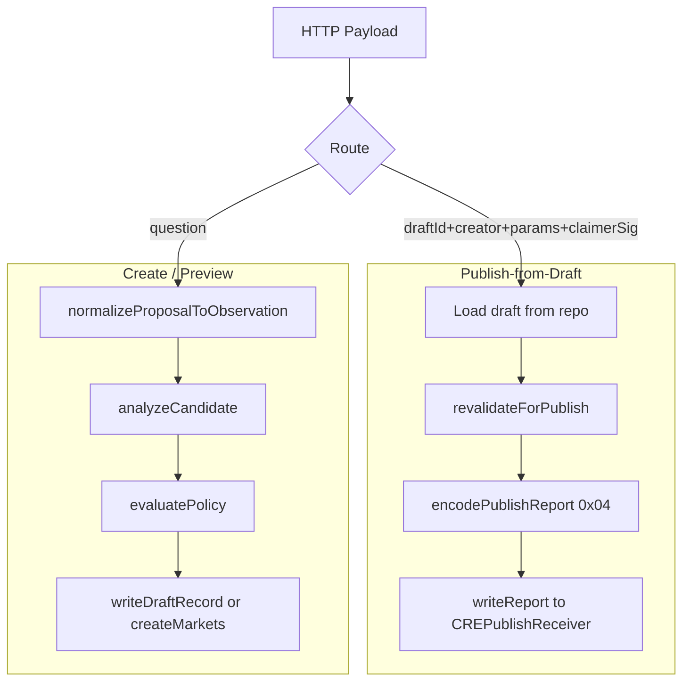
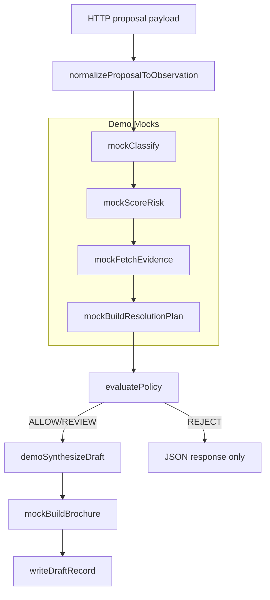

# RetroPick CRE Workflow

Chainlink CRE (Request-and-Execute) workflow for RetroPick prediction markets. Orchestrates market creation, session finalization, checkpoint settlement, and market resolution via the Chainlink Forwarder. Supports V3 architecture (MarketRegistry, ChannelSettlement, OutcomeToken1155) and legacy PoolMarketLegacy.

---

## Table of Contents

- [For Hackathon Judges](#for-hackathon-judges)
- [Workflow Architecture (Full)](#workflow-architecture-full)
- [Prerequisites](#prerequisites)
- [Local Deploy/Test Setup](#local-deploytest-setup)
- [Running the Demo](#running-the-demo)
- [Running Tests](#running-tests)
- [Staging Simulation (Optional)](#staging-simulation-optional)
- [Architecture](#architecture)
- [Project Structure](#project-structure)
- [Handlers & Triggers](#handlers--triggers)
- [Configuration Quick Reference](#configuration-quick-reference)
- [Publish-from-Draft](#publish-from-draft)
- [Relayer Checkpoint Flow](#relayer-checkpoint-flow)
- [Troubleshooting](#troubleshooting)
- [Documentation](#documentation)
- [Scripts](#scripts)
- [Related Packages](#related-packages)

---

## For Hackathon Judges

**What this is:** A Chainlink CRE workflow that runs on the DON (Decentralized Oracle Network). It orchestrates prediction-market creation, resolution, checkpoint settlement, and publish-from-draft via cron, HTTP, and EVM log triggers. Reports are delivered on-chain through the Chainlink Forwarder to CREReceiver and CREPublishReceiver.

**Key innovation:** When `orchestration.enabled`, the system acts as a **Forecasting Intelligence Engine**—policy-first creation (ML informs, deterministic rules decide), resolution-plan-driven settlement, and two-phase drafting (draft generation → user claim & publish). Policy engine outputs ALLOW | REVIEW | REJECT; ML assists classification, risk scoring, and draft synthesis.

**How to evaluate locally:**

1. **One-command demo** (no LLM, deterministic): Run the proposal preview flow with mock classifiers and policy engine. See [Running the Demo](#running-the-demo).
2. **Unit tests:** `bun test` and `bun test test/e2e` cover orchestration, HTTP callback, resolution executor, privacy, risk monitoring, safety compliance.
3. **Optional staging simulation:** Use `staging-settings` with real config (feeds, relayer, addresses) when you want to test against live services. See [Staging Simulation (Optional)](#staging-simulation-optional).

**Architecture at a glance:**



---

## Workflow Architecture (Full)

This section documents each workflow path with flowcharts and step-by-step explanations. Source: [src/main.ts](src/main.ts), [pipeline/](src/pipeline/), [httpCallback.ts](src/httpCallback.ts).

### 1. Trigger-to-Handler Map



**Why:** Judges see at a glance which trigger fires which handler. Source: [src/main.ts](src/main.ts) lines 38-76.

---

### 2. Discovery Flow (Orchestration Path)

**When:** `orchestration.enabled` + cron fires. **Source:** [pipeline/orchestration/discoveryCron.ts](src/pipeline/orchestration/discoveryCron.ts), [pipeline/orchestration/analyzeCandidate.ts](src/pipeline/orchestration/analyzeCandidate.ts).



**Explanation:**

- **Step 1:** Cron fires → `onDiscoveryCron` fetches from `sources/registry` (news, GitHub, CoinGecko, Polymarket, custom).
- **Step 2:** Observations deduped by `externalId`.
- **Step 3:** If orchestration enabled: `analyzeCandidate` runs L1–L3 (classify, risk, evidence, resolution plan) → `evaluatePolicy` (ALLOW/REVIEW/REJECT).
- **Step 4:** ALLOW + `draftingPipeline` → `writeDraftRecord` (PENDING_CLAIM). ALLOW without drafting → `createMarkets` → writeReport to MarketFactory.

**Test locally:** Demo uses mocks; run `cre workflow simulate ... --http-payload @demo/fixtures/proposal-safe.json` (HTTP path mirrors analysis). See [Running the Demo](#running-the-demo).

---

### 3. Resolution Flow (Log + Schedule)

**When:** EVM log `SettlementRequested` (log mode) or cron polls `marketIds` (schedule mode). **Source:** [pipeline/resolution/logTrigger.ts](src/pipeline/resolution/logTrigger.ts), [pipeline/resolution/scheduleResolver.ts](src/pipeline/resolution/scheduleResolver.ts), [pipeline/resolution/resolveFromPlan.ts](src/pipeline/resolution/resolveFromPlan.ts).



**Explanation:**

- **Step 1:** Log trigger receives `marketId` + `question`; schedule trigger polls `resolution.marketIds`.
- **Step 2:** Read market from PoolMarketLegacy (log) or MarketRegistry (schedule).
- **Step 3:** If `ResolutionPlan` in store → `resolutionExecutor` (deterministic / multi_source / ai_assisted / human_review). Else → `askGPTForOutcome` (DeepSeek).
- **Step 4:** `encodeOutcomeReport` → `writeReport` (no prefix) → CREReceiver → OracleCoordinator → SettlementRouter → MarketRegistry._doResolve.

**Test locally:** Use `resolution.mode: "log"` with `evms[0].marketAddress`; `scripts/requestSettlement.sh` emits event. Demo does not exercise resolution (mocks only).

---

### 4. Checkpoint Flow

**When:** Cron (submit, finalize, cancel). **Source:** [pipeline/checkpoint/checkpointSubmit.ts](src/pipeline/checkpoint/checkpointSubmit.ts), [pipeline/checkpoint/checkpointFinalize.ts](src/pipeline/checkpoint/checkpointFinalize.ts), [pipeline/checkpoint/checkpointCancel.ts](src/pipeline/checkpoint/checkpointCancel.ts).

```mermaid
flowchart TB
    subgraph submit [Submit Cron]
        Health[GET relayer/health]
        List[GET relayer/cre/checkpoints]
        Sigs[GET cre/checkpoints/:sessionId/sigs]
        Build[Build 0x03 payload]
        Write1[writeReport to CREReceiver]
    end
    subgraph finalize [Finalize Cron]
        PostFinal[POST relayer/cre/finalize/:sessionId]
        RelayerFinal[Relayer submits finalizeCheckpoint tx]
    end
    subgraph cancel [Cancel Cron]
        PostCancel[POST relayer/cre/cancel/:sessionId]
        RelayerCancel[Relayer submits cancelPendingCheckpoint tx]
    end
    Health --> List --> Sigs --> Build --> Write1
    PostFinal --> RelayerFinal
    PostCancel --> RelayerCancel
```



**Explanation:**

- **Submit:** CRE polls relayer for sessions with `hasDeltas`; fetches user sigs; builds 0x03-prefixed payload; delivers via writeReport → CREReceiver → ChannelSettlement.submitCheckpointFromPayload.
- **Finalize:** After 30 min challenge window, CRE calls `POST /cre/finalize/:sessionId`; relayer submits `finalizeCheckpoint` tx.
- **Cancel:** After 6 hr, CRE calls `POST /cre/cancel/:sessionId`; relayer submits `cancelPendingCheckpoint` tx.

**Test locally:** Requires running relayer + deployed ChannelSettlement. Demo config uses placeholder addresses; full flow needs staging.

---

### 5. HTTP Flow (Publish-from-Draft vs Create/Preview)

**When:** HTTP trigger. **Source:** [httpCallback.ts](src/httpCallback.ts).



**Explanation:**

- **Route:** `draftId` + `creator` + `params` + `claimerSig` → publish-from-draft. `question` (or `title`) → create/preview.
- **Publish:** Load draft, revalidate, encode 0x04, writeReport to CREPublishReceiver → MarketFactory.createFromDraft.
- **Create/Preview:** Normalize to SourceObservation → analyzeCandidate → policy → writeDraftRecord (orchestration) or createMarkets.

**Test locally:** Demo fixtures: `proposal-safe.json`, `proposal-review.json`, `proposal-reject.json`, `publish-safe.json`. One-command: `cre workflow simulate ./apps/workflow -T demo-settings -e apps/workflow/.env --non-interactive --trigger-index 0 --http-payload @demo/fixtures/proposal-safe.json`

---

### 6. Demo Flow (Deterministic, No LLM)

**When:** `-T demo-settings`, HTTP trigger. **Source:** [demo/demoHttpCallback.ts](demo/demoHttpCallback.ts), [demo/demoAnalyzeCandidate.ts](demo/demoAnalyzeCandidate.ts).



**Explanation:**

- Demo uses **no LLM**; all analysis steps are mocks (keyword classify, heuristic risk, static evidence, deterministic resolution plan).
- Policy engine is real (`evaluatePolicy`).
- Output: `draftId`, `status`, `brochure` for ALLOW/REVIEW; policy reasons for REJECT.

**Test locally (copy-paste):** From monorepo root:

```bash
cre workflow simulate ./apps/workflow -T demo-settings -e apps/workflow/.env --non-interactive --trigger-index 0 --http-payload @demo/fixtures/proposal-safe.json
```

---

## Prerequisites

| Prerequisite | Version | Why |
|--------------|---------|-----|
| **CRE CLI** | Latest | Required for `cre workflow simulate`; CRE SDK compiles workflow to WASM. |
| **Bun** | 1.2.21+ | Runtime for workflow; `cre-setup` runs on `bun install`. |
| **Node.js** | (optional) | Alternative if Bun unavailable; project uses Bun. |
| **Sepolia RPC** | Public or own | `project.yaml` targets use Sepolia; simulation needs RPC for EVM log trigger (when market address set). |

- **CRE account:** `cre login` only if deploying to CRE registry; simulation works without it.
- **Private key:** For signing; simulation can run with placeholder for proposal-only flows.

---

## Local Deploy/Test Setup

### Clone and Install

```bash
cd sc-cre-workflow-chainlink   # monorepo root
cd apps/workflow
bun install
```

**Why from monorepo root:** `project.yaml` lives at root; CRE CLI resolves workflow path relative to it. `bun install` runs `cre-setup` and produces `src/tmp.wasm`.

### Environment Variables

Create `apps/workflow/.env`:

```
CRE_ETH_PRIVATE_KEY=0x...   # 64-char hex (required for chain writes; simulation uses for signing)
RPC_URL=https://ethereum-sepolia-rpc.publicnode.com   # Fallback when config.rpcUrl unset
```

**Why:** `CRE_ETH_PRIVATE_KEY` used by CRE SDK for report signing; `RPC_URL` used when config does not specify `rpcUrl` (e.g., draftProposer, direct contract reads).

### Config Targets

| Target | Config | Entry | Use Case |
|--------|--------|-------|----------|
| **demo-settings** | `config.demo.json` | `src/demo-main.ts` | Hackathon demo: mocks, no LLM, HTTP + optional EVM log |
| **staging-settings** | `config.staging.json` | `src/main.ts` | Staging/test with real feeds, optional mock AI |
| **production-settings** | `config.production.json` | `src/main.ts` | Production |

**Why demo vs staging:** Demo uses `demoMode: true`, `useMocks: true`, `analysis.useLlm: false`—fully deterministic for judging. Staging can use real APIs.

### Project and Workflow YAML

- **project.yaml** (monorepo root): Defines `rpcs` per target (e.g., `ethereum-testnet-sepolia`). Required for `cre workflow simulate -T demo-settings`.
- **workflow.yaml** (apps/workflow): Maps targets to `workflow-path`, `config-path`. Demo uses `src/demo-main.ts` so CRE finds `tmp.wasm` in `src/`.

**Why run from monorepo root:** `cre workflow simulate ./apps/workflow`—CLI discovers `project.yaml` at root; path `./apps/workflow` points to workflow dir with `workflow.yaml`.

---

## Running the Demo

Deterministic, no-LLM demo. Uses mock classifiers, risk scorers, and policy engine.

**Single copy-paste command** (from monorepo root):

```bash
cre workflow simulate ./apps/workflow -T demo-settings -e apps/workflow/.env \
  --non-interactive --trigger-index 0 \
  --http-payload @demo/fixtures/proposal-safe.json
```

### Three Proposal Flows

| Fixture | Question | Policy | Draft Status |
|---------|----------|--------|--------------|
| `proposal-safe.json` | ETH $6000 by date | ALLOW | PENDING_CLAIM |
| `proposal-review.json` | MetaMask token soon (rumor) | REVIEW | REVIEW_REQUIRED |
| `proposal-reject.json` | Candidate X election | REJECT | (none) |

```bash
# Flow A — Safe (ALLOW)
cre workflow simulate ./apps/workflow -T demo-settings -e apps/workflow/.env \
  --non-interactive --trigger-index 0 --http-payload @demo/fixtures/proposal-safe.json

# Flow B — Review
cre workflow simulate ./apps/workflow -T demo-settings -e apps/workflow/.env \
  --non-interactive --trigger-index 0 --http-payload @demo/fixtures/proposal-review.json

# Flow C — Reject
cre workflow simulate ./apps/workflow -T demo-settings -e apps/workflow/.env \
  --non-interactive --trigger-index 0 --http-payload @demo/fixtures/proposal-reject.json
```

### Publish-from-Draft Flow

Requires prior `proposal-safe` run to get `draftId`. Then:

```bash
cre workflow simulate ./apps/workflow -T demo-settings -e apps/workflow/.env \
  --non-interactive --trigger-index 0 \
  --http-payload @demo/fixtures/publish-safe.json
```

### EVM Log Trigger (Optional)

When `evms[0].marketAddress` is non-zero in `config.demo.json`, the demo registers an EVM log trigger for `SettlementRequested`. Use `--trigger-index 1` with appropriate payload.

See [.DEMO.md](.DEMO.md) for full demo guide and [.DEMOExplanation.md](.DEMOExplanation.md) for pipeline flowcharts and step-by-step explanations.

---

## Running Tests

```bash
cd apps/workflow
bun test
```

```bash
bun test test/e2e
```

Tests cover orchestration, HTTP callback, resolution executor, privacy, risk monitoring, safety compliance.

---

## Staging Simulation (Optional)

Use `staging-settings` to test against live services: real feeds (CoinGecko, news, custom), relayer API, and deployed contracts. Judges can verify the full pipeline beyond the deterministic demo.

### When to Use Staging

- **Discovery flow:** Real `sources/registry` fetches (news, GitHub, CoinGecko, Polymarket, custom feeds).
- **Resolution flow:** Real `SettlementRequested` events or schedule-based resolution; optional DeepSeek AI.
- **Checkpoint flow:** Relayer builds payloads; CRE delivers via writeReport to CREReceiver.
- **Draft proposer:** Polymarket Gamma API → MarketDraftBoard.proposeDraft (direct RPC).

### Prerequisites

- Same as [Local Deploy/Test Setup](#local-deploytest-setup): CRE CLI, Bun, `.env`.
- **Chain alignment:** `config.staging.json` must use a `chainSelectorName` that exists in `project.yaml` under `staging-settings.rpcs`. Default: `ethereum-testnet-sepolia`.

### Step 1: Environment Variables

Copy [.env.example.real-time](.env.example.real-time) to `.env` (or merge into existing):

```
CRE_ETH_PRIVATE_KEY=0x...       # 64-char hex; required for writeReport, draftProposer
RPC_URL=https://ethereum-sepolia-rpc.publicnode.com
# AI resolution (only when useMockAi: false). Use ONE of:
# DEEPSEEK_API_KEY=sk-...       # Default (llmProvider: deepseek)
# GEMINI_API_KEY=...            # When llmProvider: gemini in config
```

**Why each variable:**

| Variable | Purpose |
|----------|---------|
| `CRE_ETH_PRIVATE_KEY` | CRE SDK uses for report signing; draftProposer uses for direct RPC txs. |
| `RPC_URL` | Fallback when `config.rpcUrl` unset; used by draftProposer, chain reads, scripts. |
| `DEEPSEEK_API_KEY` | AI resolution when `llmProvider` is `deepseek` (default). Only needed when `useMockAi: false`. |
| `GEMINI_API_KEY` | AI resolution when `llmProvider` is `gemini`. Alternative to DeepSeek. |

### Step 2: Config

Edit `config.staging.json` (or copy from `config.example.json`). Key fields:

| Field | Purpose | Example |
|-------|---------|---------|
| `relayerUrl` | Relayer API base; required for checkpoint jobs | `https://backend-relayer-production.up.railway.app` |
| `creReceiverAddress` | CREReceiver for resolution, checkpoint, session | Deployed contract address |
| `evms[0].marketAddress` | PoolMarketLegacy (log-trigger resolution) | Deployed address |
| `evms[0].chainSelectorName` | Must match `project.yaml` rpcs | `ethereum-testnet-sepolia` |
| `marketFactoryAddress` | Market creation receiver | Deployed address |
| `creatorAddress` | Default creator for markets | Your wallet |
| `feeds` | Feed configs for discoveryCron | See [docs/Configuration.md](docs/Configuration.md) |
| `llmProvider` | `"deepseek"` (default) or `"gemini"` for AI resolution | `"gemini"` to use Google Gemini API |
| `geminiApiKey` | Gemini API key; used when `llmProvider` is `gemini` | Or set `GEMINI_API_KEY` in `.env` |
| `geminiModel` | Gemini model (e.g. `gemini-1.5-flash`, `gemini-1.5-pro`) | Default: `gemini-1.5-flash` |
| `useMockAi` | `true` = no AI call; `false` = real AI (DeepSeek or Gemini) | `true` for quick test |

**Chain alignment:** If `evms[0].chainSelectorName` is `avalanche-fuji`, add `avalanche-fuji` to `project.yaml` under `staging-settings.rpcs`. Default `project.yaml` has `ethereum-testnet-sepolia`; use that chain in config for zero changes.

### Step 3: Run Staging Simulation

From **monorepo root**:

```bash
cre workflow simulate ./apps/workflow -T staging-settings -e apps/workflow/.env
```

**Interactive:** When prompted, choose trigger (Cron, HTTP, EVM log) and provide input.

**Non-interactive (HTTP):**

```bash
cre workflow simulate ./apps/workflow -T staging-settings -e apps/workflow/.env \
  --non-interactive --trigger-index 0 \
  --http-payload @demo/fixtures/proposal-safe.json
```

**Non-interactive (Cron):** Select cron trigger index when prompted; no payload needed.

### Step 4: What Runs

| Handler | Trigger | Requires |
|---------|---------|----------|
| onDiscoveryCron | Cron | `feeds` non-empty, `creatorAddress` |
| onCheckpointSubmit | Cron | `relayerUrl`, `creReceiverAddress`, relayer healthy |
| onLogTrigger | EVM log | `evms[0].marketAddress` non-zero, `resolution.mode` includes "log" |
| onScheduleResolver | Cron | `resolution.mode` includes "schedule", `marketRegistryAddress` or `marketIds` |
| onHttpTrigger | HTTP | `marketFactoryAddress` or publish path with `crePublishReceiverAddress` |
| onDraftProposer | Cron | `curatedPath.enabled`, `draftBoardAddress`, RPC_URL, CRE_ETH_PRIVATE_KEY |

### Minimal Staging (No Deployed Contracts)

To test discovery + HTTP create without on-chain writes:

1. Set `useMockAi: true` in config (no API key needed).
2. Use placeholder `0x0000...` for `creReceiverAddress`, `marketAddress`, `marketFactoryAddress`.
3. Set `feeds` with `mock: true` (e.g. CoinGecko feed with `mockValue`).
4. Run cron or HTTP trigger; handlers will run but `writeReport` may fail or be skipped when addresses are zero.

### Troubleshooting

| Issue | Fix |
|-------|-----|
| `no RPC URLs found` | Add `staging-settings` to `project.yaml` with `rpcs` for your chain. |
| `DeepSeek API key not found` | Set `DEEPSEEK_API_KEY` or `deepseekApiKey` in config; or set `useMockAi: true`. |
| `Gemini API key not found` | Set `GEMINI_API_KEY` or `geminiApiKey` in config when `llmProvider` is `gemini`. |
| `Gemini API key not found` | Set `GEMINI_API_KEY` in `.env` or `geminiApiKey` in config when `llmProvider` is `gemini`. |
| `Gemini API key not found` | Set `GEMINI_API_KEY` in `.env` or `geminiApiKey` in config; or use `llmProvider: "deepseek"`. |
| `Gemini API key not found` | Set `GEMINI_API_KEY` in `.env` or `geminiApiKey` in config; or use `llmProvider: "deepseek"`. |
| `Gemini API key not found` | Set `GEMINI_API_KEY` in `.env` or `geminiApiKey` in config when `llmProvider: gemini`. |
| `Missing creReceiverAddress` | Set in config; use placeholder for proposal-only tests. |
| `Relayer unhealthy` | Check `relayerUrl`; checkpoint jobs skip when relayer is down. |
| Chain mismatch | Ensure `evms[0].chainSelectorName` matches a chain in `project.yaml` rpcs. |

---

## Architecture

```
Chainlink DON (CRE Workflow)
    → Triggers: Cron | HTTP | EVM Log
    → Handlers: discovery, checkpoint, resolution, publish, session
    → writeReport → Chainlink Forwarder → CREReceiver / CREPublishReceiver
        → OracleCoordinator → SettlementRouter → MarketRegistry | PoolMarketLegacy | ChannelSettlement
```

| Component | Role |
|-----------|------|
| **CRE Workflow** | Orchestration: triggers, handlers, consensus, HTTP/chain reads, report encoding |
| **CREReceiver** | Outcome and checkpoint ingress; routes by report prefix |
| **CREPublishReceiver** | Publish-from-draft ingress; validates EIP-712, calls MarketFactory |
| **Relayer** | Off-chain trading engine; checkpoint build, finalize/cancel tx submission |

**Report routing:**

| Prefix | Receiver | Target |
|--------|----------|--------|
| (none) | CREReceiver | OracleCoordinator → SettlementRouter → MarketRegistry/PoolMarketLegacy |
| `0x03` | CREReceiver | ChannelSettlement.submitCheckpointFromPayload |
| `0x04` | CREPublishReceiver | MarketFactory.createFromDraft |

---

## Project Structure

```
apps/workflow/
├── src/                      # Production workflow
│   ├── main.ts               # Entry point: Runner, trigger registration
│   ├── demo-main.ts          # Thin wrapper → demo/main-demo (CRE finds tmp.wasm here)
│   ├── httpCallback.ts       # HTTP router: publish-from-draft vs create-market
│   ├── gpt.ts                # AI resolution (DeepSeek)
│   ├── config/               # Config validation
│   ├── domain/               # Types: draft, policy, evidence, settlement, etc.
│   ├── pipeline/             # Orchestration, creation, resolution, checkpoint, privacy
│   ├── policy/               # evaluatePolicy, bannedCategories, thresholds
│   ├── analysis/             # classify, riskScore, draftSynthesis, evidenceFetcher
│   ├── models/               # Prompts, LLM/embedding providers
│   └── types/                # Config, feed types
├── demo/                     # Deterministic demo (no LLM)
│   ├── main-demo.ts          # Demo entry: HTTP + EVM log handlers
│   ├── demoHttpCallback.ts   # Proposal preview + publish-from-draft
│   ├── demoAnalyzeCandidate.ts
│   ├── mocks/                # mockClassify, mockScoreRisk, mockEvidenceProvider, etc.
│   └── fixtures/             # proposal-safe, proposal-review, proposal-reject, publish-safe
├── docs/                     # Architecture, HandlersReference, Configuration, etc.
├── scripts/                  # requestSettlement.sh, predict.sh, getMarket.sh
├── test/                     # Unit and integration tests
├── workflow.yaml             # CRE targets: staging, production, demo-settings
├── config.staging.json       # Staging config
├── config.demo.json          # Demo config (mocks, orchestration)
└── package.json
```

---

## Handlers & Triggers

| Handler | Trigger | Purpose |
|---------|---------|---------|
| **onDiscoveryCron** | Cron | Primary creation when orchestration enabled: multi-source discovery → analyzeCandidate → policy → draftWriter/createMarkets |
| **onDraftProposer** | Cron | Polymarket events → MarketDraftBoard.proposeDraft |
| **onSessionSnapshot** | Cron | Legacy SessionFinalizer path |
| **onCheckpointSubmit** | Cron | V3 checkpoint delivery via CREReceiver; fetches payload from relayer |
| **onCheckpointFinalize** | Cron | Relayer submits finalizeCheckpoint after 30 min challenge window |
| **onCheckpointCancel** | Cron | Relayer submits cancelPendingCheckpoint after 6 hr |
| **onScheduleResolver** | Cron | V3 MarketRegistry schedule-based resolution; polls marketIds |
| **onLogTrigger** | EVM Log | SettlementRequested → resolveFromPlan → CREReceiver |
| **onHttpTrigger** | HTTP | Publish-from-draft or create-market |
| **onRiskCron** | Cron | Live-market risk monitoring (when monitoring.enabled) |

**Resolution modes** (`resolution.mode`):

- **log** — PoolMarketLegacy `SettlementRequested` events
- **schedule** — V3 MarketRegistry cron; polls `resolution.marketIds`
- **both** — Registers both

---

## Configuration Quick Reference

| Field | Purpose |
|-------|---------|
| `relayerUrl` | **Required.** Relayer API base for checkpoint jobs |
| `creReceiverAddress` | **Required.** CREReceiver for resolution, checkpoint, session |
| `evms` | `marketAddress` (PoolMarketLegacy), `marketRegistryAddress` (V3), `chainSelectorName`, `gasLimit` |
| `resolution.mode` | `"log"` \| `"schedule"` \| `"both"` |
| `orchestration` | `enabled`, `draftingPipeline` — Forecasting Intelligence Engine |
| `curatedPath` | `draftBoardAddress`, `crePublishReceiverAddress`, `enabled` |

See [docs/Configuration.md](docs/Configuration.md) for full reference.

---

## Publish-from-Draft

When `onHttpTrigger` receives `draftId`, `creator`, `params`, and `claimerSig`:

1. Validates draft exists, revalidates params
2. Encodes `0x04 || abi.encode(draftId, creator, params, claimerSig)`
3. Sends via `writeReport` to **CREPublishReceiver**
4. Requires `crePublishReceiverAddress` or `curatedPath.crePublishReceiverAddress`

**Payload format:**

```json
{
  "draftId": "0x...",
  "creator": "0x...",
  "params": {
    "question": "Will X happen?",
    "marketType": 0,
    "outcomes": ["Yes", "No"],
    "timelineWindows": [],
    "resolveTime": 1735689600,
    "tradingOpen": 0,
    "tradingClose": 1735689600
  },
  "claimerSig": "0x..."
}
```

Creator must sign EIP-712 `PublishFromDraft`. See `contracts/publishFromDraft.ts` and [packages/contracts/docs/abi/docs/cre/](../../packages/contracts/docs/abi/docs/cre/).

---

## Relayer Checkpoint Flow

1. **Submit:** CRE polls `GET {relayerUrl}/cre/checkpoints`, fetches sigs via `GET /cre/checkpoints/:sessionId/sigs`, builds payload, delivers via `writeReport` → CREReceiver.
2. **Finalize:** After 30 min challenge window, `onCheckpointFinalize` calls `POST /cre/finalize/:sessionId`.
3. **Cancel:** If stuck > 6 hr, `onCheckpointCancel` calls `POST /cre/cancel/:sessionId`.
4. **Stored sigs:** Frontend must POST user signatures to `POST /cre/checkpoints/:sessionId/sigs` before CRE cron runs.

---

## Troubleshooting

| Error | Fix |
|-------|-----|
| `workflow.yaml: no such file or directory` | Run from **monorepo root** with `./apps/workflow`, not from `apps/workflow` with `.` |
| `no RPC URLs found` | Add `demo-settings` to `project.yaml` (monorepo root) with `rpcs` for Sepolia |
| `open demo/tmp.wasm: no such file` | Demo uses `src/demo-main.ts`; run `bun install` in `apps/workflow` |
| `failed to get HTTP trigger payload: empty input` | Use `--non-interactive --trigger-index 0 --http-payload @path/to/file.json` |
| `failed to read file .../proposal-safe.json` | Use `@demo/fixtures/proposal-safe.json` (path relative to workflow folder) or absolute path |
| `Question is required` / `Received question: undefined` | Fixtures must use `question` (not `title`). Update fixtures to have `"question": "..."` or ensure handler accepts both. |
| `Missing creReceiverAddress` | Set in `config.demo.json` (or use placeholder `0x0000...` for proposal-only tests) |
| `bun install` failures | Ensure Bun 1.2.21+; check network; run from `apps/workflow` |
| Missing `project.yaml` targets | Ensure `demo-settings`, `staging-settings` exist in monorepo root `project.yaml` with `rpcs` |

---

## Documentation

| Document | Description |
|----------|-------------|
| [docs/README.md](docs/README.md) | Documentation index |
| [docs/DOCUMENTATION.md](docs/DOCUMENTATION.md) | Consolidated reference |
| [docs/Architecture.md](docs/Architecture.md) | Component roles, topology, report routing |
| [docs/HandlersReference.md](docs/HandlersReference.md) | Per-handler details |
| [docs/Configuration.md](docs/Configuration.md) | Config reference |
| [docs/ResolutionFlow.md](docs/ResolutionFlow.md) | Resolution trigger → AI → chain |
| [docs/CreationFlows.md](docs/CreationFlows.md) | Feed, publish-from-draft, draftProposer |
| [.DEMO.md](.DEMO.md) | Demo quick start |
| [.DEMOExplanation.md](.DEMOExplanation.md) | Demo pipeline flowcharts and explanations |

---

## Related Packages

| Package | Purpose |
|---------|---------|
| [packages/contracts](../../packages/contracts) | CREReceiver, ChannelSettlement, MarketRegistry; CRE docs |
| [apps/relayer](../relayer) | Checkpoint payload source; CRE endpoints |
| [Relayer CRE API](../relayer/docs/development/cre/API_REFERENCE.md) | Full endpoint reference |
| [CRE Workflow Checkpoints](../../packages/contracts/docs/abi/docs/cre/CREWorkflowCheckpoints.md) | V3 checkpoint flow |

---

## Scripts

| Script | Purpose |
|--------|---------|
| `scripts/requestSettlement.sh` | Emit `SettlementRequested` (PoolMarketLegacy) |
| `scripts/predict.sh` | Make a prediction (legacy) |
| `scripts/getMarket.sh` | Read market data |
| `scripts/getPrediction.sh` | Read user prediction result |

Example:

```bash
MARKET_ADDRESS=0x... CRE_ETH_PRIVATE_KEY=0x... RPC_URL=... \
  bash ./apps/workflow/scripts/requestSettlement.sh ./apps/workflow/config.staging.json 0
```

---

## License

UNLICENSED
