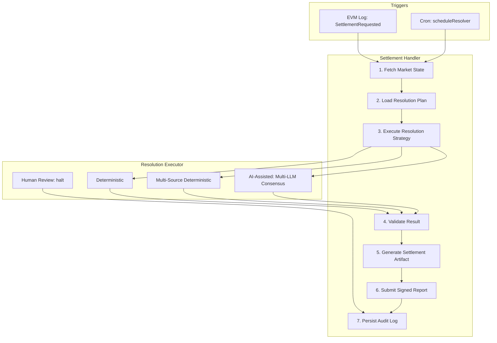

# AI Event-Driven Layer (05)

Deterministic resolution, multi-LLM consensus, settlement artifacts, and structured audit logging for market settlement. The layer routes by `ResolutionPlan.resolutionMode` instead of always using free-form AI prompts.

## Overview

When a `ResolutionPlan` is loaded (from `resolutionPlanStore`), the resolution handlers (`logTrigger`, `scheduleResolver`) use `resolutionExecutor` instead of direct `askGPTForOutcome`. This enables:

- **Deterministic resolution** — official API or onchain event fetchers with predicate evaluation
- **Multi-source deterministic** — fetch all primary sources, majority wins; fallback to fallback sources
- **AI-assisted** — multi-LLM parallel execution with consensus rules
- **Human review** — halt and log artifact with `reviewRequired: true`; no onchain write

## Architecture



## Resolution Modes

| Mode | Behavior |
|------|----------|
| **deterministic** | `official_api` or `onchain_event` fetchers + predicate evaluator. Fetches from source locator, parses JSON, evaluates `resolutionPredicate` (e.g. price > threshold). |
| **multi_source_deterministic** | Fetch all `primarySources`; compare results; majority wins. Fallback to `fallbackSources` if needed. |
| **ai_assisted** | Delegates to `llmConsensus` — runs 2–3 LLMs in parallel with same prompt. Consensus rules: unanimous accept; 2/3 majority + min confidence accept; else `REVIEW_REQUIRED`. |
| **human_review** | Halt; log artifact with `reviewRequired: true`; no `writeReport`. |

## Key Components

### resolutionExecutor

**File:** [pipeline/resolution/resolutionExecutor.ts](../pipeline/resolution/resolutionExecutor.ts)

Routes by `resolutionPlan.resolutionMode`. Implements:

- `deterministicResolution` — HTTP fetch from `locator`, parse JSON, evaluate predicate
- `multiSourceDeterministicResolution` — fetch all primary sources, majority wins
- `aiAssistedResolution` — calls `runLLMConsensus`
- `human_review` — returns `{ status: "REVIEW_REQUIRED" }`

### llmConsensus

**File:** [pipeline/resolution/llmConsensus.ts](../pipeline/resolution/llmConsensus.ts)

- Configurable providers (reuse `createLlmProvider`; add optional Claude/Gemini via config)
- Runs multiple LLMs in parallel with same prompt (from `settle.prompt`)
- Consensus rules: unanimous accept; 2/3 majority + min confidence accept; else `REVIEW_REQUIRED`
- Returns `{ outcomeIndex, confidence, reasoning, sourcesUsed }` or `null`

### SettlementArtifact

**File:** [domain/settlementArtifact.ts](../domain/settlementArtifact.ts)

```ts
type SettlementArtifact = {
  marketId: string;
  question: string;
  outcomeIndex: number;
  confidence: number;
  timestamp: number;
  modelsUsed?: string[];
  sourcesUsed: string[];
  resolutionMode: string;
  reasoning?: string;
  reviewRequired?: boolean;
  txHash?: string;
}
```

Validation: `outcomeIndex` in range; `confidence >= minThreshold` (e.g. 7000 = 70%); sources used match plan.

### Integration

- **logTrigger.ts** — After `resolveFromPlan`, if `REVIEW_REQUIRED`: store artifact with `reviewRequired: true`, skip `writeReport`. On success: build artifact, call `logSettlementArtifact`, then `writeReport`.
- **scheduleResolver.ts** — Same flow.
- **auditLogger.ts** — `logSettlementArtifact(artifact)` persists full artifact.

## Configuration

| Field | Type | Purpose |
|-------|------|---------|
| `resolution.multiLlmEnabled` | `boolean` | Enable multi-LLM consensus for ai_assisted mode |
| `resolution.llmProviders` | `string[]` | LLM provider IDs (e.g. `["openai", "anthropic"]`) |
| `resolution.minConfidence` | `number` | Minimum confidence (0–10000) for settlement; default 7000 (70%) |
| `resolution.consensusQuorum` | `number` | Min agreeing LLM providers for multi-LLM; default 2 |

## Implementation Status

| Component | Status | File |
|----------|--------|------|
| resolutionExecutor | Implemented | `pipeline/resolution/resolutionExecutor.ts` |
| llmConsensus | Implemented | `pipeline/resolution/llmConsensus.ts` |
| SettlementArtifact | Implemented | `domain/settlementArtifact.ts` |
| logTrigger integration | Implemented | `pipeline/resolution/logTrigger.ts` |
| scheduleResolver integration | Implemented | `pipeline/resolution/scheduleResolver.ts` |
| auditLogger.logSettlementArtifact | Implemented | `pipeline/audit/auditLogger.ts` |

## References

- [ResolutionFlow.md](ResolutionFlow.md) — End-to-end resolution flow
- [MarketDraftingPipelineLayer.md](MarketDraftingPipelineLayer.md) — Drafts store ResolutionPlan
- [SafetyAndComplienceLayer.md](SafetyAndComplienceLayer.md) — Policy defines allowed resolution modes
