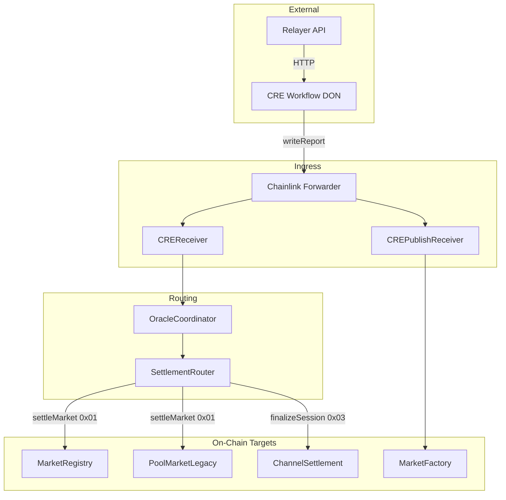

# CRE Workflow Architecture

High-level system architecture for the RetroPick Chainlink CRE workflow, relayer, and smart contracts.

## Overview

The workflow runs on the Chainlink DON (Decentralized Oracle Network). It responds to cron, HTTP, and EVM log triggers, fetches data (from feeds, relayer, or chain), and delivers reports on-chain via `evmClient.writeReport`. The Chainlink Forwarder executes the transaction and calls the configured receiver contract.

## Component Roles

| Component | Role |
|-----------|------|
| **CRE Workflow** | Orchestration: triggers, handlers, consensus, HTTP/chain reads, report encoding, `writeReport` |
| **Relayer** | Off-chain trading engine: session state, checkpoint build (operator + user sigs), finalize/cancel tx submission |
| **Chainlink Forwarder** | Transaction executor: receives DON-signed reports, calls receiver `onReport` |
| **CREReceiver** | Outcome and checkpoint ingress: routes by report prefix to OracleCoordinator |
| **CREPublishReceiver** | Publish-from-draft ingress: validates EIP-712, calls MarketFactory |
| **OracleCoordinator** | Routes validated results to SettlementRouter |
| **SettlementRouter** | Dispatches to MarketRegistry (settle) or ChannelSettlement (finalize) |
| **MarketRegistry** | V3 market registry, resolution, redeem |
| **ChannelSettlement** | V3 checkpoint submit, challenge window, finalize, cancel |
| **MarketFactory** | Market creation (direct feed reports or createFromDraft) |

## Topology



## Execution Lifecycle (Generic)

```
Trigger (cron/HTTP/EVM log) → Handler runs on DON
  → Capability calls (HTTP fetch, chain read)
  → Consensus across DON nodes
  → runtime.report + evmClient.writeReport(payload)
  → Forwarder receives tx
  → Forwarder calls receiver.onReport(metadata, payload)
  → Receiver routes by prefix
  → Target contract executes (resolve, submitCheckpoint, createFromDraft)
```

## Report Routing Table

| Report Prefix | Receiver | Internal Route | On-Chain Target |
|---------------|----------|----------------|-----------------|
| (none) | CREReceiver | submitResult | OracleCoordinator → SettlementRouter → MarketRegistry/PoolMarketLegacy |
| `0x03` | CREReceiver | submitSession | SettlementRouter → ChannelSettlement.submitCheckpointFromPayload |
| `0x04` | CREPublishReceiver | — | MarketFactory.createFromDraft |

## Workflow Handlers by Flow

| Flow | Handlers | Trigger |
|------|----------|---------|
| Resolution (log) | onLogTrigger | EVM log (`SettlementRequested`) |
| Resolution (schedule) | onScheduleResolver | Cron |
| Checkpoint submit | onCheckpointSubmit | Cron |
| Checkpoint finalize | onCheckpointFinalize | Cron (finalize schedule) |
| Checkpoint cancel | onCheckpointCancel | Cron (cancel schedule) |
| Market creation (feed) | scheduleTrigger → marketCreator | Cron |
| Publish-from-draft | onHttpTrigger → publishFromDraft | HTTP |
| Legacy session | sessionSnapshot | Cron |
| Draft proposal | onDraftProposer | Cron |

## References

- [packages/contracts/docs/abi/docs/cre/CREPipelineDiagram.md](../../packages/contracts/docs/abi/docs/cre/CREPipelineDiagram.md) — Contract-level pipeline diagrams
- [packages/contracts/docs/IntegrationMatrix.md](../../packages/contracts/docs/IntegrationMatrix.md) — Report types and ingress chain
- [HandlersReference](HandlersReference.md) — Per-handler details
