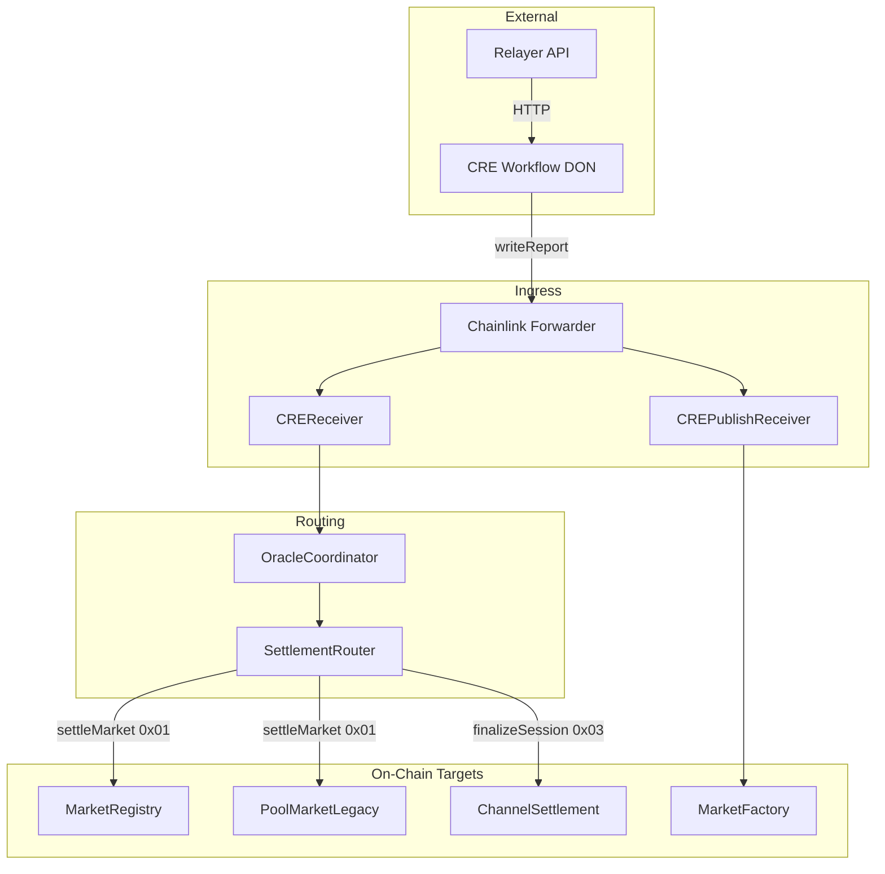

# CRE Workflow Architecture

High-level system architecture for the RetroPick Chainlink CRE workflow, relayer, and smart contracts.

## Overview

The workflow runs on the Chainlink DON (Decentralized Oracle Network). It responds to cron, HTTP, and EVM log triggers, fetches data (from feeds, relayer, or chain), and delivers reports on-chain via `evmClient.writeReport`. The Chainlink Forwarder executes the transaction and calls the configured receiver contract.

## Component Roles

| Component | Role |
|-----------|------|
| **CRE Workflow** | Orchestration: triggers, handlers, consensus, HTTP/chain reads, report encoding, `writeReport` |
| **Relayer** | Off-chain trading engine: session state, checkpoint build (operator + user sigs), finalize/cancel tx submission |
| **Chainlink Forwarder** | Transaction executor: receives DON-signed reports, calls receiver `onReport` |
| **CREReceiver** | Outcome and checkpoint ingress: routes by report prefix to OracleCoordinator |
| **CREPublishReceiver** | Publish-from-draft ingress: validates EIP-712, calls MarketFactory |
| **OracleCoordinator** | Routes validated results to SettlementRouter |
| **SettlementRouter** | Dispatches to MarketRegistry (settle) or ChannelSettlement (finalize) |
| **MarketRegistry** | V3 market registry, resolution, redeem |
| **ChannelSettlement** | V3 checkpoint submit, challenge window, finalize, cancel |
| **MarketFactory** | Market creation (direct feed reports or createFromDraft) |

## Topology



## Execution Lifecycle (Generic)

```
Trigger (cron/HTTP/EVM log) → Handler runs on DON
  → Capability calls (HTTP fetch, chain read)
  → Consensus across DON nodes
  → runtime.report + evmClient.writeReport(payload)
  → Forwarder receives tx
  → Forwarder calls receiver.onReport(metadata, payload)
  → Receiver routes by prefix
  → Target contract executes (resolve, submitCheckpoint, createFromDraft)
```

## Report Routing Table

| Report Prefix | Receiver | Internal Route | On-Chain Target |
|---------------|----------|----------------|-----------------|
| (none) | CREReceiver | submitResult | OracleCoordinator → SettlementRouter → MarketRegistry/PoolMarketLegacy |
| `0x03` | CREReceiver | submitSession | SettlementRouter → ChannelSettlement.submitCheckpointFromPayload |
| `0x04` | CREPublishReceiver | — | MarketFactory.createFromDraft |

## Forecasting Intelligence Engine

When `orchestration.enabled` is true, the workflow operates as a **Forecasting Intelligence Engine** rather than a simple feed-to-market pipeline. Key innovations:

- **Multi-source discovery** — `sources/registry.ts` fetches from news, GitHub, CoinGecko, Polymarket, and custom feeds; normalizes to `SourceObservation`.
- **Policy-first creation** — Deterministic rules (banned categories, language, resolution gates) decide ALLOW/REVIEW/REJECT; ML assists, policy controls.
- **Resolution-plan-driven settlement** — Settlement uses stored `ResolutionPlan` from draft time, not free-form AI prompts.

See [CREOrchestrationLayer.md](CREOrchestrationLayer.md) for the full spec.

## Workflow Handlers by Flow

| Flow | Handlers | Trigger |
|------|----------|---------|
| Discovery (orchestration) | onDiscoveryCron | Cron |
| Resolution (log) | onLogTrigger | EVM log (`SettlementRequested`) |
| Resolution (schedule) | onScheduleResolver | Cron |
| Checkpoint submit | onCheckpointSubmit | Cron |
| Checkpoint finalize | onCheckpointFinalize | Cron (finalize schedule) |
| Checkpoint cancel | onCheckpointCancel | Cron (cancel schedule) |
| Risk monitoring | onRiskCron | Cron (when monitoring.enabled) |
| Publish-from-draft | onHttpTrigger → publishFromDraft | HTTP |
| Legacy session | sessionSnapshot | Cron |
| Draft proposal | onDraftProposer | Cron |

## Workflow Repo Structure

Directory layout and file descriptions for `apps/workflow/`:

```
apps/workflow/
├── main.ts                    # Entry point: Runner, trigger registration, handler wiring
├── httpCallback.ts            # HTTP trigger router: publish-from-draft vs create-market
├── logCallback.ts             # (deprecated) Re-exports onLogTrigger for backward compat
├── gpt.ts                     # AI resolution: DeepSeek API, askGPTForOutcome, binary/categorical/timeline
│
├── config/                    # Config validation
│   └── schema.ts              # validateWorkflowConfig, shouldRegisterLogTrigger, shouldRegisterScheduleResolver, shouldRegisterRiskCron
│
├── domain/                    # Domain types
│   ├── candidate.ts           # SourceObservation, MarketObservation
│   ├── understanding.ts       # UnderstandingOutput
│   ├── evidence.ts            # EvidenceBundle, EvidenceLink
│   ├── resolutionPlan.ts      # ResolutionPlan, resolution modes
│   ├── draft.ts               # DraftArtifact
│   ├── draftRecord.ts         # DraftRecord, DraftStatus
│   ├── marketBrief.ts         # MarketBrief (L5 explainability)
│   ├── settlementArtifact.ts  # SettlementArtifact
│   └── ...
│
├── analysis/                  # Analysis core
│   ├── classify.ts            # L1: category, event type (LLM optional)
│   ├── riskScore.ts           # L2: risk scores (LLM optional)
│   ├── evidenceFetcher.ts     # Evidence fetch
│   ├── oracleability.ts       # L3: resolution source scoring
│   ├── unresolvedCheck.ts     # L3: unresolved-state verification
│   ├── buildResolutionPlan.ts # ResolutionPlan synthesis
│   ├── draftSynthesis.ts      # L4: canonical question, outcomes
│   ├── explain.ts             # L5: generateMarketBrief
│   ├── settlementInference.ts # L6: inferSettlement
│   └── ...
│
├── policy/                    # Policy engine
│   ├── evaluate.ts            # Policy evaluation (ALLOW/REVIEW/REJECT)
│   ├── bannedCategories.ts    # Category rules
│   ├── bannedTerms.ts         # HARD_BANNED_TERMS, GAMBLING_TERMS
│   ├── sourceTrust.ts         # Source-type base trust
│   └── thresholds.ts           # Configurable thresholds
│
├── models/                    # ML provider layer
│   ├── interfaces.ts          # LlmProvider, EmbeddingProvider, VerifierProvider
│   ├── providers/              # llmProvider, embeddingProvider, verifierProvider
│   └── prompts/                # classify, risk, draft, explain, settle prompts
│
├── types/
│   ├── config.ts              # WorkflowConfig, ResolutionMode
│   └── feed.ts                # FeedConfig, FeedItem, MarketInput, FeedType
│
├── pipeline/                  # Active handlers (primary implementation)
│   ├── orchestration/
│   │   ├── analyzeCandidate.ts  # Analysis core entrypoint
│   │   └── discoveryCron.ts     # Multi-source discovery → analyzeCandidate → policy → draft/create
│   ├── resolution/
│   │   ├── logTrigger.ts       # EVM log → resolveFromPlan → writeReport
│   │   ├── scheduleResolver.ts # Cron → resolveFromPlan → writeReport
│   │   ├── resolveFromPlan.ts   # Load plan, call resolutionExecutor
│   │   ├── resolutionExecutor.ts # deterministic, multi_source_deterministic, ai_assisted, human_review
│   │   └── llmConsensus.ts     # Multi-LLM consensus for ai_assisted
│   ├── checkpoint/
│   │   ├── checkpointSubmit.ts   # GET /health, /cre/checkpoints → POST build → writeReport(0x03)
│   │   ├── checkpointFinalize.ts # POST /cre/finalize/:sessionId (relayer submits tx)
│   │   └── checkpointCancel.ts   # POST /cre/cancel/:sessionId (relayer submits tx)
│   ├── creation/
│   │   ├── scheduleTrigger.ts   # Legacy: Feeds → generateMarketInput → createMarkets
│   │   ├── marketCreator.ts    # encode + writeReport to marketFactoryAddress
│   │   ├── publishFromDraft.ts # encodePublishReport(0x04) → writeReport to CREPublishReceiver
│   │   ├── draftProposer.ts    # Polymarket Gamma API → proposeDraft (direct RPC)
│   │   ├── draftWriter.ts      # writeDraftRecord, markDraftPublished
│   │   └── publishRevalidation.ts # revalidateForPublish before publish
│   ├── persistence/
│   │   ├── draftRepository.ts  # DraftRecord storage
│   │   └── resolutionPlanStore.ts # ResolutionPlan storage
│   ├── audit/
│   │   └── auditLogger.ts      # logDraftDecision, logSettlementArtifact
│   ├── privacy/               # Privacy-preserving extensions
│   │   ├── controlledRelease.ts
│   │   ├── confidentialFetch.ts
│   │   ├── eligibilityCheck.ts
│   │   └── privacyRouter.ts
│   └── monitoring/            # Risk monitoring
│       ├── riskCron.ts
│       └── ...
│
├── jobs/                      # Thin wrappers (deprecated; re-export pipeline)
│   ├── checkpointSubmit.ts    # → pipeline/checkpoint/checkpointSubmit
│   ├── checkpointFinalize.ts   # → pipeline/checkpoint/checkpointFinalize
│   ├── marketCreator.ts        # → pipeline/creation/marketCreator
│   ├── scheduleTrigger.ts     # → pipeline/creation/scheduleTrigger
│   └── sessionSnapshot.ts     # Legacy: yellowSessions → 0x03 payload → CREReceiver
│
├── contracts/                 # On-chain clients and report encoding
│   ├── reportFormats.ts       # encodeOutcomeReport, encodePublishReport, DraftPublishParams
│   ├── poolMarketLegacy.ts    # PoolMarketLegacy ABI: getMarket, marketType, getCategoricalOutcomes, getTimelineWindows
│   ├── marketRegistry.ts     # MarketRegistry ABI: getMarket, marketType, outcomes, timeline
│   ├── publishFromDraft.ts    # EIP-712 computeParamsHash, typed data for PublishFromDraft
│   └── draftBoardClient.ts   # proposeDraft, computeQuestionHash, computeOutcomesHash (direct RPC)
│
├── sources/                   # External data feeds
│   ├── coinGecko.ts           # CoinGecko price API → price-based questions
│   ├── newsAPI.ts             # News API → questionTemplate + valuePath
│   ├── githubTrends.ts        # GitHub trends → repo/trend questions
│   ├── polymarketEvents.ts    # Polymarket Gamma API → events as drafts
│   └── customFeeds.ts         # Custom URL fetch → questionTemplate + valuePath
│
├── builders/                  # Data transformation and validation
│   ├── generateMarket.ts     # FeedItem → MarketInput (externalId hash, validate)
│   ├── schemaValidator.ts    # validateFeedConfig, validateFeedItem, validateMarketInput
│   └── buildFinalStateRequest.ts # SessionPayloadInput → 0x03-prefixed ABI (legacy session)
│
├── utils/
│   ├── http.ts                # httpJsonRequest: CRE HTTPClient + consensusIdenticalAggregation
│   └── jsonPath.ts            # getValueByPath: dot-notation JSON extraction for feeds
│
├── test/                      # Tests
│   ├── integration.test.ts   # Unit/integration tests
│   └── e2e/
│       └── workflowE2E.test.ts # End-to-end workflow tests
│
├── config.example.json        # Example config
├── config.staging.json        # Staging config
├── config.production.json     # Production config
└── docs/                      # Documentation (see DOCUMENTATION.md)
```

### Key Files by Responsibility

| File | Responsibility |
|------|----------------|
| **gpt.ts** | AI outcome resolution. `GPTService.askGPTForOutcome(question, marketType, outcomes?, timelineWindows?)` — DeepSeek API (`api.deepseek.com/v1/chat/completions`), model `gptModel` or `deepseek-chat`. Binary: `{"result":"YES"|"NO","confidence":0-10000}`; categorical/timeline: `{"outcomeIndex":0..N-1,"confidence":0-10000}`. System prompts per market type. Key: `DEEPSEEK_API_KEY` or `config.deepseekApiKey`. `consensusIdenticalAggregation` for DON consensus. Mock: `useMockAi` / `mockAiResponse`. |
| **httpCallback.ts** | Routes HTTP payloads: `draftId`+`creator`+`params`+`claimerSig` → publishFromDraft; `question` → createMarkets. |
| **contracts/reportFormats.ts** | `encodeOutcomeReport(market, marketId, outcomeIndex, confidence)` — no prefix; `encodePublishReport(draftId, creator, params, claimerSig)` — 0x04 prefix. |
| **contracts/poolMarketLegacy.ts** | Read market from PoolMarketLegacy for log-trigger resolution. |
| **contracts/marketRegistry.ts** | Read market from MarketRegistry for schedule resolution. |
| **contracts/draftBoardClient.ts** | `proposeDraft` via direct RPC (viem); used by draftProposer. Requires `AI_ORACLE_ROLE`. |
| **utils/http.ts** | `httpJsonRequest(runtime, { url, method, headers, body })` — CRE HTTP capability with consensus. |
| **utils/jsonPath.ts** | `getValueByPath(obj, "a.b.c")` — used by feeds to extract values from API responses. |
| **sources/*.ts** | Each fetches from external API and returns `FeedItem[]`; `scheduleTrigger` dispatches by `feed.type`. |
| **builders/generateMarket.ts** | `generateMarketInput(feedItem, requestedBy)` — validates, hashes externalId, produces MarketInput. |
| **builders/buildFinalStateRequest.ts** | Legacy session: encodes 0x03-prefixed payload for SessionFinalizer path. |

### gpt.ts (AI Resolution) — Detailed

Market outcome resolution via DeepSeek. Used by `logTrigger.ts` and `scheduleResolver.ts`.

| Aspect | Detail |
|--------|--------|
| **API** | `https://api.deepseek.com/v1/chat/completions` |
| **Model** | `config.gptModel` or default `deepseek-chat` |
| **Key** | CRE secret `DEEPSEEK_API_KEY` or `config.deepseekApiKey` |
| **Consensus** | `consensusIdenticalAggregation<GPTResponse>` — DON nodes must return identical response |
| **Mock** | `useMockAi: true` skips API; uses `mockAiResponse` (e.g. `{"result":"YES","confidence":10000}`) |

**Binary (marketType 0):** System prompt enforces `{"result":"YES"|"NO","confidence":0-10000}`. Maps YES→0, NO→1.

**Categorical (marketType 1):** User prompt includes `question` + `outcomes` array. AI returns `{"outcomeIndex":0..N-1,"confidence":0-10000}`.

**Timeline (marketType 2):** User prompt includes `question` + `timelineWindows`. AI returns window index.

**Flow:** `askGPTForOutcome()` → `askGPT()` or `askGPTWithPrompt()` → `buildGPTRequest` / `buildGPTRequestTyped` → HTTP POST (base64 body) → `handleDeepSeekResponse` → `parseOutcome` / `parseTypedOutcome`.

**Resolution Executor & Multi-LLM Consensus:** When a `ResolutionPlan` exists (loaded from `resolutionPlanStore`), resolution uses `resolutionExecutor` instead of direct `askGPTForOutcome`. Modes: **deterministic** (official_api / onchain_event fetchers + predicate evaluator), **multi_source_deterministic** (fetch all primarySources, majority wins), **ai_assisted** (delegates to `llmConsensus` with configurable multi-LLM providers), **human_review** (halt, log artifact with `reviewRequired`). See [AIDrivenLayerEvent.md](AIDrivenLayerEvent.md).

### Data Flow Summary

| Flow | Entry | Key Files | Exit |
|------|-------|-----------|------|
| **Discovery (orchestration)** | Cron | `discoveryCron.ts` → `sources/registry` → `analyzeCandidate` → policy → `draftWriter` / `createMarkets` | DraftRepository or MarketFactory |
| **Resolution (log)** | EVM log | `logTrigger.ts` → `resolveFromPlan` → `resolutionExecutor` → `reportFormats.ts` | CREReceiver |
| **Resolution (schedule)** | Cron | `scheduleResolver.ts` → `resolveFromPlan` → `resolutionExecutor` → `reportFormats.ts` | CREReceiver |
| **Checkpoint submit** | Cron | `checkpointSubmit.ts` → `utils/http.ts` (relayer) | CREReceiver (0x03) |
| **Checkpoint finalize/cancel** | Cron | `checkpointFinalize.ts` / `checkpointCancel.ts` → `utils/http.ts` | Relayer submits tx |
| **Feed creation** | Cron | `scheduleTrigger.ts` → `sources/*` → `generateMarket.ts` → `marketCreator.ts` | MarketFactory |
| **Publish-from-draft** | HTTP | `httpCallback.ts` → `publishFromDraft.ts` → `reportFormats.ts` | CREPublishReceiver (0x04) |
| **Draft proposer** | Cron | `draftProposer.ts` → `polymarketEvents.ts` → `draftBoardClient.ts` | Direct RPC to MarketDraftBoard |

## References

- [packages/contracts/docs/abi/docs/cre/CREPipelineDiagram.md](../../packages/contracts/docs/abi/docs/cre/CREPipelineDiagram.md) — Contract-level pipeline diagrams
- [packages/contracts/docs/IntegrationMatrix.md](../../packages/contracts/docs/IntegrationMatrix.md) — Report types and ingress chain
- [HandlersReference](HandlersReference.md) — Per-handler details
