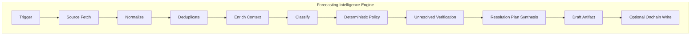

# CRE Orchestration Layer

The CRE Orchestration Layer transforms the workflow from a simple **feed-to-market pipeline** into a **Forecasting Intelligence Engine**. When `orchestration.enabled` is true, the workflow runs a full analysis pipeline before any market creation or draft proposal.

## Overview

Key innovations:

- **Multi-source discovery** — News, GitHub, CoinGecko, Polymarket, protocol blogs, and custom feeds; normalized to `SourceObservation`
- **Policy-first creation** — Deterministic rules (banned categories, language, resolution gates) decide ALLOW/REVIEW/REJECT; ML assists, policy controls
- **Resolution-first drafting** — No draft without trusted resolution sources, method, and unresolved-state proof
- **Resolution-plan-driven settlement** — Settlement uses stored `ResolutionPlan` from draft time, not free-form AI prompts
- **Auditability** — Structured artifacts: evidence, classifier outputs, policy reasons, resolution plan, audit trail

## Layered Architecture

```
Trigger Layer (cron, HTTP, EVM log)
    ↓
Source Adapter Layer (sources/registry, normalize to SourceObservation)
    ↓
Analysis Layer (normalize, enrich, classify, risk, evidence, oracleability, unresolved)
    ↓
Deterministic Policy Layer (evaluate → ALLOW | REVIEW | REJECT)
    ↓
Draft Artifact Layer (DraftArtifact with resolution plan)
    ↓
Onchain Execution Layer (reportFormats, marketCreator, publishFromDraft)
```

## Target Model Flow



## Key Components

| Component | Location | Purpose |
|-----------|----------|---------|
| **analyzeCandidate** | [pipeline/orchestration/analyzeCandidate.ts](../pipeline/orchestration/analyzeCandidate.ts) | Analysis core entrypoint: classify, risk, evidence, oracleability, unresolved check, resolution plan, draft synthesis |
| **discoveryCron** | [pipeline/orchestration/discoveryCron.ts](../pipeline/orchestration/discoveryCron.ts) | Cron handler: fetch from registry → dedupe → analyzeCandidate per observation → policy → draft/create |
| **sources/registry** | [sources/registry.ts](../sources/registry.ts) | Dispatches by feed type; returns `SourceObservation[]` |
| **SourceObservation** | [domain/candidate.ts](../domain/candidate.ts) | Canonical schema: sourceType, sourceId, externalId, title, body, url, tags, eventTime, raw |

## Data Flow

1. **Fetch** — `fetchObservationsFromRegistry(runtime)` fetches from all configured feeds (coinGecko, newsAPI, githubTrends, polymarket, custom)
2. **Dedupe** — Observations deduplicated by `externalId`
3. **Analyze** — For each observation: `analyzeCandidate(runtime, obs)` runs the full pipeline
4. **Policy** — `evaluatePolicy` returns ALLOW, REVIEW, or REJECT
5. **Output** — ALLOW: create market or (when `draftingPipeline`) write draft; REVIEW/REJECT: audit only

## Build Phases (from Upgrade Plan)

| Phase | Scope | Key Deliverables |
|-------|-------|------------------|
| **Phase 1** | Source registry + discovery cron | discoveryCron, source registry, SourceObservation schema |
| **Phase 2** | Analysis core | analyzeCandidate, normalize, enrich, classify, policy, unresolved check, resolution plan |
| **Phase 3** | HTTP proposal integration | httpCallback routes proposals through analyzeCandidate |
| **Phase 4** | Multi-source draft proposer | draftProposer uses analysis core; Polymarket as one source |
| **Phase 5** | Resolution from plan | logTrigger/scheduleResolver use stored ResolutionPlan |

## Implementation Status

| Component | Status | File |
|-----------|--------|------|
| Discovery cron | Implemented | [discoveryCron.ts](../pipeline/orchestration/discoveryCron.ts) |
| analyzeCandidate | Implemented | [analyzeCandidate.ts](../pipeline/orchestration/analyzeCandidate.ts) |
| Source registry | Implemented | [sources/registry.ts](../sources/registry.ts) |
| HTTP callback integration | Implemented | [httpCallback.ts](../httpCallback.ts) |
| Draft proposer | Implemented | [draftProposer.ts](../pipeline/creation/draftProposer.ts) |

## Configuration

| Field | Purpose |
|-------|---------|
| `orchestration.enabled` | Enable CRE Orchestration Layer (discoveryCron, analyzeCandidate, policy engine) |
| `orchestration.draftingPipeline` | When true: ALLOW creates DraftRecord (PENDING_CLAIM) instead of direct createMarkets |

## Related Docs

- [MarketDraftingPipelineLayer](MarketDraftingPipelineLayer.md) — Two-phase draft → publish flow
- [SafetyAndComplienceLayer](SafetyAndComplienceLayer.md) — Policy engine, resolution certainty
- [MLModels](MLModels.md) — L1–L6 analysis layers
