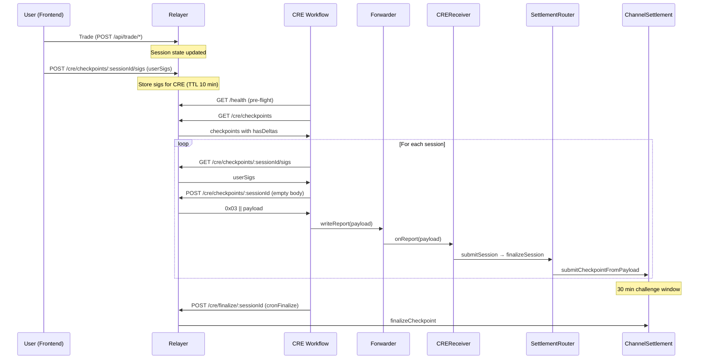

# Checkpoint Flow

V3 checkpoint lifecycle: submit via CRE, 30 min challenge window, finalize (or cancel if stuck). The relayer builds signed payloads; the CRE workflow fetches and delivers on-chain.

## Overview

1. **Submit:** CRE cron → GET /cre/checkpoints → POST /cre/checkpoints/:sessionId → writeReport(0x03 payload) → CREReceiver → ChannelSettlement.submitCheckpointFromPayload
2. **Challenge window:** 30 minutes; users can challenge with newer nonce; finalizeCheckpoint reverts during window
3. **Finalize:** After 30 min, CRE cron → POST /cre/finalize/:sessionId → relayer submits finalizeCheckpoint tx
4. **Cancel:** After 6 hr (CANCEL_DELAY), CRE cron → POST /cre/cancel/:sessionId → relayer submits cancelPendingCheckpoint (releases stuck reserves)

## Flow Diagram

## Handler Mapping

| Handler | Cron | Purpose |
|---------|------|---------|
| onCheckpointSubmit | cronSchedule | Poll relayer, build payload, writeReport to CREReceiver |
| onCheckpointFinalize | cronScheduleFinalize | POST /cre/finalize/:sessionId (relayer submits tx) |
| onCheckpointCancel | cronScheduleCancel | POST /cre/cancel/:sessionId (relayer submits tx) |

## Stored Sigs Flow

The CRE workflow **does not** collect user signatures directly. The frontend must:

1. Prompt users to sign the checkpoint digest (EIP-712).
2. POST user signatures to `POST /cre/checkpoints/:sessionId/sigs` before the CRE cron runs.

When onCheckpointSubmit runs:

1. GET /cre/checkpoints/:sessionId/sigs — fetches stored sigs (returns 404 if none).
2. POST /cre/checkpoints/:sessionId with **empty body** — relayer falls back to stored sigs when body has no `userSigs`.
3. If no stored sigs and no userSigs in body → relayer returns 400 or invalid payload → CRE skips session.

## Submit Details (onCheckpointSubmit)

**Source:** [pipeline/checkpoint/checkpointSubmit.ts](../pipeline/checkpoint/checkpointSubmit.ts)

1. **Pre-flight:** GET /health — if `ok != true` or error → return early ("Relayer unhealthy" / "Relayer unreachable").
2. **List:** GET /cre/checkpoints → filter `hasDeltas: true`.
3. **For each session:**
   - Optionally GET /cre/checkpoints/:sessionId/sigs (to check; CRE always POSTs with empty body).
   - POST /cre/checkpoints/:sessionId with `body: {}`.
   - If payload invalid or not starting with `0x03` → skip.
   - `runtime.report` + `evmClient.writeReport(receiver: creReceiverAddress)`.
   - On TxStatus.SUCCESS → log txHash.

## Finalize Details (onCheckpointFinalize)

**Source:** [pipeline/checkpoint/checkpointFinalize.ts](../pipeline/checkpoint/checkpointFinalize.ts)

1. GET /cre/checkpoints → filter `hasDeltas: true`.
2. For each session: POST /cre/finalize/:sessionId.
3. Relayer submits `finalizeCheckpoint(marketId, sessionId, deltas)` to ChannelSettlement.
4. Idempotent: 400 if challenge window not elapsed or no pending checkpoint.

## Cancel Details (onCheckpointCancel)

**Source:** [pipeline/checkpoint/checkpointCancel.ts](../pipeline/checkpoint/checkpointCancel.ts)

1. GET /cre/checkpoints → filter `hasDeltas: true`.
2. For each session: POST /cre/cancel/:sessionId.
3. Relayer submits `cancelPendingCheckpoint(marketId, sessionId)`.
4. Valid only after CANCEL_DELAY (6 hours) from pending `createdAt`.
5. Idempotent: 400 if CANCEL_DELAY not elapsed or no pending.

## Config

| Field | Purpose |
|-------|---------|
| `relayerUrl` | Base URL for CRE endpoints |
| `creReceiverAddress` | CREReceiver for writeReport (submit only) |
| `cronSchedule` | Checkpoint submit cron |
| `cronScheduleFinalize` | Finalize cron |
| `cronScheduleCancel` | Cancel cron |

## References

- [RelayerIntegration](RelayerIntegration.md) — Endpoint usage
- [Relayer CRE API Reference](../relayer/docs/development/cre/API_REFERENCE.md) — Full endpoint specs
- [packages/contracts/docs/abi/docs/cre/CREWorkflowCheckpoints.md](../../packages/contracts/docs/abi/docs/cre/CREWorkflowCheckpoints.md)
