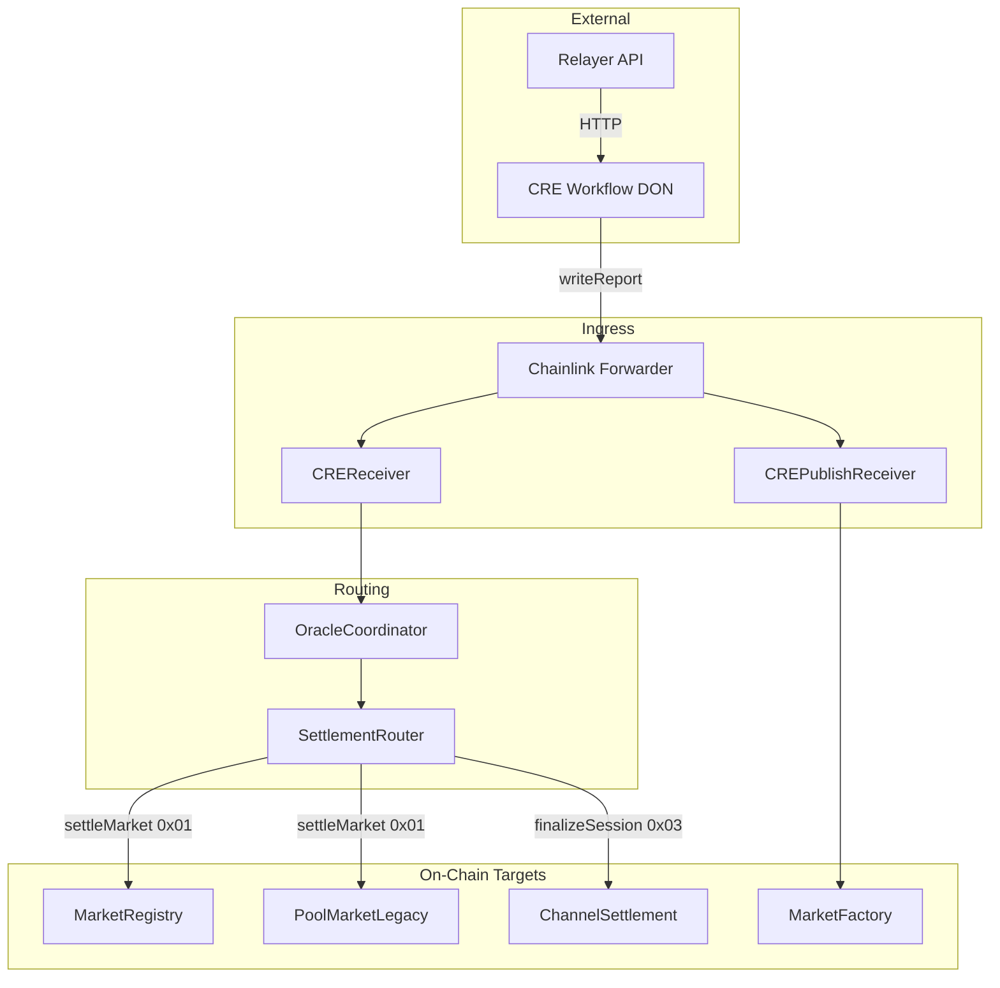
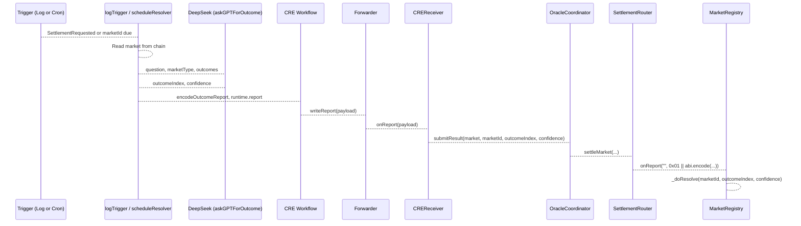
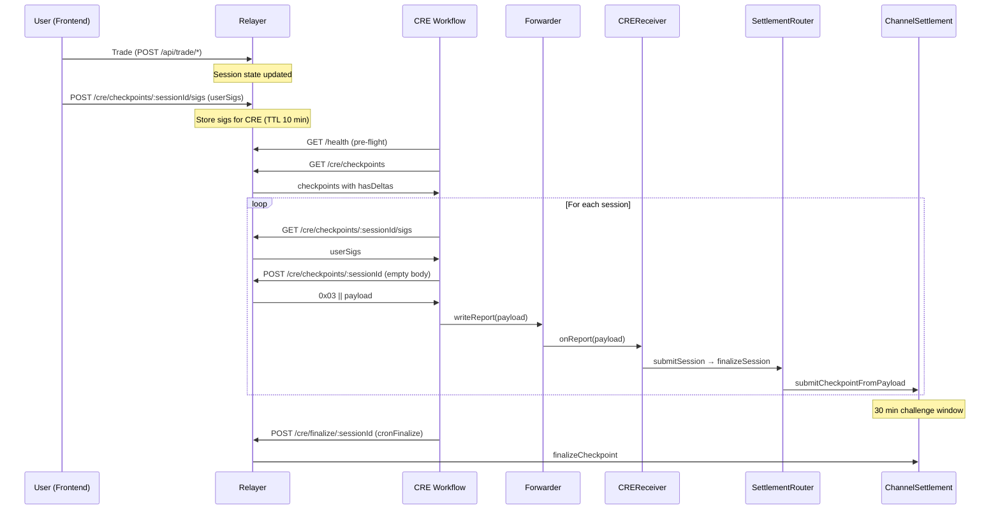

# CRE Workflow Documentation

Comprehensive documentation for the RetroPick Chainlink CRE (Request-and-Execute) workflow. This workflow orchestrates market creation, session finalization, checkpoint settlement, and market resolution via the Chainlink Forwarder.

---

## Table of Contents

1. [Quick Start](#quick-start)
2. [Prerequisites](#prerequisites)
3. [Key Concepts](#key-concepts)
4. [Layer Architecture Summary](#layer-architecture-summary)
5. [Architecture](#architecture)
6. [Configuration](#configuration)
7. [Handlers Reference](#handlers-reference)
8. [Resolution Flow](#resolution-flow)
9. [Checkpoint Flow](#checkpoint-flow)
10. [Relayer Integration](#relayer-integration)
11. [Contract Integration](#contract-integration)
12. [Creation Flows](#creation-flows)
13. [Forecasting Intelligence Engine Layers](#forecasting-intelligence-engine-layers)
14. [Troubleshooting](#troubleshooting)

---

## Quick Start

1. **Install:** `cd apps/workflow && bun install`
2. **Config:** Copy `config.example.json` to `config.staging.json` or `config.production.json`
3. **Simulate:** From project root: `cre workflow simulate ./apps/workflow --target=staging-settings`

---

## Prerequisites

- **Relayer:** [apps/relayer](../relayer) — Session state, checkpoint build, finalize/cancel. See [Relayer CRE API](../relayer/docs/development/cre/API_REFERENCE.md)
- **Contracts:** [packages/contracts](../../packages/contracts) — CREReceiver, ChannelSettlement, MarketRegistry. See [CRE docs](../../packages/contracts/docs/abi/docs/cre/)

---

## Key Concepts

- **CRE Workflow:** Chainlink DON-run workflow with cron, HTTP, and log triggers
- **CREReceiver:** On-chain entrypoint for outcome reports (resolution) and checkpoint reports (0x03)
- **CREPublishReceiver:** Separate entrypoint for publish-from-draft (market creation)
- **Relayer:** Off-chain trading engine; builds checkpoint payloads; CRE fetches and delivers on-chain

---

## Layer Architecture Summary

When `orchestration.enabled` is true, the workflow operates as a **Forecasting Intelligence Engine** composed of layered subsystems. Each layer has a dedicated spec document:

| Layer | Description | Status | Doc |
|-------|-------------|--------|-----|
| **CRE Orchestration** | Multi-source discovery, analysis core, policy-first creation | Implemented | [CREOrchestrationLayer.md](CREOrchestrationLayer.md) |
| **Market Drafting Pipeline** | Two-phase publication: Draft Generation → User Claim & Publish | Implemented | [MarketDraftingPipelineLayer.md](MarketDraftingPipelineLayer.md) |
| **Safety & Compliance** | Policy engine, banned categories/terms, resolution certainty, audit | Implemented | [SafetyAndComplienceLayer.md](SafetyAndComplienceLayer.md) |
| **ML Models** | 7-layer stack (L0–L6): classify, risk, oracleability, draft synthesis, explainability, settlement | Implemented | [MLModels.md](MLModels.md) |
| **AI Event-Driven** | Deterministic resolution, multi-LLM consensus, settlement artifacts | Implemented | [AIDrivenLayerEvent.md](AIDrivenLayerEvent.md) |
| **Risk Monitoring** | Live-market risk monitoring, compliance enforcement | Implemented | [RiskMonitoringCOmplience.md](RiskMonitoringCOmplience.md) |
| **Privacy Extensions** | Confidential fetch, eligibility gating, controlled release | Partial | [RiskPrivacyExtension.md](RiskPrivacyExtension.md) |

### High-Level Data Flow (Orchestration Enabled)

```
Trigger (cron/HTTP/log)
  → Orchestration (discoveryCron, analyzeCandidate)
  → Analysis (ML: classify, risk, evidence, oracleability, draft synthesis)
  → Policy (Safety: ALLOW/REVIEW/REJECT)
  → Draft Artifact (Market Drafting: writeDraftRecord or createMarkets)
  → Resolution (AI Event-Driven: resolutionExecutor, llmConsensus)
  → Onchain (writeReport)
```

When `orchestration.enabled` is true, `discoveryCron` is the primary creation entry; it fetches from the source registry, dedupes, runs `analyzeCandidate` per observation, and either `writeDraftRecord` (when `draftingPipeline` is true) or `createMarkets` for ALLOW items. Resolution uses `resolveFromPlan` → `resolutionExecutor` (deterministic, multi_source_deterministic, ai_assisted, human_review); `onRiskCron` runs live-market monitoring when `monitoring.enabled` is true.

### Legacy Data Flow (Orchestration Disabled)

```
Cron (scheduleTrigger)
  → Feeds → fetchFeed → generateMarketInput → createMarkets
  → writeReport to MarketFactory
```

When orchestration is disabled, the legacy path uses `scheduleTrigger` to fetch from feeds and create markets directly.

---

## Architecture

High-level system architecture for the RetroPick Chainlink CRE workflow, relayer, and smart contracts.

### Overview

The workflow runs on the Chainlink DON (Decentralized Oracle Network). It responds to cron, HTTP, and EVM log triggers, fetches data (from feeds, relayer, or chain), and delivers reports on-chain via `evmClient.writeReport`. The Chainlink Forwarder executes the transaction and calls the configured receiver contract.

### Component Roles

| Component | Role |
|-----------|------|
| **CRE Workflow** | Orchestration: triggers, handlers, consensus, HTTP/chain reads, report encoding, `writeReport` |
| **Relayer** | Off-chain trading engine: session state, checkpoint build (operator + user sigs), finalize/cancel tx submission |
| **Chainlink Forwarder** | Transaction executor: receives DON-signed reports, calls receiver `onReport` |
| **CREReceiver** | Outcome and checkpoint ingress: routes by report prefix to OracleCoordinator |
| **CREPublishReceiver** | Publish-from-draft ingress: validates EIP-712, calls MarketFactory |
| **OracleCoordinator** | Routes validated results to SettlementRouter |
| **SettlementRouter** | Dispatches to MarketRegistry (settle) or ChannelSettlement (finalize) |
| **MarketRegistry** | V3 market registry, resolution, redeem |
| **ChannelSettlement** | V3 checkpoint submit, challenge window, finalize, cancel |
| **MarketFactory** | Market creation (direct feed reports or createFromDraft) |

### Topology



### Execution Lifecycle (Generic)

```
Trigger (cron/HTTP/EVM log) → Handler runs on DON
  → Capability calls (HTTP fetch, chain read)
  → Consensus across DON nodes
  → runtime.report + evmClient.writeReport(payload)
  → Forwarder receives tx
  → Forwarder calls receiver.onReport(metadata, payload)
  → Receiver routes by prefix
  → Target contract executes (resolve, submitCheckpoint, createFromDraft)
```

### Report Routing Table

| Report Prefix | Receiver | Internal Route | On-Chain Target |
|---------------|----------|----------------|-----------------|
| (none) | CREReceiver | submitResult | OracleCoordinator → SettlementRouter → MarketRegistry/PoolMarketLegacy |
| `0x03` | CREReceiver | submitSession | SettlementRouter → ChannelSettlement.submitCheckpointFromPayload |
| `0x04` | CREPublishReceiver | — | MarketFactory.createFromDraft |

### Resolution Pipeline

When `orchestration.enabled` is true and a stored `ResolutionPlan` exists, resolution flows through [resolveFromPlan.ts](../pipeline/resolution/resolveFromPlan.ts) → [resolutionExecutor.ts](../pipeline/resolution/resolutionExecutor.ts), which routes by `resolutionPlan.resolutionMode`:

| Mode | Behavior |
|------|----------|
| `deterministic` | Fetch from `official_api` or `onchain_event` source; evaluate `resolutionPredicate`; return outcome |
| `multi_source_deterministic` | Fetch all primary sources; majority wins; fallback to fallback sources if needed |
| `ai_assisted` | Delegate to [llmConsensus.ts](../pipeline/resolution/llmConsensus.ts) — multi-LLM parallel execution, quorum rules |
| `human_review` | Return `REVIEW_REQUIRED`; artifact stored, no `writeReport` |

The executor validates the result (outcomeIndex in range, confidence >= minThreshold) and produces a `SettlementArtifact` before `writeReport`. See [Resolution Flow](#resolution-flow) and [AIDrivenLayerEvent.md](AIDrivenLayerEvent.md).

### Workflow Handlers by Flow

| Flow | Handlers | Trigger |
|------|----------|---------|
| Discovery (orchestration) | onDiscoveryCron | Cron |
| Resolution (log) | onLogTrigger | EVM log (`SettlementRequested`) |
| Resolution (schedule) | onScheduleResolver | Cron |
| Checkpoint submit | onCheckpointSubmit | Cron |
| Checkpoint finalize | onCheckpointFinalize | Cron (finalize schedule) |
| Checkpoint cancel | onCheckpointCancel | Cron (cancel schedule) |
| Risk monitoring | onRiskCron | Cron (monitoring.cronSchedule) |
| Publish-from-draft | onHttpTrigger → publishFromDraft | HTTP |
| Legacy session | sessionSnapshot | Cron |
| Draft proposal | onDraftProposer | Cron |

### Workflow Repo Structure

Directory layout and file descriptions for `apps/workflow/`:

```
apps/workflow/
├── main.ts                    # Entry point: Runner, trigger registration, handler wiring
├── httpCallback.ts            # HTTP trigger router: publish-from-draft vs create-market
├── logCallback.ts             # (deprecated) Re-exports onLogTrigger for backward compat
├── gpt.ts                     # AI resolution: DeepSeek API, askGPTForOutcome, binary/categorical/timeline
│
├── config/                    # Config validation
│   └── schema.ts              # validateWorkflowConfig, shouldRegisterLogTrigger, shouldRegisterScheduleResolver, shouldRegisterRiskCron
│
├── types/
│   ├── config.ts              # WorkflowConfig, ResolutionMode
│   └── feed.ts                # FeedConfig, FeedItem, MarketInput, FeedType
│
├── pipeline/                  # Active handlers (primary implementation)
│   ├── resolution/
│   │   ├── logTrigger.ts      # EVM log SettlementRequested → resolveFromPlan → writeReport
│   │   ├── scheduleResolver.ts # Cron poll marketIds → resolveFromPlan → writeReport
│   │   ├── resolveFromPlan.ts  # Load ResolutionPlan, call resolutionExecutor, return SettlementArtifact
│   │   ├── resolutionExecutor.ts # Routes by resolutionPlan.resolutionMode (deterministic, ai_assisted, human_review)
│   │   └── llmConsensus.ts    # Multi-LLM parallel execution and consensus for ai_assisted mode
│   ├── checkpoint/
│   │   ├── checkpointSubmit.ts   # GET /health, /cre/checkpoints → POST build → writeReport(0x03)
│   │   ├── checkpointFinalize.ts # POST /cre/finalize/:sessionId (relayer submits tx)
│   │   └── checkpointCancel.ts   # POST /cre/cancel/:sessionId (relayer submits tx)
│   └── creation/
│       ├── scheduleTrigger.ts   # Feeds → fetchFeed → generateMarketInput → createMarkets
│       ├── marketCreator.ts     # encode + writeReport to marketFactoryAddress
│       ├── publishFromDraft.ts  # encodePublishReport(0x04) → writeReport to CREPublishReceiver
│       ├── draftWriter.ts       # writeDraftRecord, markDraftClaimed, markDraftPublished (DraftRepository)
│       ├── publishRevalidation.ts # revalidateForPublish — draft freshness, params match, unresolved
│       └── draftProposer.ts     # Polymarket Gamma API → proposeDraft (direct RPC)
│
├── jobs/                      # Thin wrappers (deprecated; re-export pipeline)
│   ├── checkpointSubmit.ts    # → pipeline/checkpoint/checkpointSubmit
│   ├── checkpointFinalize.ts   # → pipeline/checkpoint/checkpointFinalize
│   ├── marketCreator.ts        # → pipeline/creation/marketCreator
│   ├── scheduleTrigger.ts      # → pipeline/creation/scheduleTrigger
│   └── sessionSnapshot.ts     # Legacy: yellowSessions → 0x03 payload → CREReceiver
│
├── contracts/                 # On-chain clients and report encoding
│   ├── reportFormats.ts       # encodeOutcomeReport, encodePublishReport, DraftPublishParams
│   ├── poolMarketLegacy.ts    # PoolMarketLegacy ABI: getMarket, marketType, getCategoricalOutcomes, getTimelineWindows
│   ├── marketRegistry.ts     # MarketRegistry ABI: getMarket, marketType, outcomes, timeline
│   ├── publishFromDraft.ts    # EIP-712 computeParamsHash, typed data for PublishFromDraft
│   └── draftBoardClient.ts   # proposeDraft, computeQuestionHash, computeOutcomesHash (direct RPC)
│
├── sources/                   # External data feeds
│   ├── coinGecko.ts           # CoinGecko price API → price-based questions
│   ├── newsAPI.ts             # News API → questionTemplate + valuePath
│   ├── githubTrends.ts        # GitHub trends → repo/trend questions
│   ├── polymarketEvents.ts    # Polymarket Gamma API → events as drafts
│   └── customFeeds.ts         # Custom URL fetch → questionTemplate + valuePath
│
├── builders/                  # Data transformation and validation
│   ├── generateMarket.ts     # FeedItem → MarketInput (externalId hash, validate)
│   ├── schemaValidator.ts    # validateFeedConfig, validateFeedItem, validateMarketInput
│   └── buildFinalStateRequest.ts # SessionPayloadInput → 0x03-prefixed ABI (legacy session)
│
├── utils/
│   ├── http.ts                # httpJsonRequest: CRE HTTPClient + consensusIdenticalAggregation
│   └── jsonPath.ts            # getValueByPath: dot-notation JSON extraction for feeds
│
├── test/                      # Tests
│   ├── integration.test.ts   # Unit/integration tests
│   └── e2e/
│       └── workflowE2E.test.ts # End-to-end workflow tests
│
├── domain/                    # Domain types (candidate, understanding, evidence, resolutionPlan, draft, draftRecord, marketBrief, settlementArtifact)
├── analysis/                  # Analysis core (classify, riskScore, oracleability, unresolvedCheck, buildResolutionPlan, draftSynthesis, explain, settlementInference)
├── policy/                    # Policy engine (evaluate, bannedCategories, bannedTerms, sourceTrust, thresholds)
├── models/                    # ML providers (interfaces, providers, prompts)
├── pipeline/orchestration/    # analyzeCandidate, discoveryCron
├── pipeline/privacy/          # controlledRelease, confidentialFetch, eligibilityCheck, privacyRouter
├── pipeline/monitoring/      # riskCron, collectMetrics, applyEnforcement
├── docs/                      # Documentation (this folder; layer specs: CREOrchestrationLayer, MLModels, etc.)
├── config.example.json        # Example config
├── config.staging.json        # Staging config
├── config.production.json     # Production config
└── docs/                      # Documentation (see DOCUMENTATION.md)
```

#### Key Files by Responsibility

| File | Responsibility |
|------|----------------|
| **gpt.ts** | AI outcome resolution. `GPTService.askGPTForOutcome(question, marketType, outcomes?, timelineWindows?)` — DeepSeek API (`api.deepseek.com/v1/chat/completions`), model `gptModel` or `deepseek-chat`. Binary: `{"result":"YES"|"NO","confidence":0-10000}`; categorical/timeline: `{"outcomeIndex":0..N-1,"confidence":0-10000}`. System prompts per market type. Key: `DEEPSEEK_API_KEY` or `config.deepseekApiKey`. `consensusIdenticalAggregation` for DON consensus. Mock: `useMockAi` / `mockAiResponse`. |
| **httpCallback.ts** | Routes HTTP payloads: `draftId`+`creator`+`params`+`claimerSig` → publishFromDraft; `question` → createMarkets. |
| **contracts/reportFormats.ts** | `encodeOutcomeReport(market, marketId, outcomeIndex, confidence)` — no prefix; `encodePublishReport(draftId, creator, params, claimerSig)` — 0x04 prefix. |
| **contracts/poolMarketLegacy.ts** | Read market from PoolMarketLegacy for log-trigger resolution. |
| **contracts/marketRegistry.ts** | Read market from MarketRegistry for schedule resolution. |
| **contracts/draftBoardClient.ts** | `proposeDraft` via direct RPC (viem); used by draftProposer. Requires `AI_ORACLE_ROLE`. |
| **utils/http.ts** | `httpJsonRequest(runtime, { url, method, headers, body })` — CRE HTTP capability with consensus. |
| **utils/jsonPath.ts** | `getValueByPath(obj, "a.b.c")` — used by feeds to extract values from API responses. |
| **sources/*.ts** | Each fetches from external API and returns `FeedItem[]`; `scheduleTrigger` dispatches by `feed.type`. |
| **builders/generateMarket.ts** | `generateMarketInput(feedItem, requestedBy)` — validates, hashes externalId, produces MarketInput. |
| **builders/buildFinalStateRequest.ts** | Legacy session: encodes 0x03-prefixed payload for SessionFinalizer path. |
| **pipeline/orchestration/analyzeCandidate.ts** | Analysis core entrypoint: classify, risk, evidence, oracleability, unresolved check, buildResolutionPlan, draft synthesis. Returns AnalysisResult with policy, draft, marketBrief. |
| **pipeline/orchestration/discoveryCron.ts** | Primary creation handler when orchestration enabled: registry → dedupe → analyzeCandidate per observation → writeDraftRecord or createMarkets. |
| **pipeline/resolution/resolutionExecutor.ts** | Routes by resolutionPlan.resolutionMode: deterministic, multi_source_deterministic, ai_assisted (llmConsensus), human_review. Produces SettlementArtifact. |
| **pipeline/resolution/llmConsensus.ts** | Multi-LLM parallel execution for ai_assisted mode; quorum rules, min confidence; returns outcomeIndex and confidence or null. |
| **pipeline/creation/draftWriter.ts** | writeDraftRecord, markDraftClaimed, markDraftPublished, expireDraft; DraftRepository interface. |
| **pipeline/creation/publishRevalidation.ts** | revalidateForPublish: draft exists, not expired, status PENDING_CLAIM/CLAIMED, params match, unresolved check. |
| **pipeline/monitoring/riskCronHandler.ts** | Live-market risk monitoring: collect metrics → compute signals → apply enforcement (NoopEnforcementApplier logs only; on-chain PAUSE/DELIST planned). |

#### gpt.ts (AI Resolution) — Detailed

Market outcome resolution via DeepSeek. Used by `logTrigger.ts` and `scheduleResolver.ts`.

| Aspect | Detail |
|--------|--------|
| **API** | `https://api.deepseek.com/v1/chat/completions` |
| **Model** | `config.gptModel` or default `deepseek-chat` |
| **Key** | CRE secret `DEEPSEEK_API_KEY` or `config.deepseekApiKey` |
| **Consensus** | `consensusIdenticalAggregation<GPTResponse>` — DON nodes must return identical response |
| **Mock** | `useMockAi: true` skips API; uses `mockAiResponse` (e.g. `{"result":"YES","confidence":10000}`) |

**Binary (marketType 0):** System prompt enforces `{"result":"YES"|"NO","confidence":0-10000}`. Maps YES→0, NO→1.

**Categorical (marketType 1):** User prompt includes `question` + `outcomes` array. AI returns `{"outcomeIndex":0..N-1,"confidence":0-10000}`.

**Timeline (marketType 2):** User prompt includes `question` + `timelineWindows`. AI returns window index.

**Flow:** `askGPTForOutcome()` → `askGPT()` or `askGPTWithPrompt()` → `buildGPTRequest` / `buildGPTRequestTyped` → HTTP POST (base64 body) → `handleDeepSeekResponse` → `parseOutcome` / `parseTypedOutcome`.

### Data Flow Summary

| Flow | Entry | Key Files | Exit |
|------|-------|-----------|------|
| **Orchestration (discovery)** | Cron | `discoveryCron.ts` → `analyzeCandidate.ts` → `writeDraftRecord` / `marketCreator.ts` | DraftRepository / MarketFactory |
| **Risk monitoring** | Cron | `riskCronHandler.ts` → collectMetrics → applyEnforcement | Log / (planned: on-chain) |
| **Resolution (log)** | EVM log | `logTrigger.ts` → `resolveFromPlan` → `resolutionExecutor` / `gpt.ts` → `reportFormats.ts` | CREReceiver |
| **Resolution (schedule)** | Cron | `scheduleResolver.ts` → `resolveFromPlan` → `resolutionExecutor` / `gpt.ts` → `reportFormats.ts` | CREReceiver |
| **Checkpoint submit** | Cron | `checkpointSubmit.ts` → `utils/http.ts` (relayer) | CREReceiver (0x03) |
| **Checkpoint finalize/cancel** | Cron | `checkpointFinalize.ts` / `checkpointCancel.ts` → `utils/http.ts` | Relayer submits tx |
| **Feed creation** | Cron | `scheduleTrigger.ts` → `sources/*` → `generateMarket.ts` → `marketCreator.ts` | MarketFactory |
| **Publish-from-draft** | HTTP | `httpCallback.ts` → `publishFromDraft.ts` → `reportFormats.ts` | CREPublishReceiver (0x04) |
| **Draft proposer** | Cron | `draftProposer.ts` → `polymarketEvents.ts` → `draftBoardClient.ts` | Direct RPC to MarketDraftBoard |

### References

- [packages/contracts/docs/abi/docs/cre/CREPipelineDiagram.md](../../packages/contracts/docs/abi/docs/cre/CREPipelineDiagram.md) — Contract-level pipeline diagrams
- [packages/contracts/docs/IntegrationMatrix.md](../../packages/contracts/docs/IntegrationMatrix.md) — Report types and ingress chain
- [CREOrchestrationLayer.md](CREOrchestrationLayer.md) — Orchestration layer spec
- [MLModels.md](MLModels.md) — ML models chapter
- [SafetyAndComplienceLayer.md](SafetyAndComplienceLayer.md) — Safety & compliance
- [MarketDraftingPipelineLayer.md](MarketDraftingPipelineLayer.md) — Market drafting pipeline
- [AIDrivenLayerEvent.md](AIDrivenLayerEvent.md) — AI event-driven settlement
- [RiskMonitoringCOmplience.md](RiskMonitoringCOmplience.md) — Risk monitoring
- [RiskPrivacyExtension.md](RiskPrivacyExtension.md) — Privacy extensions

---

## Configuration

Full reference for `WorkflowConfig` used by the CRE workflow. Edit `config.staging.json` or `config.production.json` (see [config.example.json](../config.example.json)).

### Required Fields

| Field | Purpose | Example |
|-------|---------|---------|
| `relayerUrl` | Base URL of relayer API; required for checkpoint jobs | `"https://backend-relayer-production.up.railway.app"` |
| `evms` | Array with at least one EVM config; `chainSelectorName` required | See [EVM Config](#evm-config) |

### Core Addresses

| Field | Purpose | Used By |
|-------|---------|---------|
| `creReceiverAddress` | CREReceiver for resolution, checkpoint, session finalization | onLogTrigger, onScheduleResolver, onCheckpointSubmit, sessionSnapshot |
| `crePublishReceiverAddress` | CREPublishReceiver for publish-from-draft | onHttpTrigger (fallback when curatedPath.crePublishReceiverAddress not set) |
| `marketFactoryAddress` | Receiver for feed-driven market creation | scheduleTrigger, marketCreator |

### Cron Schedules

| Field | Default | Purpose |
|-------|---------|---------|
| `cronSchedule` | `"*/15 * * * *"` | Main cron: discoveryCron (or scheduleTrigger when orchestration disabled), draftProposer, sessionSnapshot, checkpointSubmit, scheduleResolver |
| `cronScheduleFinalize` | Same as cronSchedule | Separate cron for checkpoint finalize. **Recommended:** Run at least every 35–40 min (e.g. `0 */35 * * * *`) since challenge window is 30 min. |
| `cronScheduleCancel` | `"0 0 */8 * * *"` | Cron for checkpoint cancel (every 8 hr). Run at least every 8 hr; CANCEL_DELAY is 6 hr. |

Cron format: `second minute hour day month weekday` (6 fields).

### EVM Config

Each `evms` entry:

| Field | Purpose | Required For |
|-------|---------|---------------|
| `marketAddress` | PoolMarketLegacy address (for log-trigger resolution) | resolution.mode = "log" or "both" |
| `marketRegistryAddress` | MarketRegistry address (for schedule resolution) | resolution.mode = "schedule" or "both" |
| `chainSelectorName` | Chain selector (e.g. `avalanche-fuji`, `ethereum-testnet-sepolia`) | All |
| `gasLimit` | Gas limit for writeReport | All |

Example:

```json
"evms": [
  {
    "marketAddress": "0x...",
    "marketRegistryAddress": "0x...",
    "chainSelectorName": "avalanche-fuji",
    "gasLimit": "500000"
  }
]
```

### Resolution

| Field | Type | Purpose |
|-------|------|---------|
| `resolution.mode` | `"log"` \| `"schedule"` \| `"both"` | Resolution lane. Default: `"log"` |
| `resolution.marketIds` | `number[]` | Market IDs to poll when mode includes "schedule". Merged with relayer markets when `useRelayerMarkets` is true. |
| `resolution.useRelayerMarkets` | `boolean` | When true, fetch market IDs from `GET {relayerUrl}/cre/markets` and merge with `marketIds`. Schedule mode requires either `marketIds` non-empty or `useRelayerMarkets: true`. |

- **log**: Event-driven; listens for `SettlementRequested` on `marketAddress`. Requires `evms[0].marketAddress`.
- **schedule**: Cron polls `marketIds` (and/or relayer when `useRelayerMarkets`); resolves markets where `resolveTime <= now`. Requires `evms[0].marketRegistryAddress`.
- **both**: Registers both log trigger and schedule resolver.

### Resolution (Extended)

When `orchestration.enabled` is true and resolution uses the AI Event-Driven layer:

| Field | Type | Purpose |
|-------|------|---------|
| `resolution.multiLlmEnabled` | `boolean` | Enable multi-LLM consensus for ai_assisted mode. When true, runs multiple providers in parallel. |
| `resolution.llmProviders` | `string[]` | LLM provider IDs for multi-LLM (e.g. `["openai", "anthropic"]`). Used when multiLlmEnabled is true. |
| `resolution.minConfidence` | `number` | Minimum confidence (0–10000) for settlement. Default 7000 (70%). |
| `resolution.consensusQuorum` | `number` | Min number of agreeing LLM providers for multi-LLM. Default 2. |

### Orchestration

| Field | Purpose |
|-------|---------|
| `orchestration.enabled` | When true, discoveryCron is primary; analyzeCandidate runs per observation. |
| `orchestration.draftingPipeline` | When true, ALLOW creates draft only (writeDraftRecord, PENDING_CLAIM); no direct createMarkets. When false, ALLOW → createMarkets for backward compat. |

### Analysis

| Field | Purpose |
|-------|---------|
| `analysis.useLlm` | Use LLM for classify, riskScore, draftSynthesis when true. Fallback to rules when false. |
| `analysis.useExplainability` | When true, generate MarketBrief (explainability) for approved drafts. |

### Monitoring

| Field | Purpose |
|-------|---------|
| `monitoring.enabled` | Enable onRiskCron for live-market risk monitoring. |
| `monitoring.cronSchedule` | Cron for risk checks (e.g. `"*/5 * * * *"` every 5 min). Default `"*/5 * * * *"`. |
| `monitoring.marketIds` | Market IDs to monitor. Falls back to resolution.marketIds when unset. |
| `monitoring.useRelayerMarkets` | When true, fetch market IDs from relayer. Falls back to resolution.useRelayerMarkets when unset. |

**Conditional registration:** onRiskCron is registered when `monitoring.enabled` is true and marketIds or useRelayerMarkets is available.

### Privacy

| Field | Purpose |
|-------|---------|
| `privacy.enabled` | Enable privacy-preserving extensions (confidential fetch, eligibility gating, controlled release). |
| `privacy.defaultProfile` | Default PrivacyProfile: `PUBLIC` \| `PROTECTED_SOURCE` \| `PRIVATE_INPUT` \| `COMPLIANCE_GATED`. |

### Curated Path (Draft Board)

| Field | Purpose |
|-------|---------|
| `curatedPath.enabled` | Enable draftProposer and publish-from-draft |
| `curatedPath.draftBoardAddress` | MarketDraftBoard contract (for proposeDraft) |
| `curatedPath.crePublishReceiverAddress` | CREPublishReceiver (overrides top-level) |

Validation: If `curatedPath.enabled` and `crePublishReceiverAddress` are set, `draftBoardAddress` is required.

### AI (Resolution)

| Field | Purpose |
|-------|---------|
| `gptModel` | Model name (default: `deepseek-chat`) |
| `deepseekApiKey` | API key; fallback when DEEPSEEK_API_KEY secret not set |
| `useMockAi` | Use mock response for demo (no API call) |
| `mockAiResponse` | JSON string for mock (e.g. `"{\"result\":\"YES\",\"confidence\":10000}"`) |

### Market Creation

| Field | Purpose |
|-------|---------|
| `creatorAddress` | Default creator for feed-driven creation |
| `feeds` | Array of [FeedConfig](#feed-config) for scheduleTrigger |

### Feed Config

Each feed in `feeds`:

| Field | Type | Purpose |
|-------|------|---------|
| `id` | string | Unique identifier |
| `type` | `"newsAPI"` \| `"coinGecko"` \| `"githubTrends"` \| `"polymarket"` \| `"custom"` | Feed source |
| `url` | string | URL for custom feed |
| `questionTemplate` | string | Template for market question |
| `category` | string | Category label |
| `metadata` | object | Extra metadata (e.g. limit for polymarket) |

Additional fields per type: `coinId`, `vsCurrency`, `multiplier` (coinGecko); `apiKey` (newsAPI); etc.

### Legacy Session Finalization

| Field | Purpose |
|-------|---------|
| `yellowSessions` | Array of session payloads for legacy SessionFinalizer path |

Each item: `marketId`, `sessionId`, `participants`, `balances`, `signatures`, `backendSignature`, `resolveTime`.

### Polymarket (Draft Proposer)

| Field | Purpose |
|-------|---------|
| `polymarket.apiUrl` | Gamma API URL (default: `https://gamma-api.polymarket.com`) |
| `polymarket.apiKey` | Optional API key for rate limits |

### RPC and Keys

| Field | Purpose |
|-------|---------|
| `rpcUrl` | RPC for direct contract writes (draftProposer); falls back to env RPC_URL |
| `channelSettlementAddress` | Optional; for cancel job; can derive from relayer |

Environment: `CRE_ETH_PRIVATE_KEY` (or `DRAFT_PROPOSER_PRIVATE_KEY`) for draftProposer.

### Example Minimal Config

```json
{
  "relayerUrl": "https://backend-relayer-production.up.railway.app",
  "creReceiverAddress": "0x51c0680d8E9fFE2A2f6CC65e598280D617D6cAb7",
  "cronSchedule": "*/15 * * * *",
  "cronScheduleFinalize": "0 */35 * * * *",
  "evms": [
    {
      "marketAddress": "0x0000000000000000000000000000000000000000",
      "marketRegistryAddress": "0x...",
      "chainSelectorName": "avalanche-fuji",
      "gasLimit": "500000"
    }
  ],
  "resolution": { "mode": "schedule", "marketIds": [0, 1] }
}
```

### Validation Rules

- `evms` must have at least one entry.
- `relayerUrl` required (length >= 10).
- If `resolution.mode` is `schedule` or `both`: `evms[0].marketRegistryAddress` required and non-zero.
- If `resolution.mode` is `log` or `both`: `evms[0].marketAddress` required and non-zero.
- If `curatedPath.enabled` and `curatedPath.crePublishReceiverAddress`: `curatedPath.draftBoardAddress` required.

### Environment Variables

| Variable | Purpose |
|----------|---------|
| `CRE_ETH_PRIVATE_KEY` | Private key for chain writes |
| `RPC_URL` | RPC URL (fallback when config.rpcUrl not set) |
| `DEEPSEEK_API_KEY` | AI API key (CRE secret or env) |

---

## Handlers Reference

Per-handler documentation for all CRE workflow handlers registered in [main.ts](../main.ts).

### Handler Summary

| Handler | Trigger | Config | Purpose |
|---------|---------|--------|---------|
| onDiscoveryCron | cron | orchestration, feeds, sources | Primary creation when orchestration enabled: registry → analyzeCandidate → writeDraftRecord/createMarkets |
| scheduleTrigger | cron | feeds, creatorAddress | Feed-driven market creation (legacy; discoveryCron is primary when orchestration enabled) |
| draftProposer | cron | curatedPath, polymarket, rpcUrl | Polymarket → MarketDraftBoard.proposeDraft |
| sessionSnapshot | cron | yellowSessions, creReceiverAddress | Legacy SessionFinalizer path |
| onCheckpointSubmit | cron | relayerUrl, creReceiverAddress | V3 checkpoint delivery via CREReceiver |
| onCheckpointFinalize | cronFinalize | relayerUrl | Relayer submits finalizeCheckpoint after 30 min |
| onCheckpointCancel | cronCancel | relayerUrl | Relayer submits cancelPendingCheckpoint after 6 hr |
| onScheduleResolver | cron | resolution.marketIds, marketRegistryAddress | V3 MarketRegistry schedule-based resolution |
| onLogTrigger | Log | marketAddress | SettlementRequested → resolveFromPlan → CREReceiver |
| onRiskCron | cronRisk | monitoring | Live-market risk monitoring: collect metrics → signals → enforcement |
| onHttpTrigger | HTTP | crePublishReceiverAddress | Publish-from-draft when payload has draftId, creator, params, claimerSig |

### Conditional Registration

- **onLogTrigger:** Registered when `resolution.mode` is `"log"` or `"both"` AND `evms[0].marketAddress` is set and non-zero.
- **onScheduleResolver:** Registered when `resolution.mode` is `"schedule"` or `"both"` AND `evms[0].marketRegistryAddress` is set and non-zero.
- **onRiskCron:** Registered when `monitoring.enabled` is true and `monitoring.marketIds` or `monitoring.useRelayerMarkets` is available.

### Trigger Schedules

| Trigger | Config Field | Default |
|---------|--------------|---------|
| cron | cronSchedule | `*/15 * * * *` (every 15 min) |
| cronFinalize | cronScheduleFinalize | Same as cronSchedule |
| cronCancel | cronScheduleCancel | `0 0 */8 * * *` (every 8 hr) |

### Handler Details

#### onDiscoveryCron

- **Source:** [pipeline/orchestration/discoveryCron.ts](../pipeline/orchestration/discoveryCron.ts)
- **Flow:** Fetches observations from source registry → dedupe → for each: `analyzeCandidate` → policy → `writeDraftRecord` (when `draftingPipeline`) or `createMarkets` for ALLOW items.
- **Requires:** `orchestration.enabled`; feeds or sources for observations.
- **Note:** Primary creation handler when orchestration enabled; scheduleTrigger is legacy fallback.

#### onRiskCron

- **Source:** [pipeline/monitoring/riskCronHandler.ts](../pipeline/monitoring/riskCronHandler.ts)
- **Flow:** Collect metrics for monitored markets → compute risk signals → apply enforcement (NoopEnforcementApplier logs only; on-chain PAUSE/DELIST planned).
- **Requires:** `monitoring.enabled`, `monitoring.marketIds` or `monitoring.useRelayerMarkets`.
- **Cron:** Uses `monitoring.cronSchedule` (default `*/5 * * * *`).

#### scheduleTrigger

- **Source:** [pipeline/creation/scheduleTrigger.ts](../pipeline/creation/scheduleTrigger.ts)
- **Flow:** Fetches items from configured feeds (coinGecko, newsAPI, githubTrends, polymarket, custom) → generateMarketInput → createMarkets.
- **Output:** writeReport to marketFactoryAddress.
- **Skip:** No-op if `feeds` empty or `creatorAddress` missing.
- **Note:** When `orchestration.enabled` is true, `onDiscoveryCron` is primary; scheduleTrigger may be deprecated or used as fallback.

#### draftProposer

- **Source:** [pipeline/creation/draftProposer.ts](../pipeline/creation/draftProposer.ts)
- **Flow:** Fetches Polymarket events → proposeDraft to MarketDraftBoard via RPC (direct contract call).
- **Requires:** curatedPath.enabled, draftBoardAddress, RPC_URL, CRE_ETH_PRIVATE_KEY.

#### sessionSnapshot

- **Source:** [jobs/sessionSnapshot.ts](../jobs/sessionSnapshot.ts)
- **Flow:** For each yellowSession with resolveTime <= now, builds 0x03-prefixed payload → writeReport to CREReceiver.
- **Requires:** yellowSessions, creReceiverAddress.
- **Target:** CREReceiver → OracleCoordinator → SettlementRouter → SessionFinalizer (legacy path).

#### onCheckpointSubmit

- **Source:** [pipeline/checkpoint/checkpointSubmit.ts](../pipeline/checkpoint/checkpointSubmit.ts)
- **Flow:** GET /health → GET /cre/checkpoints → for each hasDeltas: GET /cre/checkpoints/:sessionId/sigs → POST /cre/checkpoints/:sessionId → writeReport(0x03 payload) → CREReceiver.
- **Requires:** relayerUrl, creReceiverAddress.

#### onCheckpointFinalize

- **Source:** [pipeline/checkpoint/checkpointFinalize.ts](../pipeline/checkpoint/checkpointFinalize.ts)
- **Flow:** GET /cre/checkpoints → for each: POST /cre/finalize/:sessionId. Relayer submits finalizeCheckpoint tx (succeeds after 30 min challenge window).
- **Requires:** relayerUrl.
- **Idempotent:** 400 if challenge window not elapsed or no pending.

#### onCheckpointCancel

- **Source:** [pipeline/checkpoint/checkpointCancel.ts](../pipeline/checkpoint/checkpointCancel.ts)
- **Flow:** GET /cre/checkpoints → for each: POST /cre/cancel/:sessionId. Relayer submits cancelPendingCheckpoint tx (after 6 hr CANCEL_DELAY).
- **Requires:** relayerUrl.
- **Idempotent:** 400 if CANCEL_DELAY not elapsed or no pending.

#### onScheduleResolver

- **Source:** [pipeline/resolution/scheduleResolver.ts](../pipeline/resolution/scheduleResolver.ts)
- **Flow:** For each marketId: read market from MarketRegistry → if resolveTime <= now and not settled → `resolveFromPlan` (load ResolutionPlan, call `resolutionExecutor`) → if REVIEW_REQUIRED: store artifact, skip writeReport; else encodeOutcomeReport → writeReport to CREReceiver.
- **Requires:** creReceiverAddress, marketRegistryAddress, resolution.marketIds.
- **Resolution path:** When stored ResolutionPlan exists, uses resolutionExecutor (deterministic, multi_source_deterministic, ai_assisted, human_review); otherwise falls back to askGPTForOutcome.

#### onLogTrigger

- **Source:** [pipeline/resolution/logTrigger.ts](../pipeline/resolution/logTrigger.ts)
- **Flow:** On SettlementRequested(marketId, question): read market from PoolMarketLegacy → `resolveFromPlan` (load ResolutionPlan, call `resolutionExecutor`) → if REVIEW_REQUIRED: store artifact, skip writeReport; else encodeOutcomeReport → writeReport to CREReceiver.
- **Requires:** creReceiverAddress, marketAddress.
- **Event:** `SettlementRequested(uint256 indexed marketId, string question)`.

#### onHttpTrigger

- **Source:** [httpCallback.ts](../httpCallback.ts), [pipeline/creation/publishFromDraft.ts](../pipeline/creation/publishFromDraft.ts)
- **Flow:** If payload has draftId, creator, params, claimerSig → publishFromDraft → writeReport(0x04) to CREPublishReceiver. Else routes to create market (currently returns Success).
- **Requires:** crePublishReceiverAddress (or curatedPath.crePublishReceiverAddress).
- **Target:** CREPublishReceiver (not CREReceiver).

---

## Resolution Flow

End-to-end market resolution: from trigger to on-chain settlement. The workflow determines the winning outcome via AI (DeepSeek) and delivers it through the CRE pipeline to MarketRegistry or PoolMarketLegacy.

### Resolution Modes

| Mode | Trigger | Contract | Handler |
|------|---------|----------|---------|
| **log** | EVM log `SettlementRequested` | PoolMarketLegacy | onLogTrigger |
| **schedule** | Cron (poll marketIds) | MarketRegistry | onScheduleResolver |
| **both** | Both triggers registered | Both | Both handlers |

Configure via `resolution.mode` and `resolution.marketIds` (for schedule).

### Flow Diagram



### Step-by-Step

#### 1. Trigger

**Log mode:** `SettlementRequested(uint256 indexed marketId, string question)` emitted by PoolMarketLegacy. EVM log trigger fires with `marketId` and `question`.

**Schedule mode:** Cron runs; handler iterates `resolution.marketIds`; for each market, checks `resolveTime <= now` and `!settled`.

#### 2. Read Market

- **Log:** Read from `evms[0].marketAddress` (PoolMarketLegacy): `getMarket`, `marketType`, `getCategoricalOutcomes` / `getTimelineWindows` as needed.
- **Schedule:** Read from `evms[0].marketRegistryAddress` (MarketRegistry): same methods.

Skip if market does not exist, already settled, or (schedule) resolveTime not yet due.

#### 3. AI Outcome (askGPTForOutcome)

**Source:** [gpt.ts](../gpt.ts)

| Market Type | AI Input | AI Output |
|-------------|----------|-----------|
| Binary (0) | question | `{ result: "YES"\|"NO", confidence: 0-10000 }` → outcomeIndex 0 or 1 |
| Categorical (1) | question, outcomes array | `{ outcomeIndex: 0..N-1, confidence: 0-10000 }` |
| Timeline (2) | question, timelineWindows | `{ outcomeIndex: 0..N-1, confidence: 0-10000 }` |

- **Provider:** DeepSeek API (`api.deepseek.com/v1/chat/completions`).
- **Model:** Config `gptModel` or default `deepseek-chat`.
- **Confidence:** Basis points (10000 = 100%).
- **Mock:** `useMockAi: true` returns `mockAiResponse` without API call.
- **Key:** `DEEPSEEK_API_KEY` (CRE secret) or `config.deepseekApiKey`.

#### 4. Encode and Send

**Source:** [contracts/reportFormats.ts](../contracts/reportFormats.ts)

```ts
encodeOutcomeReport(market, marketId, outcomeIndex, confidence)
// → abi.encode(address market, uint256 marketId, uint8 outcomeIndex, uint16 confidence)
// No prefix; SettlementRouter adds 0x01 when calling market.onReport
```

1. `runtime.report({ encodedPayload, encoderName: "evm", ... })` — DON consensus.
2. `evmClient.writeReport(runtime, { receiver: creReceiverAddress, report, gasConfig })` — Forwarder tx.

#### 5. On-Chain Path

1. **Forwarder** → `CREReceiver.onReport(report)`
2. **CREReceiver** — No 0x03 prefix → `oracleCoordinator.submitResult(market, marketId, outcomeIndex, confidence)`
3. **OracleCoordinator** — Optionally validates confidence via ReportValidator → `settlementRouter.settleMarket(...)`
4. **SettlementRouter** — Builds `0x01 || abi.encode(marketId, outcomeIndex, confidence)` → `market.onReport("", report)`
5. **MarketRegistry** — `onReport` decodes and calls `_doResolve(marketId, winningOutcome, confidence)`

#### 6. _doResolve

- **Binary:** Sets `outcome` (Yes/No).
- **Categorical/Timeline:** Sets `typedOutcomeIndex`.
- Marks `settled = true`, stores `confidence`, `settledAt`, emits `MarketResolved`.
- Users redeem via `MarketRegistry.redeem(marketId)`.

### Resolution Config

| Field | Purpose |
|-------|---------|
| `creReceiverAddress` | CREReceiver for writeReport |
| `evms[0].marketAddress` | PoolMarketLegacy (log mode) |
| `evms[0].marketRegistryAddress` | MarketRegistry (schedule mode) |
| `resolution.mode` | "log" \| "schedule" \| "both" |
| `resolution.marketIds` | Market IDs to poll (schedule) |
| `gptModel` | DeepSeek model name |
| `deepseekApiKey` | API key (fallback) |
| `useMockAi` | Skip API, use mock response |
| `mockAiResponse` | JSON string for mock |

### Resolution Executor

When a stored `ResolutionPlan` exists, [resolveFromPlan.ts](../pipeline/resolution/resolveFromPlan.ts) delegates to [resolutionExecutor.ts](../pipeline/resolution/resolutionExecutor.ts), which routes by `resolutionPlan.resolutionMode`:

| Mode | Behavior |
|------|----------|
| `deterministic` | Fetch from `official_api` or `onchain_event`; evaluate `resolutionPredicate`; return outcome |
| `multi_source_deterministic` | Fetch all primary sources; majority wins; fallback sources if needed |
| `ai_assisted` | Delegate to [llmConsensus.ts](../pipeline/resolution/llmConsensus.ts) |
| `human_review` | Return `REVIEW_REQUIRED`; halt, no writeReport |

### Multi-LLM Consensus

For `ai_assisted` mode, [llmConsensus.ts](../pipeline/resolution/llmConsensus.ts) runs multiple LLM providers in parallel. Consensus rules: unanimous accept; 2/3 majority + min confidence accept; else `REVIEW_REQUIRED`. Config: `resolution.multiLlmEnabled`, `resolution.llmProviders`, `resolution.minConfidence`, `resolution.consensusQuorum`.

### Settlement Artifact

Before `writeReport`, the executor produces a `SettlementArtifact` (marketId, question, outcomeIndex, confidence, sourcesUsed, resolutionMode, reasoning). Validation: outcomeIndex in range, confidence >= minThreshold. See [domain/settlementArtifact.ts](../domain/settlementArtifact.ts).

### REVIEW_REQUIRED Path

When `resolutionMode` is `human_review` or consensus fails, the artifact is stored with `reviewRequired: true` and no `writeReport` is sent. The market remains unsettled for manual review.

### References

- [packages/contracts/docs/abi/docs/cre/CREWorkflowOutcome.md](../../packages/contracts/docs/abi/docs/cre/CREWorkflowOutcome.md)
- [AIDrivenLayerEvent.md](AIDrivenLayerEvent.md) — AI event-driven settlement spec

---

## Checkpoint Flow

V3 checkpoint lifecycle: submit via CRE, 30 min challenge window, finalize (or cancel if stuck). The relayer builds signed payloads; the CRE workflow fetches and delivers on-chain.

### Overview

1. **Submit:** CRE cron → GET /cre/checkpoints → POST /cre/checkpoints/:sessionId → writeReport(0x03 payload) → CREReceiver → ChannelSettlement.submitCheckpointFromPayload
2. **Challenge window:** 30 minutes; users can challenge with newer nonce; finalizeCheckpoint reverts during window
3. **Finalize:** After 30 min, CRE cron → POST /cre/finalize/:sessionId → relayer submits finalizeCheckpoint tx
4. **Cancel:** After 6 hr (CANCEL_DELAY), CRE cron → POST /cre/cancel/:sessionId → relayer submits cancelPendingCheckpoint (releases stuck reserves)

### Flow Diagram



### Handler Mapping

| Handler | Cron | Purpose |
|---------|------|---------|
| onCheckpointSubmit | cronSchedule | Poll relayer, build payload, writeReport to CREReceiver |
| onCheckpointFinalize | cronScheduleFinalize | POST /cre/finalize/:sessionId (relayer submits tx) |
| onCheckpointCancel | cronScheduleCancel | POST /cre/cancel/:sessionId (relayer submits tx) |

### Stored Sigs Flow

The CRE workflow **does not** collect user signatures directly. The frontend must:

1. Prompt users to sign the checkpoint digest (EIP-712).
2. POST user signatures to `POST /cre/checkpoints/:sessionId/sigs` before the CRE cron runs.

When onCheckpointSubmit runs:

1. GET /cre/checkpoints/:sessionId/sigs — fetches stored sigs (returns 404 if none).
2. POST /cre/checkpoints/:sessionId with **empty body** — relayer falls back to stored sigs when body has no `userSigs`.
3. If no stored sigs and no userSigs in body → relayer returns 400 or invalid payload → CRE skips session.

### Submit Details (onCheckpointSubmit)

**Source:** [pipeline/checkpoint/checkpointSubmit.ts](../pipeline/checkpoint/checkpointSubmit.ts)

1. **Pre-flight:** GET /health — if `ok != true` or error → return early ("Relayer unhealthy" / "Relayer unreachable").
2. **List:** GET /cre/checkpoints → filter `hasDeltas: true`.
3. **For each session:**
   - Optionally GET /cre/checkpoints/:sessionId/sigs (to check; CRE always POSTs with empty body).
   - POST /cre/checkpoints/:sessionId with `body: {}`.
   - If payload invalid or not starting with `0x03` → skip.
   - `runtime.report` + `evmClient.writeReport(receiver: creReceiverAddress)`.
   - On TxStatus.SUCCESS → log txHash.

### Finalize Details (onCheckpointFinalize)

**Source:** [pipeline/checkpoint/checkpointFinalize.ts](../pipeline/checkpoint/checkpointFinalize.ts)

1. GET /cre/checkpoints → filter `hasDeltas: true`.
2. For each session: POST /cre/finalize/:sessionId.
3. Relayer submits `finalizeCheckpoint(marketId, sessionId, deltas)` to ChannelSettlement.
4. Idempotent: 400 if challenge window not elapsed or no pending checkpoint.

### Cancel Details (onCheckpointCancel)

**Source:** [pipeline/checkpoint/checkpointCancel.ts](../pipeline/checkpoint/checkpointCancel.ts)

1. GET /cre/checkpoints → filter `hasDeltas: true`.
2. For each session: POST /cre/cancel/:sessionId.
3. Relayer submits `cancelPendingCheckpoint(marketId, sessionId)`.
4. Valid only after CANCEL_DELAY (6 hours) from pending `createdAt`.
5. Idempotent: 400 if CANCEL_DELAY not elapsed or no pending.

### Checkpoint Config

| Field | Purpose |
|-------|---------|
| `relayerUrl` | Base URL for CRE endpoints |
| `creReceiverAddress` | CREReceiver for writeReport (submit only) |
| `cronSchedule` | Checkpoint submit cron |
| `cronScheduleFinalize` | Finalize cron |
| `cronScheduleCancel` | Cancel cron |

### References

- [apps/relayer/docs/development/cre/API_REFERENCE.md](../../relayer/docs/development/cre/API_REFERENCE.md) — Full endpoint specs
- [packages/contracts/docs/abi/docs/cre/CREWorkflowCheckpoints.md](../../packages/contracts/docs/abi/docs/cre/CREWorkflowCheckpoints.md)

---

## Relayer Integration

Workflow ↔ Relayer API contract and usage. The workflow calls the relayer for checkpoint lifecycle (list, build, finalize, cancel) and health checks.

### Base URL

Config `relayerUrl` (e.g. `https://backend-relayer-production.up.railway.app`). Trailing slashes are stripped.

### Endpoint Reference (Workflow Usage)

| Method | Endpoint | Used By | Purpose |
|--------|----------|---------|---------|
| GET | /health | onCheckpointSubmit | Pre-flight health check; skip batch if relayer down |
| GET | /cre/checkpoints | onCheckpointSubmit, onCheckpointFinalize, onCheckpointCancel | List sessions with checkpoint metadata |
| GET | /cre/checkpoints/:sessionId/sigs | onCheckpointSubmit | Fetch stored user signatures (optional check) |
| POST | /cre/checkpoints/:sessionId | onCheckpointSubmit | Build full payload; body empty (relayer uses stored sigs) |
| POST | /cre/finalize/:sessionId | onCheckpointFinalize | Relayer submits finalizeCheckpoint tx |
| POST | /cre/cancel/:sessionId | onCheckpointCancel | Relayer submits cancelPendingCheckpoint tx |

### Health Check

**Endpoint:** `GET {relayerUrl}/health`

**When:** Before processing checkpoints in onCheckpointSubmit (pre-flight).

**Expected:** `{ "ok": true }`

**Behavior:** If request fails or `ok != true`, workflow returns early ("Relayer unhealthy" / "Relayer unreachable") and does not process any checkpoints.

### Checkpoint Lifecycle

#### 1. List

`GET /cre/checkpoints` returns:

```json
{
  "checkpoints": [
    { "sessionId": "0x...", "marketId": "0", "hasDeltas": true }
  ]
}
```

Workflow filters `hasDeltas: true` and processes each session.

#### 2. Spec (Optional)

`GET /cre/checkpoints/:sessionId` returns digest, users, deltas, channelSettlementAddress. Used by frontend for signature collection. Workflow does not call this for build; it POSTs directly.

#### 3. Sigs

- **Frontend:** `POST /cre/checkpoints/:sessionId/sigs` with `{ userSigs: { "0xAddr": "0x..." } }` — stores sigs (TTL 10 min).
- **Workflow:** Optionally `GET /cre/checkpoints/:sessionId/sigs` to check if sigs exist; always `POST /cre/checkpoints/:sessionId` with empty body.

#### 4. Build

`POST /cre/checkpoints/:sessionId` with `body: {}`. Relayer uses stored sigs when body has no `userSigs`. Returns `{ payload: "0x03...", format: "ChannelSettlement" }`. Workflow validates payload starts with `0x03`.

#### 5. Deliver

Workflow: `runtime.report` + `evmClient.writeReport(receiver: creReceiverAddress)` with the payload.

#### 6. Finalize

After 30 min challenge window, `POST /cre/finalize/:sessionId`. Relayer submits `finalizeCheckpoint` tx.

#### 7. Cancel (Optional)

If checkpoint stuck > 6 hr, `POST /cre/cancel/:sessionId`. Relayer submits `cancelPendingCheckpoint` tx.

### Frontend Responsibility

1. After trades, fetch checkpoint spec: `GET /cre/checkpoints/:sessionId` (digest, users).
2. Prompt users to sign EIP-712 digest.
3. POST user signatures: `POST /cre/checkpoints/:sessionId/sigs` with `{ userSigs: { ... } }` **before** CRE cron runs.
4. CRE cron will fetch stored sigs (or relayer uses them on POST with empty body) and build payload.

### Error Handling

| Code | Meaning | Workflow Response |
|------|---------|-------------------|
| 400 | No deltas; state finalized; missing sig; challenge window; no pending | Log "not ready" or skip |
| 404 | Session not found | Skip / error |
| 500 | Finalize/cancel tx failed | Log failure |
| 503 | Relayer misconfigured (CHANNEL_SETTLEMENT_ADDRESS, RPC_URL, etc.) | Log 503 |

Workflow uses `httpJsonRequest` which throws on non-2xx. Handlers catch and log; finalize/cancel treat 400 as "not ready" (idempotent).

### Checkpoint Pre-Filtering (canFinalize, canCancel)

When `CHANNEL_SETTLEMENT_ADDRESS` and `RPC_URL` are set, `GET /cre/checkpoints` enriches each entry with:

- `pendingCheckpointCreatedAt` — Unix timestamp when checkpoint was submitted (if pending)
- `canFinalize` — true when 30 min challenge window has elapsed
- `canCancel` — true when 6 hr CANCEL_DELAY has elapsed

The CRE workflow filters by `canFinalize` / `canCancel` before POSTing to avoid 400s.

### Endpoints Not Used by Workflow

| Endpoint | Purpose | Note |
|----------|---------|------|
| GET /cre/sessions | Legacy sessions (resolveTime <= now) | Alternative to /cre/checkpoints for discovery |
| GET /cre/sessions/:sessionId | Legacy SessionFinalizer payload | sessionSnapshot uses yellowSessions from config, not relayer |
| GET /cre/markets | Session-to-market mapping | Used by scheduleResolver when useRelayerMarkets |
| POST /cre/sessions/create | Auto-create session for market | Workflow may call after market creation (when marketIds available) |

### Full API Reference

See [apps/relayer/docs/development/cre/API_REFERENCE.md](../../relayer/docs/development/cre/API_REFERENCE.md) for complete endpoint specs, request/response schemas, and error details.

---

## Contract Integration

Report formats, receivers, and on-chain routing. The workflow encodes payloads and sends them to CREReceiver or CREPublishReceiver via the Chainlink Forwarder.

### Report Formats

#### Outcome (Resolution)

**Source:** [contracts/reportFormats.ts](../contracts/reportFormats.ts) — `encodeOutcomeReport`

**Format:** `abi.encode(address market, uint256 marketId, uint8 outcomeIndex, uint16 confidence)` — no prefix.

**Flow:** CRE → CREReceiver → OracleCoordinator.submitResult → SettlementRouter.settleMarket → market.onReport.

SettlementRouter builds `0x01 || abi.encode(marketId, outcomeIndex, confidence)` and calls `market.onReport("", report)`. The workflow does not add 0x01; the router does.

#### Checkpoint (Session Settlement)

**Format:** `0x03 || abi.encode(Checkpoint, Delta[], operatorSig, users[], userSigs[])`

**Built by:** Relayer (POST /cre/checkpoints/:sessionId). Workflow receives payload from relayer and passes through.

**Flow:** CRE → CREReceiver → OracleCoordinator.submitSession → SettlementRouter.finalizeSession → ChannelSettlement.submitCheckpointFromPayload.

#### Publish-from-Draft

**Source:** [contracts/reportFormats.ts](../contracts/reportFormats.ts) — `encodePublishReport`

**Format:** `0x04 || abi.encode(draftId, creator, DraftPublishParams, claimerSig)`

**Flow:** CRE → CREPublishReceiver → MarketFactory.createFromDraft. Workflow targets CREPublishReceiver, not CREReceiver.

### CREReceiver Routing

**Source:** [packages/contracts/src/oracle/CREReceiver.sol](../../packages/contracts/src/oracle/CREReceiver.sol)

```solidity
if (report.length > 0 && report[0] == 0x03) {
    oracleCoordinator.submitSession(report[1:]);  // checkpoint path
    return;
}
// else: outcome path
abi.decode(report, (address, uint256, uint8, uint16));
oracleCoordinator.submitResult(market, marketId, outcomeIndex, confidence);
```

| Report[0] | Route | Target |
|-----------|-------|--------|
| 0x03 | submitSession | SettlementRouter → ChannelSettlement |
| (none) | submitResult | SettlementRouter → MarketRegistry / PoolMarketLegacy |

### CREPublishReceiver

Separate receiver for publish-from-draft. Workflow must target CREPublishReceiver for 0x04 payloads. Validates EIP-712 PublishFromDraft signature and calls MarketFactory.createFromDraft.

### SettlementRouter

**Source:** [packages/contracts/src/core/SettlementRouter.sol](../../packages/contracts/src/core/SettlementRouter.sol)

#### settleMarket(market, marketId, outcomeIndex, confidence)

- Callable only by OracleCoordinator.
- Builds `report = 0x01 || abi.encode(marketId, outcomeIndex, confidence)`.
- Calls `market.onReport("", report)` where market is MarketRegistry or PoolMarketLegacy (IPredictionMarketReceiver).
- If useReceiverAllowlist: market must be approved.

#### finalizeSession(payload)

- Callable only by OracleCoordinator.
- If channelSettlement set: decodes payload, calls `IChannelSettlement(channelSettlement).submitCheckpointFromPayload(payload)`.
- Else if sessionFinalizer set: calls `ISessionFinalizer(sessionFinalizer).finalizeSession(payload)`.

### MarketRegistry.onReport

**Source:** [packages/contracts/src/core/MarketRegistry.sol](../../packages/contracts/src/core/MarketRegistry.sol)

- Callable only by SettlementRouter.
- Requires `report[0] == 0x01`.
- Decodes `(marketId, outcomeIndex, confidence)` from report[1:].
- Calls `_doResolve(marketId, outcomeIndex, confidence)` — marks settled, sets outcome, emits MarketResolved.

### ChannelSettlement

- **submitCheckpointFromPayload(payload):** Submits checkpoint; 30 min challenge window starts.
- **finalizeCheckpoint(marketId, sessionId, deltas):** Callable after challenge window; applies deltas on-chain.
- **cancelPendingCheckpoint(marketId, sessionId):** Callable after CANCEL_DELAY (6 hr); releases reserves.

Relayer submits finalizeCheckpoint and cancelPendingCheckpoint; workflow triggers via POST /cre/finalize and POST /cre/cancel.

### Config Addresses

| Config Field | Contract | Used For |
|--------------|----------|----------|
| creReceiverAddress | CREReceiver | Resolution, checkpoint, legacy session |
| crePublishReceiverAddress | CREPublishReceiver | Publish-from-draft |
| marketFactoryAddress | MarketFactory | Feed-driven market creation |
| evms[0].marketAddress | PoolMarketLegacy | Log resolution target |
| evms[0].marketRegistryAddress | MarketRegistry | Schedule resolution target |

### Ingress Chain

| Step | Caller | Callee | Guard |
|------|--------|--------|-------|
| 1 | Chainlink Forwarder | CREReceiver / CREPublishReceiver | Forwarder only |
| 2 | CREReceiver | OracleCoordinator | onlyReceiver |
| 3 | OracleCoordinator | SettlementRouter | — |
| 4a | SettlementRouter | ChannelSettlement | (checkpoint) |
| 4b | SettlementRouter | MarketRegistry | settleMarket → onReport |
| (Publish) | Forwarder | CREPublishReceiver | Forwarder only |
| (Publish) | CREPublishReceiver | MarketFactory | — |

### References

- [packages/contracts/docs/IntegrationMatrix.md](../../packages/contracts/docs/IntegrationMatrix.md)
- [packages/contracts/docs/abi/docs/cre/CREReportFormats.md](../../packages/contracts/docs/abi/docs/cre/CREReportFormats.md)

---

## Creation Flows

Market creation paths: feed-driven (scheduleTrigger), publish-from-draft (HTTP), and draft proposer (Polymarket → MarketDraftBoard).

### Overview

| Path | Trigger | Receiver | Flow |
|------|---------|----------|------|
| Orchestration (draftingPipeline) | Cron | DraftRepository / MarketFactory | discoveryCron → analyzeCandidate → writeDraftRecord (ALLOW) or createMarkets |
| Feed-driven | Cron | MarketFactory | Feeds → scheduleTrigger → marketCreator → writeReport |
| Publish-from-draft | HTTP | CREPublishReceiver | loadDraft → revalidateForPublish → publishFromDraft → writeReport(0x04) |
| Draft proposer | Cron | RPC (direct) | Polymarket → proposeDraft → MarketDraftBoard.proposeDraft |

### 0. Orchestration Path (draftingPipeline)

When `orchestration.enabled` and `orchestration.draftingPipeline` are true, ALLOW items produce `DraftRecord` with status `PENDING_CLAIM` via [draftWriter.ts](../pipeline/creation/draftWriter.ts); no direct market creation. Discovery cron and HTTP proposal share this path. State machine: DISCOVERED → PENDING_CLAIM → CLAIMED → PUBLISHED. See [Market Drafting Pipeline](#market-drafting-pipeline) and [MarketDraftingPipelineLayer.md](MarketDraftingPipelineLayer.md).

### 1. Feed-Driven (scheduleTrigger)

**Source:** [pipeline/creation/scheduleTrigger.ts](../pipeline/creation/scheduleTrigger.ts), [pipeline/creation/marketCreator.ts](../pipeline/creation/marketCreator.ts)

#### Flow

1. Cron runs → onScheduleTrigger.
2. For each feed in `feeds`: fetch items (coinGecko, newsAPI, githubTrends, polymarket, custom).
3. Generate MarketInput from each item (question, requestedBy, resolveTime, category, source, externalId).
4. createMarkets: for each input, encode and writeReport to `marketFactoryAddress`.

#### Feed Types

| Type | Source | Notes |
|------|--------|-------|
| coinGecko | CoinGecko API | Price-based questions |
| newsAPI | News API | News-based questions |
| githubTrends | GitHub | Repo/trend data |
| polymarket | Polymarket Gamma API | External events as drafts |
| custom | Custom URL | HTTP fetch with config |

#### Config

| Field | Purpose |
|-------|---------|
| feeds | Array of FeedConfig |
| creatorAddress | requestedBy for all created markets |
| marketFactoryAddress | Receiver for writeReport (MarketFactory) |

#### Payload

`abi.encode(question, requestedBy, resolveTime, category, source, externalId, signature)` — no prefix. MarketFactory receives directly.

### 2. Create Market via HTTP

**Source:** [httpCallback.ts](../httpCallback.ts), [pipeline/creation/marketCreator.ts](../pipeline/creation/marketCreator.ts)

When HTTP payload has `question` (and not the publish-from-draft shape), the workflow creates a market via MarketFactory.

#### Flow

1. HTTP trigger receives payload with `question` (required), optional `resolveTime`, `category`, `requestedBy`.
2. buildFeedItemFromPayload builds a FeedItem with defaults (resolveTime: now + 24h, category: "http").
3. generateMarketInput + createMarkets → writeReport to `marketFactoryAddress`.

#### Config

- `marketFactoryAddress` — required
- `creatorAddress` — required (or provide `requestedBy` in payload)

#### HTTP Payload

```json
{
  "question": "Will X happen by tomorrow?",
  "resolveTime": 1735689600,
  "category": "custom",
  "requestedBy": "0x..."
}
```

### 3. Publish-from-Draft (HTTP)

**Source:** [httpCallback.ts](../httpCallback.ts), [pipeline/creation/publishFromDraft.ts](../pipeline/creation/publishFromDraft.ts)

#### Flow

1. HTTP trigger receives payload with `draftId`, `creator`, `params`, `claimerSig`.
2. Load draft from DraftRepository; call [revalidateForPublish](../pipeline/creation/publishRevalidation.ts) (draft exists, not expired, status PENDING_CLAIM/CLAIMED, params match, unresolved check).
3. On success: publishFromDraft encodes `0x04 || abi.encode(draftId, creator, params, claimerSig)` → writeReport to **CREPublishReceiver** → markDraftPublished.
4. On revalidation failure: return error, no publish.

#### Publish Revalidation

Before publish, [publishRevalidation.ts](../pipeline/creation/publishRevalidation.ts) verifies: draft exists and not expired; status is `PENDING_CLAIM` or `CLAIMED`; claimed params match stored draft (question, outcomes, resolveTime); optional unresolved check; no duplicate active market. EIP-712 signature validation is delegated to contracts.

#### Prerequisites

- Draft must be Claimed (claimAndSeed) on MarketDraftBoard.
- Creator must match claimer.
- Creator signs EIP-712 PublishFromDraft; claimerSig included in payload.

#### HTTP Payload

```json
{
  "draftId": "0x...",
  "creator": "0x...",
  "params": {
    "question": "Will X happen?",
    "marketType": 0,
    "outcomes": ["Yes", "No"],
    "timelineWindows": [],
    "resolveTime": 1735689600,
    "tradingOpen": 0,
    "tradingClose": 1735689600
  },
  "claimerSig": "0x..."
}
```

**marketType:** 0=binary, 1=categorical, 2=timeline.

#### Config

| Field | Purpose |
|-------|---------|
| crePublishReceiverAddress | Top-level or curatedPath.crePublishReceiverAddress |

#### On-Chain

CREPublishReceiver validates EIP-712 PublishFromDraft signature and calls MarketFactory.createFromDraft(draftId, creator, params).

### 4. Draft Proposer (Polymarket → MarketDraftBoard)

**Source:** [pipeline/creation/draftProposer.ts](../pipeline/creation/draftProposer.ts)

#### Flow

1. Cron runs → onDraftProposer.
2. Fetch Polymarket events (Gamma API).
3. For each event: proposeDraft via **direct RPC call** to MarketDraftBoard.proposeDraft.
4. Does **not** use CRE writeReport; uses CRE_ETH_PRIVATE_KEY to sign and send tx.

#### Scope

- **Only proposes** drafts to MarketDraftBoard. Claim and publish remain manual (require creator EIP-712 signatures).
- Signer must have AI_ORACLE_ROLE on MarketDraftBoard (per contract).

#### Config

| Field | Purpose |
|-------|---------|
| curatedPath.enabled | Must be true |
| curatedPath.draftBoardAddress | MarketDraftBoard contract |
| polymarket.apiUrl | Gamma API (default: https://gamma-api.polymarket.com) |
| polymarket.apiKey | Optional for rate limits |
| rpcUrl | RPC for direct tx; falls back to RPC_URL env |
| CRE_ETH_PRIVATE_KEY | Signer; or DRAFT_PROPOSER_PRIVATE_KEY |

#### proposeDraft

Calls MarketDraftBoard.proposeDraft with question, questionUri, outcomes, outcomesUri, resolveTime, tradingOpen, tradingClose. Returns tx hash.

#### Chain Support

| chainSelectorName | chainId |
|-------------------|---------|
| avalanche-fuji | 43113 |
| ethereum-testnet-sepolia | 11155111 |

### Comparison

| Aspect | Feed-Driven | HTTP Create | Publish-from-Draft | Draft Proposer |
|--------|-------------|-------------|---------------------|----------------|
| Trigger | Cron | HTTP | HTTP | Cron |
| Receiver | MarketFactory | MarketFactory | CREPublishReceiver | RPC (MarketDraftBoard) |
| CRE writeReport | Yes | Yes | Yes | No (direct tx) |
| Creator sig | No | No | Yes (EIP-712) | N/A (propose only) |
| Claim/Publish | N/A | N/A | Manual (creator) | Manual |

### Session Auto-Creation (Optional)

After market creation, the workflow can notify the relayer to create a trading session via `POST {relayerUrl}/cre/sessions/create`.

**Relayer endpoint:** `POST /cre/sessions/create`

**Body:** `{ marketId, vaultId, resolveTime, sessionId?, numOutcomes?, b? }`

If `sessionId` is omitted, the relayer generates one deterministically. When workflow receives market IDs from creation (e.g. via future marketCreator enhancement to parse MarketCreated events), it can call this endpoint to auto-create sessions.

### References

- [packages/contracts/docs/abi/docs/cre/CREWorkflowPublish.md](../../packages/contracts/docs/abi/docs/cre/CREWorkflowPublish.md)

---

## Forecasting Intelligence Engine Layers

When `orchestration.enabled` is true, the workflow operates as a Forecasting Intelligence Engine. Each layer has a dedicated spec document. Brief summaries below.

### Orchestration Layer

Multi-source discovery, policy-first creation, resolution-first drafting. Flow: Trigger → Source Fetch → Normalize → Dedupe → Classify → Policy → Draft/Onchain. Key files: [discoveryCron.ts](../pipeline/orchestration/discoveryCron.ts), [analyzeCandidate.ts](../pipeline/orchestration/analyzeCandidate.ts), [sources/registry.ts](../sources/registry.ts). See [CREOrchestrationLayer.md](CREOrchestrationLayer.md).

### Market Drafting Pipeline

Two-phase publication: Draft Generation (PENDING_CLAIM) → User Claim & Publish. Key components: [draftWriter.ts](../pipeline/creation/draftWriter.ts), DraftRepository, [publishRevalidation.ts](../pipeline/creation/publishRevalidation.ts). State machine: DISCOVERED → PENDING_CLAIM → CLAIMED → PUBLISHED. See [MarketDraftingPipelineLayer.md](MarketDraftingPipelineLayer.md).

### AI Event-Driven Resolution

Resolution executor routes by `resolutionPlan.resolutionMode`; settlement artifact and audit. See [AIDrivenLayerEvent.md](AIDrivenLayerEvent.md).

### Risk Monitoring & Compliance

`onRiskCron` handler: collect metrics, compute signals, apply enforcement (NoopEnforcementApplier logs only; on-chain PAUSE/DELIST planned). See [RiskMonitoringCOmplience.md](RiskMonitoringCOmplience.md).

### Privacy Extensions

`PrivacyProfile`: PUBLIC | PROTECTED_SOURCE | PRIVATE_INPUT | COMPLIANCE_GATED. `privacyRouter` routes by profile; `eligibilityCheck` for COMPLIANCE_GATED publish; `controlledRelease`, `confidentialFetch`, `privateSettlement` (mock providers). See [RiskPrivacyExtension.md](RiskPrivacyExtension.md).

### ML Models Stack

L0–L6: Source Representation → Understanding → Risk → Oracleability → Draft Synthesis → Explainability → Settlement Inference. Provider interfaces: LlmProvider, EmbeddingProvider, VerifierProvider. Config: `analysis.useLlm`, `analysis.useExplainability`. See [MLModels.md](MLModels.md).

---

## Troubleshooting

Common failure modes, log messages, and resolutions for the CRE workflow.

### Startup / Config Validation

#### "Config must have at least one evms entry"

**Cause:** `evms` is empty or missing.

**Fix:** Add at least one EVM config with `chainSelectorName`, `marketAddress` (for log resolution), `marketRegistryAddress` (for schedule resolution), `gasLimit`.

#### "relayerUrl is required for checkpoint jobs"

**Cause:** `relayerUrl` missing, empty, or too short (< 10 chars).

**Fix:** Set `relayerUrl` to relayer base URL (e.g. `https://backend-relayer-production.up.railway.app`).

#### "resolution.mode includes 'schedule' but marketRegistryAddress is not set or is zero"

**Cause:** Schedule resolution enabled but `evms[0].marketRegistryAddress` not configured.

**Fix:** Set `evms[0].marketRegistryAddress` to deployed MarketRegistry address.

#### "resolution.mode includes 'log' but marketAddress is not set or is zero"

**Cause:** Log resolution enabled but `evms[0].marketAddress` not configured.

**Fix:** Set `evms[0].marketAddress` to deployed PoolMarketLegacy address.

#### "curatedPath.enabled with crePublishReceiverAddress requires draftBoardAddress"

**Cause:** Curated path enabled with CREPublishReceiver but no draft board.

**Fix:** Set `curatedPath.draftBoardAddress` or disable curated path.

#### "Network not found: {chainSelectorName}"

**Cause:** Unsupported or typo in `chainSelectorName` (e.g. `avalanche-fuji`, `ethereum-testnet-sepolia`).

**Fix:** Use a supported chain selector. Check CRE SDK / getNetwork support.

### Resolution

#### "Missing creReceiverAddress"

**Log:** `[ERROR] creReceiverAddress required for outcome resolution` or `[ScheduleResolver] Missing creReceiverAddress`

**Cause:** `creReceiverAddress` not set or zero address.

**Fix:** Set `creReceiverAddress` to deployed CREReceiver contract.

#### "Market already settled"

**Log:** `[Step 2] Market already settled, skipping...` or `[ScheduleResolver] Market X already settled`

**Cause:** Market was resolved previously.

**Fix:** No action; workflow correctly skips.

#### "resolveTime X > now"

**Log:** `[ScheduleResolver] Market X resolveTime X > now`

**Cause:** Resolution time not yet reached.

**Fix:** Wait until resolveTime; or add market to resolution.marketIds only when due.

#### "DeepSeek API key not found"

**Cause:** Neither DEEPSEEK_API_KEY (CRE secret) nor `config.deepseekApiKey` set.

**Fix:** Set DEEPSEEK_API_KEY as CRE secret, or add `deepseekApiKey` to config. For demo: `useMockAi: true`, `mockAiResponse: '{"result":"YES","confidence":10000}'`.

#### "Failed to parse GPT outcome" / "Invalid result value" / "Invalid confidence"

**Cause:** AI returned non-JSON or invalid structure (e.g. markdown, wrong keys, confidence out of 0–10000).

**Fix:** Check AI prompts and model. Use `useMockAi` for stable demo. Ensure model returns strict JSON.

#### "Transaction failed: {TxStatus}"

**Cause:** writeReport tx reverted or failed.

**Fix:** Check gas limit, receiver address, Forwarder config. Verify OracleCoordinator and SettlementRouter wiring on-chain.

### Checkpoint

#### "Relayer unhealthy" / "Relayer unreachable"

**Log:** `[Checkpoint] Relayer health check failed (ok != true)` or `Relayer health check failed: ...`

**Cause:** GET /health failed or returned `ok != true`.

**Fix:** Ensure relayer is running; check relayerUrl; verify relayer exposes /health with `{ ok: true }`.

#### "No sessions with deltas"

**Log:** `[Checkpoint] No sessions with deltas` or similar for finalize/cancel

**Cause:** No active sessions with checkpointable deltas; or list empty.

**Fix:** Normal when no trading activity. Create session, execute trades, then checkpoint will have deltas.

#### " invalid payload or missing sigs"

**Log:** `[Checkpoint] Session X: invalid payload or missing sigs`

**Cause:** POST /cre/checkpoints/:sessionId returned payload without 0x03 prefix, or missing user signatures.

**Fix:** Frontend must POST user signatures to `POST /cre/checkpoints/:sessionId/sigs` before CRE cron. Ensure relayer has OPERATOR_PRIVATE_KEY and CHANNEL_SETTLEMENT_ADDRESS configured.

#### "Challenge window" / "No pending" (Finalize)

**Log:** `[CheckpointFinalize] Session X: not ready (Challenge window...` or `No pending...`

**Cause:** 400 from relayer: challenge window not elapsed (30 min) or no pending checkpoint to finalize.

**Fix:** Wait for challenge window. Ensure checkpoint was successfully submitted first. Idempotent; next cron will retry.

#### "CANCEL_DELAY" / "TooEarly" (Cancel)

**Log:** `[CheckpointCancel] Session X: not ready (CANCEL_DELAY...`

**Cause:** 400 from relayer: cancel only valid after 6 hr from pending createdAt.

**Fix:** Wait for CANCEL_DELAY. Idempotent; next cron will retry.

#### "503" from relayer

**Cause:** Relayer misconfigured: CHANNEL_SETTLEMENT_ADDRESS, OPERATOR_PRIVATE_KEY, or RPC_URL missing; nonce sync failed.

**Fix:** Configure relayer env vars. See [apps/relayer/README.md](../relayer/README.md).

### Creation

#### "Missing marketFactoryAddress" (Feed-driven)

**Log:** `[Cron] Missing marketFactoryAddress in config`

**Fix:** Set `marketFactoryAddress` for scheduleTrigger / marketCreator.

#### "Missing creatorAddress"

**Log:** `[Cron] Missing creatorAddress in config, skipping`

**Fix:** Set `creatorAddress` for feed-driven creation.

#### "No feeds configured" / "No feed items generated"

**Log:** `[Cron] No feeds configured` or `No feed items generated`

**Fix:** Add feeds to config; ensure feed URLs and params are valid; check external API availability.

#### "Missing crePublishReceiverAddress" (Publish-from-draft)

**Log:** `[PublishFromDraft] Missing crePublishReceiverAddress`

**Fix:** Set `crePublishReceiverAddress` or `curatedPath.crePublishReceiverAddress`.

#### "DraftProposer not enabled" / "Missing RPC or private key"

**Log:** `[DraftProposer] Not enabled` or `RPC_URL and CRE_ETH_PRIVATE_KEY required`

**Fix:** Set `curatedPath.enabled`, `curatedPath.draftBoardAddress`, `rpcUrl` (or RPC_URL), CRE_ETH_PRIVATE_KEY (or DRAFT_PROPOSER_PRIVATE_KEY).

### HTTP / Relayer Errors

#### "HTTP error 400: ..."

**Cause:** Relayer or external API returned 400. Body contains details.

**Fix:** Check error body. For checkpoint: missing sigs, challenge window, no pending. For others: validate request payload.

#### "HTTP error 404: ..."

**Cause:** Session or resource not found.

**Fix:** Verify sessionId; ensure session exists on relayer.

#### "HTTP error 503: ..."

**Cause:** Relayer or service unavailable; or misconfigured (see 503 from relayer above).

**Fix:** Check relayer status; verify relayer env vars.
