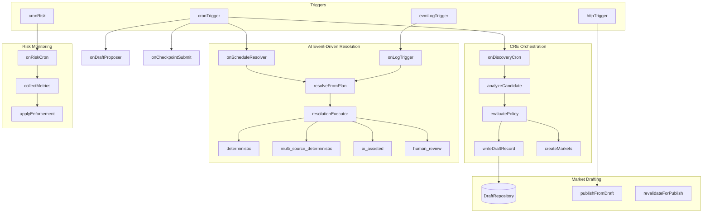

# RetroPick CRE Workflow — Deep Technical Reference

This document is a **deep technical reference** for the RetroPick Chainlink CRE workflow. It complements [DOCUMENTATION.md](DOCUMENTATION.md) by adding architecture detail, implementation status, and code-to-doc mapping. For Quick Start, Prerequisites, Configuration, Handlers Reference, Resolution Flow, Checkpoint Flow, Relayer, Contracts, Creation Flows, and Troubleshooting, see [DOCUMENTATION.md](DOCUMENTATION.md).

---

## 1. Executive Summary and System Identity

### Forecasting Intelligence Engine

When `orchestration.enabled` is true, the workflow operates as a **Forecasting Intelligence Engine** — a policy-first, multi-source market compiler that moves beyond naive feed-to-market pipelines. Per [.docs/UpgradePlan.md](../.docs/UpgradePlan.md):

- **Multi-source discovery**: News, GitHub, CoinGecko, Polymarket, protocol blogs — not Polymarket-only
- **Policy-first creation**: Deterministic rules decide ALLOW/REVIEW/REJECT; ML assists
- **Resolution-first drafting**: No draft without trusted resolution sources and unresolved-state proof
- **Resolution-plan-driven settlement**: Settlement uses stored `ResolutionPlan` from draft, not free-form AI prompts
- **Auditability**: Structured artifacts — evidence, classifier outputs, policy reasons, resolution plan, audit trail

### High-Level Topology

```
Trigger Layer (Cron | HTTP | EVM Log)
  → Source Adapter Layer (registry, feeds)
  → Analysis Layer (classify, risk, evidence, oracleability, unresolved)
  → Policy Layer (evaluate → ALLOW | REVIEW | REJECT)
  → Draft Artifact Layer (synthesizeDraft, writeDraftRecord)
  → Resolution Layer (resolveFromPlan, resolutionExecutor)
  → Onchain (writeReport → CREReceiver | CREPublishReceiver)
```

---

## 2. Deep Architecture Diagram



---

## 3. Layer-by-Layer Deep Dive

### CRE Orchestration Layer

| Aspect | Detail |
|--------|--------|
| **Purpose** | Multi-source discovery, analysis core, policy-first creation. Entrypoint for all creation flows when orchestration enabled. |
| **Key files** | [pipeline/orchestration/discoveryCron.ts](../pipeline/orchestration/discoveryCron.ts), [pipeline/orchestration/analyzeCandidate.ts](../pipeline/orchestration/analyzeCandidate.ts), [sources/registry.ts](../sources/registry.ts) |
| **Status** | Implemented |
| **Flow** | `fetchObservationsFromRegistry` → `dedupeObservations` → `analyzeCandidate` per observation → policy → `writeDraftRecord` or `createMarkets` |

### Market Drafting Pipeline

| Aspect | Detail |
|--------|--------|
| **Purpose** | Two-phase publication: Draft Generation (PENDING_CLAIM) → User Claim & Publish. No spontaneous live markets. |
| **Key files** | [pipeline/creation/draftWriter.ts](../pipeline/creation/draftWriter.ts), [pipeline/creation/publishRevalidation.ts](../pipeline/creation/publishRevalidation.ts), [pipeline/persistence/draftRepository.ts](../pipeline/persistence/draftRepository.ts) |
| **Status** | Implemented |
| **Gaps** | In-memory DraftRepository; Firestore/DB planned (market_drafting_pipeline_build plan) |

### Safety & Compliance Layer

| Aspect | Detail |
|--------|--------|
| **Purpose** | Policy engine, banned categories/terms, resolution certainty, unresolved check, audit. |
| **Key files** | [policy/evaluate.ts](../policy/evaluate.ts), [analysis/buildResolutionPlan.ts](../analysis/buildResolutionPlan.ts), [analysis/oracleability.ts](../analysis/oracleability.ts), [analysis/unresolvedCheck.ts](../analysis/unresolvedCheck.ts) |
| **Status** | Implemented (gaps) |
| **Gaps** | Oracleability/unresolvedCheck do not use `UnderstandingOutput`; EvidenceProvider tiers; ruleHits, scores, REVIEW_ONLY_CATEGORIES (safety_compliance_layer_build plan) |

### ML Models Layer

| Aspect | Detail |
|--------|--------|
| **Purpose** | 7-layer stack (L0–L6): classify, risk, oracleability, draft synthesis, explainability, settlement. |
| **Key files** | [analysis/classify.ts](../analysis/classify.ts), [analysis/riskScore.ts](../analysis/riskScore.ts), [analysis/draftSynthesis.ts](../analysis/draftSynthesis.ts), [analysis/explain.ts](../analysis/explain.ts), [models/](../models/) |
| **Status** | Implemented (LLM optional) |
| **Config** | `analysis.useLlm`, `analysis.useExplainability` — when false, rule-based fallback |

### AI Event-Driven Layer

| Aspect | Detail |
|--------|--------|
| **Purpose** | Deterministic resolution, multi-LLM consensus, settlement artifacts, structured audit. |
| **Key files** | [pipeline/resolution/resolutionExecutor.ts](../pipeline/resolution/resolutionExecutor.ts), [pipeline/resolution/llmConsensus.ts](../pipeline/resolution/llmConsensus.ts), [domain/settlementArtifact.ts](../domain/settlementArtifact.ts) |
| **Status** | Implemented |
| **Modes** | `deterministic`, `multi_source_deterministic`, `ai_assisted`, `human_review` |

### Risk Monitoring Layer

| Aspect | Detail |
|--------|--------|
| **Purpose** | Live-market risk monitoring, compliance enforcement, metrics collection. |
| **Key files** | [pipeline/monitoring/riskCronHandler.ts](../pipeline/monitoring/riskCronHandler.ts), [pipeline/monitoring/collectMetrics.ts](../pipeline/monitoring/collectMetrics.ts), [pipeline/monitoring/applyEnforcement.ts](../pipeline/monitoring/applyEnforcement.ts) |
| **Status** | Implemented (NoopEnforcementApplier) |
| **Gaps** | On-chain PAUSE/DELIST planned |

### Privacy Extensions

| Aspect | Detail |
|--------|--------|
| **Purpose** | Confidential fetch, eligibility gating, controlled release. |
| **Key files** | [pipeline/privacy/](../pipeline/privacy/), [domain/privacy.ts](../domain/privacy.ts) |
| **Status** | Partial |
| **Gaps** | Wire CRE ConfidentialHTTPClient; eligibility gate for publish (privacy_preserving_extensions plan) |

---

## 4. End-to-End Data Flows

### Flow A — Creation (Orchestration + Drafting Pipeline)

```
sources/registry → fetchObservationsFromRegistry
  → dedupeObservations
  → analyzeCandidate (
      classify → risk → evidence → buildResolutionPlan → policy
      → synthesizeDraft → generateMarketBrief
    )
  → [draftingPipeline] writeDraftRecord → DraftRepository (PENDING_CLAIM)
  → [else] createMarkets → MarketFactory
```

### Flow B — Publish from Draft

```
HTTP (draftId, creator, params, claimerSig)
  → loadDraft (DraftRepository.get)
  → revalidateForPublish (publishRevalidation.ts)
  → publishFromDraft → encodePublishReport(0x04) → CREPublishReceiver
  → markDraftPublished
```

### Flow C — Resolution

```
SettlementRequested (log) / Cron (schedule)
  → getResolutionPlan(marketId) [resolutionPlanStore]
  → resolveFromPlan → resolutionExecutor.executeResolution
  → [deterministic] fetch + predicate
  → [multi_source_deterministic] majority vote
  → [ai_assisted] llmConsensus (multi-LLM)
  → [human_review] REVIEW_REQUIRED, no writeReport
  → SettlementArtifact → encodeOutcomeReport → CREReceiver
```

---

## 5. Implementation Status Matrix

| Component | Current State | Planned / Gap |
|-----------|---------------|---------------|
| Draft persistence | In-memory DraftRepository | Firestore/DB (market_drafting) |
| Publish revalidation | Implemented | — |
| Resolution plan store | In-memory resolutionPlanStore | Configurable backend (safety_compliance) |
| Evidence layer | evidenceFetcher + DefaultEvidenceService | EvidenceProvider + tiers (safety_compliance) |
| Oracleability / Unresolved | Uses (obs, evidence) | Add UnderstandingOutput (safety_compliance) |
| Policy rulebook | Basic | ruleHits, scores, REVIEW_ONLY_CATEGORIES (safety_compliance) |
| Audit | auditLogger (draft + settlement) | logSettlementArtifact, privacy audit |
| Privacy | Domain + pipeline modules | Wire CRE ConfidentialHTTPClient (privacy) |
| Risk enforcement | NoopEnforcementApplier | On-chain PAUSE/DELIST (risk_monitoring) |

---

## 6. Key File Reference (Code-to-Doc Mapping)

| Responsibility | File |
|----------------|------|
| Analysis entrypoint | `pipeline/orchestration/analyzeCandidate.ts` |
| Discovery cron | `pipeline/orchestration/discoveryCron.ts` |
| Resolution executor | `pipeline/resolution/resolutionExecutor.ts` |
| LLM consensus | `pipeline/resolution/llmConsensus.ts` |
| Draft write/lifecycle | `pipeline/creation/draftWriter.ts` |
| Publish revalidation | `pipeline/creation/publishRevalidation.ts` |
| Policy engine | `policy/evaluate.ts` |
| Resolution plan builder | `analysis/buildResolutionPlan.ts` |
| Risk monitoring | `pipeline/monitoring/riskCronHandler.ts` |
| Privacy router | `pipeline/privacy/privacyRouter.ts` |
| Evidence fetch | `analysis/evidenceFetcher.ts` |
| Oracleability | `analysis/oracleability.ts` |
| Unresolved check | `analysis/unresolvedCheck.ts` |
| Draft synthesis | `analysis/draftSynthesis.ts` |
| Explainability | `analysis/explain.ts` |

---

## 7. Configuration Deep Reference

Extended config options (see [Configuration.md](Configuration.md) for full reference):

| Field | Purpose |
|-------|---------|
| `orchestration.draftingPipeline` | When true, ALLOW → writeDraftRecord only (no direct createMarkets) |
| `resolution.multiLlmEnabled` | Enable multi-LLM consensus for ai_assisted mode |
| `resolution.llmProviders` | Provider IDs for multi-LLM (e.g. `["openai", "anthropic"]`) |
| `resolution.minConfidence` | Min confidence (0–10000) for settlement. Default 7000 |
| `resolution.consensusQuorum` | Min agreeing LLM providers for multi-LLM. Default 2 |
| `privacy.enabled` | Enable privacy-preserving extensions |
| `privacy.defaultProfile` | Default: `PUBLIC` \| `PROTECTED_SOURCE` \| `PRIVATE_INPUT` \| `COMPLIANCE_GATED` |
| `analysis.useLlm` | Use LLM for classify, riskScore, draftSynthesis |
| `analysis.useExplainability` | Generate MarketBrief for approved drafts |

---

## 8. Cross-References and Navigation

### Primary Documentation

- [DOCUMENTATION.md](DOCUMENTATION.md) — Quick Start, Prerequisites, Configuration, Handlers Reference, Resolution Flow, Checkpoint Flow, Relayer, Contracts, Creation Flows, Troubleshooting

### Layer Specs

- [CREOrchestrationLayer.md](CREOrchestrationLayer.md)
- [MarketDraftingPipelineLayer.md](MarketDraftingPipelineLayer.md)
- [SafetyAndComplienceLayer.md](SafetyAndComplienceLayer.md)
- [MLModels.md](MLModels.md)
- [AIDrivenLayerEvent.md](AIDrivenLayerEvent.md)
- [RiskMonitoringCOmplience.md](RiskMonitoringCOmplience.md)
- [RiskPrivacyExtension.md](RiskPrivacyExtension.md)

### Implementation Roadmap

Plan files in `.cursor/plans/` document build order and gaps:

- `cre_orchestration_layer_upgrade_e7e3c698.plan.md`
- `market_drafting_pipeline_build_dd7cd9bb.plan.md`
- `safety_compliance_layer_build_a5f6216e.plan.md`
- `ml_models_chapter_build_a2f7511d.plan.md`
- `ai_event-driven_layer_upgrade_9bb5aef3.plan.md`
- `privacy_preserving_extensions_9314b6fa.plan.md`

---

## 9. Domain Model Summary

Key domain types and their roles in the pipeline:

```
SourceObservation (domain/candidate.ts)
  → UnderstandingOutput (domain/understanding.ts)
  → RiskScores (domain/risk.ts)
  → EvidenceBundle (domain/evidence.ts)
  → ResolutionPlan (domain/resolutionPlan.ts)
  → PolicyDecision (domain/policy.ts)
  → DraftArtifact (domain/draft.ts) / DraftRecord (domain/draftRecord.ts)
  → MarketBrief (domain/marketBrief.ts)
  → SettlementArtifact (domain/settlementArtifact.ts)
```

- **SourceObservation**: Normalized input from registry (title, body, url, tags, raw)
- **UnderstandingOutput**: Category, event type, ambiguity, marketability (from classify)
- **RiskScores**: Category risk, gambling language, ambiguity, manipulation
- **EvidenceBundle**: primary, supporting, contradicting evidence links
- **ResolutionPlan**: resolutionMode, primarySources, fallbackSources, resolutionPredicate
- **PolicyDecision**: status (ALLOW/REVIEW/REJECT), optional ruleHits, scores
- **DraftArtifact**: canonicalQuestion, outcomes, explanation, evidenceLinks, resolutionPlan
- **DraftRecord**: Full persisted record with status (PENDING_CLAIM, CLAIMED, PUBLISHED, etc.)
- **MarketBrief**: title, explanation, whyThisMarketExists, evidenceSummary, sourceLinks, resolutionExplanation, caveats
- **SettlementArtifact**: marketId, question, outcomeIndex, confidence, sourcesUsed, resolutionMode, reasoning
