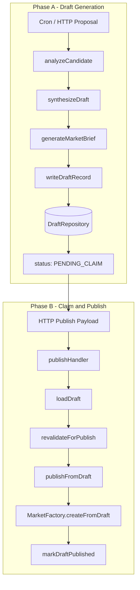

# Market Drafting Pipeline Layer

Two-phase publication system: Draft Generation (Phase A) and User Claim & Publish (Phase B). No spontaneous live markets — all markets require explicit claim and publish after draft creation.

## Overview

The Market Drafting Pipeline closes the gap between the legacy "ALLOW → direct createMarkets" flow and the policy-first architecture. When `orchestration.draftingPipeline` is true:

- **Phase A — Draft Generation**: Analysis → Policy → Draft Synthesis → Brochure → Persist as `PENDING_CLAIM` (no immediate market creation)
- **Phase B — User Claim & Publish**: User signs EIP-712 → HTTP handler loads draft → Revalidate → Publish onchain

## Architecture



## Phase A — Draft Generation

1. **Trigger**: Discovery cron or HTTP proposal
2. **analyzeCandidate**: Classify, risk, evidence, oracleability, unresolved check, resolution plan
3. **synthesizeDraft**: Canonical question, outcomes, explanation
4. **generateMarketBrief**: L5 explainability (optional; fallback brochure when disabled)
5. **writeDraftRecord**: Build `DraftRecord`, set status from policy (ALLOW→PENDING_CLAIM, REVIEW→REVIEW_REQUIRED), persist to `DraftRepository`

## Phase B — User Claim & Publish

1. **HTTP payload**: `draftId`, `creator`, `params`, `claimerSig`
2. **loadDraft**: Fetch from `DraftRepository` by `draftId`
3. **revalidateForPublish**: Draft exists, not expired, status claimable, params match stored draft, unresolved check passed
4. **publishFromDraft**: Encode 0x04 report → writeReport to CREPublishReceiver
5. **markDraftPublished**: Update status to PUBLISHED, store `marketId`

## Domain Types

### DraftStatus

| Status | Meaning |
|--------|---------|
| `PENDING_CLAIM` | Draft created; awaiting user claim |
| `CLAIMED` | User claimed; awaiting publish |
| `PUBLISHED` | Market created onchain |
| `EXPIRED` | Draft expired (TTL) |
| `REJECTED` | Policy rejected; audit only |
| `REVIEW_REQUIRED` | Policy REVIEW; manual review needed |

### DraftRecord

Full record per [domain/draftRecord.ts](../domain/draftRecord.ts): `draftId`, `status`, `observation`, `understanding`, `risk`, `evidence`, `resolutionPlan`, `policy`, `draft`, `brochure`, `createdAt`, `claimedAt`, `publishedAt`, `expiresAt`, `creator`, `claimer`, `marketId`, `onchainDraftRef`, `privacyProfile`.

### DraftRepository

Interface in [pipeline/creation/draftWriter.ts](../pipeline/creation/draftWriter.ts): `put`, `get`, `updateStatus`. In-memory implementation in [pipeline/persistence/draftRepository.ts](../pipeline/persistence/draftRepository.ts).

## Key Files

| File | Purpose |
|------|---------|
| [domain/draftRecord.ts](../domain/draftRecord.ts) | `DraftRecord`, `DraftStatus` types |
| [pipeline/creation/draftWriter.ts](../pipeline/creation/draftWriter.ts) | `writeDraftRecord`, `markDraftClaimed`, `markDraftPublished`, `expireDraft` |
| [pipeline/persistence/draftRepository.ts](../pipeline/persistence/draftRepository.ts) | In-memory `DraftRepository` |
| [pipeline/creation/publishRevalidation.ts](../pipeline/creation/publishRevalidation.ts) | `revalidateForPublish` — draft freshness, params match, unresolved |

## Revalidation Rules

Per [publishRevalidation.ts](../pipeline/creation/publishRevalidation.ts):

- Draft exists and not expired
- Status is `PENDING_CLAIM` or `CLAIMED`
- `question`, `marketType`, `outcomes`, `resolveTime` match stored draft
- `unresolvedCheckPassed` was true at draft time
- EIP-712 signature validation delegated to contract

## State Machine

```
DISCOVERED → ANALYZED → REJECTED
                    → PENDING_CLAIM → CLAIMED → PUBLISHED → ACTIVE → SETTLED
                    → REVIEW_REQUIRED
                    → PENDING_CLAIM → EXPIRED
```

## Configuration

| Field | Purpose |
|-------|---------|
| `orchestration.enabled` | Enable orchestration (required for drafting pipeline) |
| `orchestration.draftingPipeline` | When true: ALLOW creates draft only (no direct createMarkets) |

## Implementation Status

| Component | Status | Location |
|----------|--------|----------|
| DraftRecord, DraftStatus | Done | domain/draftRecord.ts |
| draftWriter | Done | pipeline/creation/draftWriter.ts |
| draftRepository | Done | pipeline/persistence/draftRepository.ts |
| publishRevalidation | Done | pipeline/creation/publishRevalidation.ts |
| httpCallback integration | Done | Load draft, revalidate, markDraftPublished |
| discoveryCron integration | Done | writeDraftRecord when draftingPipeline |

## Related

- [CREOrchestrationLayer.md](CREOrchestrationLayer.md) — Source of draft artifacts
- [SafetyAndComplienceLayer.md](SafetyAndComplienceLayer.md) — Policy engine (ALLOW/REVIEW/REJECT)
- [CreationFlows.md](CreationFlows.md) — Publish-from-draft HTTP flow
