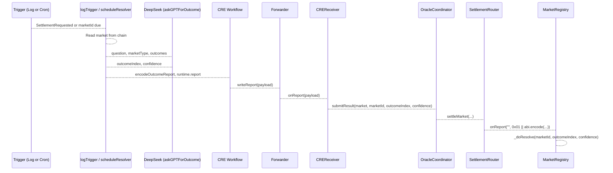

# Resolution Flow

End-to-end market resolution: from trigger to on-chain settlement. The workflow determines the winning outcome via AI (DeepSeek) and delivers it through the CRE pipeline to MarketRegistry or PoolMarketLegacy.

## Resolution Modes

| Mode | Trigger | Contract | Handler |
|------|---------|----------|---------|
| **log** | EVM log `SettlementRequested` | PoolMarketLegacy | onLogTrigger |
| **schedule** | Cron (poll marketIds) | MarketRegistry | onScheduleResolver |
| **both** | Both triggers registered | Both | Both handlers |

Configure via `resolution.mode` and `resolution.marketIds` (for schedule). See [Configuration](Configuration.md).

## Flow Diagram



## Step-by-Step

### 1. Trigger

**Log mode:** `SettlementRequested(uint256 indexed marketId, string question)` emitted by PoolMarketLegacy. EVM log trigger fires with `marketId` and `question`.

**Schedule mode:** Cron runs; handler iterates `resolution.marketIds`; for each market, checks `resolveTime <= now` and `!settled`.

### 2. Read Market

- **Log:** Read from `evms[0].marketAddress` (PoolMarketLegacy): `getMarket`, `marketType`, `getCategoricalOutcomes` / `getTimelineWindows` as needed.
- **Schedule:** Read from `evms[0].marketRegistryAddress` (MarketRegistry): same methods.

Skip if market does not exist, already settled, or (schedule) resolveTime not yet due.

### 3. AI Outcome (askGPTForOutcome)

**Source:** [gpt.ts](../gpt.ts)

| Market Type | AI Input | AI Output |
|-------------|----------|-----------|
| Binary (0) | question | `{ result: "YES"\|"NO", confidence: 0-10000 }` → outcomeIndex 0 or 1 |
| Categorical (1) | question, outcomes array | `{ outcomeIndex: 0..N-1, confidence: 0-10000 }` |
| Timeline (2) | question, timelineWindows | `{ outcomeIndex: 0..N-1, confidence: 0-10000 }` |

- **Provider:** DeepSeek API (`api.deepseek.com/v1/chat/completions`).
- **Model:** Config `gptModel` or default `deepseek-chat`.
- **Confidence:** Basis points (10000 = 100%).
- **Mock:** `useMockAi: true` returns `mockAiResponse` without API call.
- **Key:** `DEEPSEEK_API_KEY` (CRE secret) or `config.deepseekApiKey`.

### 4. Encode and Send

**Source:** [contracts/reportFormats.ts](../contracts/reportFormats.ts)

```ts
encodeOutcomeReport(market, marketId, outcomeIndex, confidence)
// → abi.encode(address market, uint256 marketId, uint8 outcomeIndex, uint16 confidence)
// No prefix; SettlementRouter adds 0x01 when calling market.onReport
```

1. `runtime.report({ encodedPayload, encoderName: "evm", ... })` — DON consensus.
2. `evmClient.writeReport(runtime, { receiver: creReceiverAddress, report, gasConfig })` — Forwarder tx.

### 5. On-Chain Path

1. **Forwarder** → `CREReceiver.onReport(report)`
2. **CREReceiver** — No 0x03 prefix → `oracleCoordinator.submitResult(market, marketId, outcomeIndex, confidence)`
3. **OracleCoordinator** — Optionally validates confidence via ReportValidator → `settlementRouter.settleMarket(...)`
4. **SettlementRouter** — Builds `0x01 || abi.encode(marketId, outcomeIndex, confidence)` → `market.onReport("", report)`
5. **MarketRegistry** — `onReport` decodes and calls `_doResolve(marketId, winningOutcome, confidence)`

### 6. _doResolve

- **Binary:** Sets `outcome` (Yes/No).
- **Categorical/Timeline:** Sets `typedOutcomeIndex`.
- Marks `settled = true`, stores `confidence`, `settledAt`, emits `MarketResolved`.
- Users redeem via `MarketRegistry.redeem(marketId)`.

## Config

| Field | Purpose |
|-------|---------|
| `creReceiverAddress` | CREReceiver for writeReport |
| `evms[0].marketAddress` | PoolMarketLegacy (log mode) |
| `evms[0].marketRegistryAddress` | MarketRegistry (schedule mode) |
| `resolution.mode` | "log" \| "schedule" \| "both" |
| `resolution.marketIds` | Market IDs to poll (schedule) |
| `gptModel` | DeepSeek model name |
| `deepseekApiKey` | API key (fallback) |
| `useMockAi` | Skip API, use mock response |
| `mockAiResponse` | JSON string for mock |

## References

- [HandlersReference](HandlersReference.md) — onLogTrigger, onScheduleResolver
- [ContractIntegration](ContractIntegration.md) — Report formats, chain routing
- [packages/contracts/docs/abi/docs/cre/CREWorkflowOutcome.md](../../packages/contracts/docs/abi/docs/cre/CREWorkflowOutcome.md)
