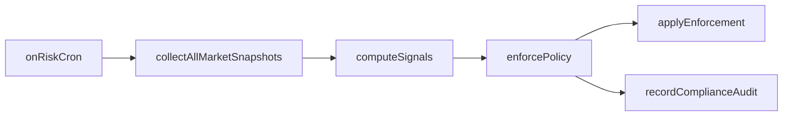

# Risk Monitoring & Compliance Enforcement

Live-market risk monitoring and compliance enforcement. When enabled, a cron handler scans active markets, computes risk signals, and applies enforcement actions (alert, pause, delist, block new trades).

## Overview

- **Handler:** `onRiskCron` — runs on `monitoring.cronSchedule`.
- **Flow:** Collect market snapshots → compute signals → enforce policy → record audit.
- **Actions:** NO_ACTION, ALERT, PAUSE_MARKET, DELIST_MARKET, BLOCK_NEW_TRADES, REVIEW_REQUIRED.

## Configuration

| Field | Purpose |
|-------|---------|
| `monitoring.enabled` | Enable onRiskCron |
| `monitoring.cronSchedule` | Cron for risk checks (default: `"*/5 * * * *"` every 5 min) |
| `monitoring.marketIds` | Market IDs to monitor; falls back to resolution.marketIds when unset |
| `monitoring.useRelayerMarkets` | Fetch market IDs from relayer; falls back to resolution.useRelayerMarkets when unset |

## Flow

## Components

| Component | Location | Purpose |
|-----------|----------|---------|
| riskCron | `pipeline/monitoring/riskCron.ts` | Entrypoint: runRiskCron |
| collectMetrics | `pipeline/monitoring/collectMetrics.ts` | MarketMetricsProvider — fetches live market snapshots |
| computeSignals | `pipeline/monitoring/computeSignals.ts` | Computes risk signals (volume spike, concentration, late trading, etc.) |
| enforcePolicy | `pipeline/monitoring/enforcePolicy.ts` | Maps signals to EnforcementAction |
| EnforcementApplier | Injected | Applies action (e.g. call relayer/contract to pause) |
| ComplianceReporter | Injected | Records ComplianceAuditRecord |

## Risk Signals

- `overallRisk`
- `volumeSpikeScore`
- `concentrationScore`
- `lateTradingSpikeScore`
- `staleSourceRisk`
- `policyViolationRisk`
- `legalSensitivityRisk`

## Implementation Status

| Component | Status |
|-----------|--------|
| riskCron | Implemented |
| collectMetrics | Implemented |
| computeSignals | Implemented |
| enforcePolicy | Implemented |
| Handler registration | When `monitoring.enabled` in main.ts |

## Related Docs

- [SafetyAndComplienceLayer](SafetyAndComplienceLayer.md) — policy rules and audit
- [Configuration](Configuration.md) — monitoring config reference
