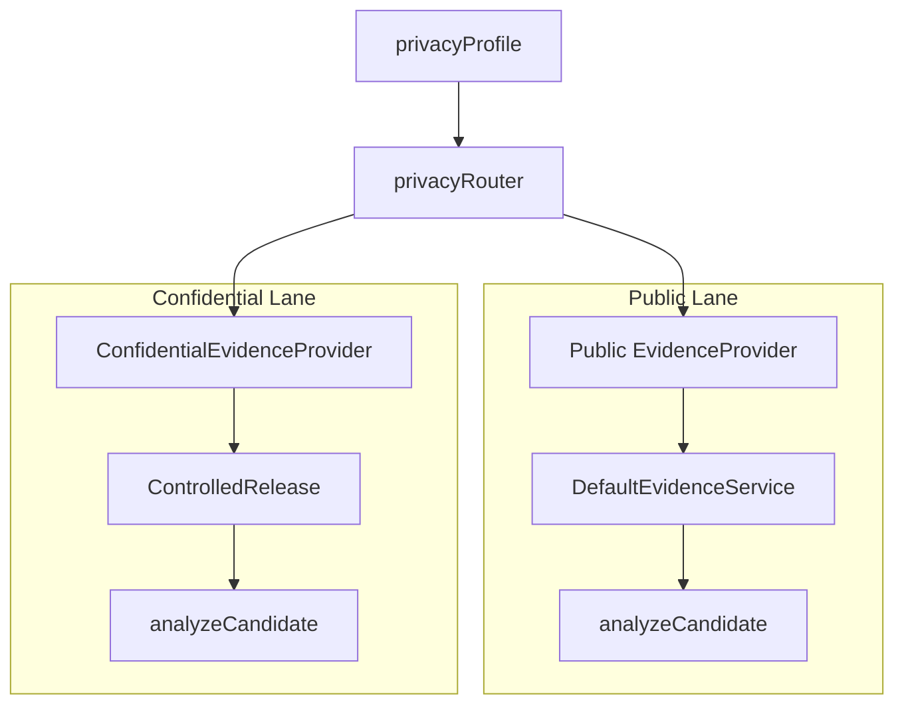

# Privacy-Preserving Extensions

Privacy-preserving extensions add a provider-driven confidential execution framework. Same business logic; only the provider implementation changes based on `PrivacyProfile`.

## Overview

- **Privacy as execution mode:** Selected by `privacyProfile` on drafts/markets.
- **Public vs Confidential lanes:** `privacyRouter` routes by profile.
- **Controlled release:** Raw sensitive data never leaks; only policy-filtered output is disclosed.

## Architecture: Public vs Confidential Lanes

## Privacy Profiles

**Source:** [domain/privacy.ts](../domain/privacy.ts)

| Profile | Description |
|---------|-------------|
| `PUBLIC` | Default; standard evidence fetch |
| `PROTECTED_SOURCE` | Requires confidential fetch for premium/enterprise sources |
| `PRIVATE_INPUT` | Confidential fetch + optional private settlement |
| `COMPLIANCE_GATED` | Eligibility check before publish or trade |

## Privacy Router

**Source:** [pipeline/privacy/privacyRouter.ts](../pipeline/privacy/privacyRouter.ts)

| Function | Returns true for |
|----------|------------------|
| `requiresConfidentialFetch(profile)` | PROTECTED_SOURCE, PRIVATE_INPUT |
| `requiresEligibilityCheck(profile)` | COMPLIANCE_GATED |
| `requiresPrivateSettlement(profile)` | PRIVATE_INPUT |

## Pipeline Modules

| Module | Purpose |
|--------|---------|
| [controlledRelease.ts](../pipeline/privacy/controlledRelease.ts) | Filters raw output by `DisclosurePolicy`; returns `ControlledRelease` |
| [confidentialFetch.ts](../pipeline/privacy/confidentialFetch.ts) | `ConfidentialEvidenceProvider` — fetchConfidential for protected sources |
| [eligibilityCheck.ts](../pipeline/privacy/eligibilityCheck.ts) | `EligibilityProvider` — checkEligibility for COMPLIANCE_GATED markets |
| [privateSettlement.ts](../pipeline/privacy/privateSettlement.ts) | `ConfidentialSettlementProvider` — computeSettlement for PRIVATE_INPUT |

## Integration Points

### analyzeCandidate

When `privacyProfile` is PROTECTED_SOURCE or PRIVATE_INPUT and `confidentialEvidenceProvider` is provided:

- Calls `confidentialEvidenceProvider.fetchConfidential(...)` for premium sources.
- Merges `publicOutput` into evidence flow; never passes raw confidential payloads.
- Logs privacy audit via `logPrivacyAudit`.

### HTTP Publish (httpCallback)

When draft has `privacyProfile === COMPLIANCE_GATED`:

- Before `publishFromDraft`, calls `eligibilityProvider.checkEligibility({ wallet, marketId, policyProfile })`.
- If `!decision.allowed`, returns error with `reasonCode`.

### Settlement (Optional)

When market has `privacyProfile === PRIVATE_INPUT` and `confidentialSettlementProvider` is provided:

- Routes to `confidentialSettlementProvider.computeSettlement(...)` instead of standard resolution.
- Uses only `settlement.publicOutput` (outcomeIndex, confidenceBps) for on-chain report.

## Configuration

| Field | Purpose |
|-------|---------|
| `privacy.enabled` | Enable confidential fetch, eligibility gating, private settlement |
| `privacy.defaultProfile` | Default: `PUBLIC` \| `PROTECTED_SOURCE` \| `PRIVATE_INPUT` \| `COMPLIANCE_GATED` |

## Implementation Status

| Component | Location | Status |
|-----------|----------|--------|
| Privacy router | `pipeline/privacy/privacyRouter.ts` | Implemented |
| Controlled release | `pipeline/privacy/controlledRelease.ts` | Implemented |
| Confidential fetch | `pipeline/privacy/confidentialFetch.ts` | Implemented |
| Eligibility check | `pipeline/privacy/eligibilityCheck.ts` | Implemented |
| Privacy audit | `pipeline/privacy/privacyAudit.ts` | Implemented |
| analyzeCandidate integration | `pipeline/orchestration/analyzeCandidate.ts` | Confidential fetch when profile requires |

## Related Docs

- [CREOrchestrationLayer](CREOrchestrationLayer.md) — analyzeCandidate flow
- [SafetyAndComplienceLayer](SafetyAndComplienceLayer.md) — policy boundaries
