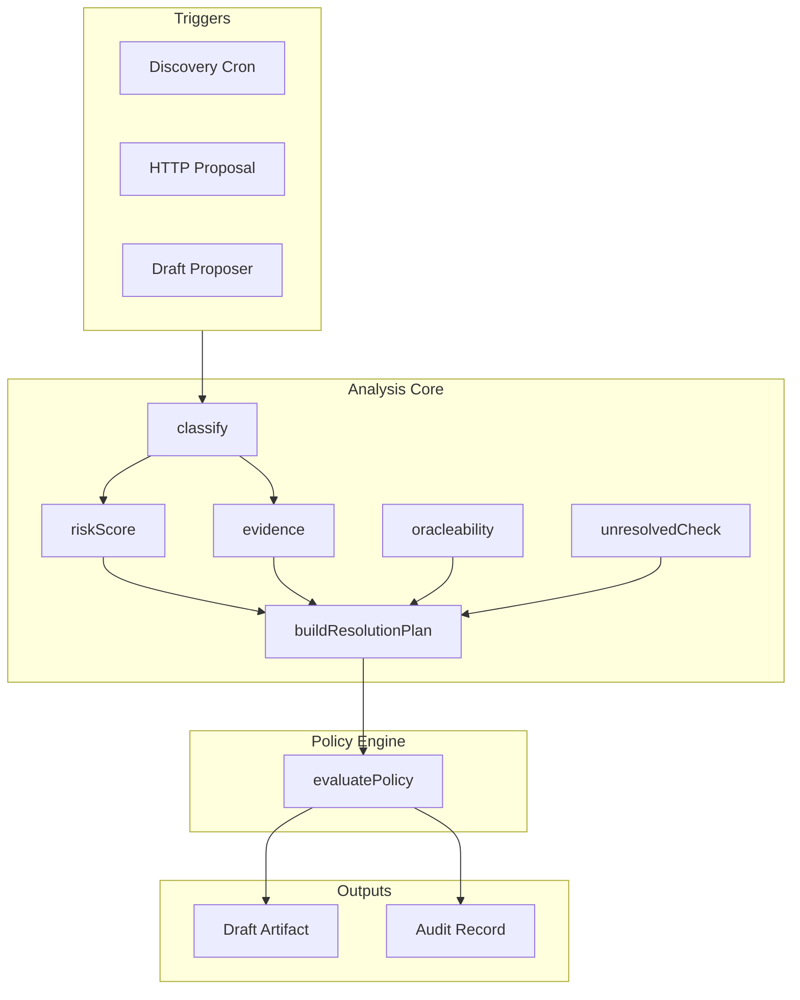

# Safety & Compliance Layer

The Safety & Compliance Layer enforces deterministic policy rules on market candidates. **ML informs, policy controls, contracts enforce.** The policy engine is the final source of truth; AI assists classification and risk scoring but does not override hard rules.

## Overview

- **Policy-first creation:** Deterministic rules decide ALLOW, REVIEW, or REJECT.
- **Rulebook:** Banned categories, hard-banned terms, gambling language, unresolved check, oracleability thresholds.
- **Audit trail:** Draft-time and settlement-time audit records for compliance.

## Architecture

## Policy Engine

**Source:** [policy/evaluate.ts](../policy/evaluate.ts)

Input: `PolicyInput` (observation, understanding, risk, resolutionPlan). Output: `PolicyDecision` (ALLOW | REVIEW | REJECT).

### Rule Gates (from 03 spec)

| Rule | Effect |
|------|--------|
| `CATEGORY_BANNED` | REJECT — politics, sports, war_violence, etc. |
| `HARD_BANNED_TERMS` | REJECT — assassination, kill, murder, etc. |
| `INVALID_MARKET_TYPE` | REJECT |
| `GAMBLING_LANGUAGE_REJECT` | REJECT — exceeds maxGamblingLanguageReject |
| `UNRESOLVED_CHECK_FAILED` | REJECT — outcome already known |
| `ORACLEABILITY_REJECT` | REJECT — below oracleability threshold |
| `REVIEW_ONLY_CATEGORIES` | REVIEW — regulatory, entertainment |
| `AMBIGUITY_REVIEW` | REVIEW — above ambiguity threshold |
| `GAMBLING_LANGUAGE_REVIEW` | REVIEW — above gambling review threshold |
| `DUPLICATE_RISK_REJECT` | REJECT — duplicate risk exceeds threshold |

### Policy Decision Output

- `status`: `ALLOW` | `REVIEW` | `REJECT`
- `reasons`: Human-readable reasons
- `ruleHits`: Rule IDs that fired
- `scores`: `ambiguity`, `overallRisk`, `gamblingLanguageRisk`, `oracleability`

## Evidence & Resolution Certainty

- **Evidence:** [analysis/evidenceFetcher.ts](../analysis/evidenceFetcher.ts) — `EvidenceBundle` with primary, supporting, contradicting tiers.
- **Oracleability:** [analysis/oracleability.ts](../analysis/oracleability.ts) — resolution source scoring.
- **Unresolved check:** [analysis/unresolvedCheck.ts](../analysis/unresolvedCheck.ts) — verifies outcome is not already known.
- **Resolution plan:** [analysis/buildResolutionPlan.ts](../analysis/buildResolutionPlan.ts) — synthesizes `ResolutionPlan` from understanding and evidence.

## Audit & Monitoring

**Source:** [pipeline/audit/auditLogger.ts](../pipeline/audit/auditLogger.ts)

| Function | Purpose |
|----------|---------|
| `logDraftDecision` | Draft-time audit: candidateId, policy status, ruleHits, draftId |
| `logSettlementDecision` | Settlement-time audit: marketId, outcomeIndex, confidence, txHash |
| `logSettlementArtifact` | Full AI Event-Driven artifact (modelsUsed, sourcesUsed, reasoning) |

## Resolution Plan Persistence

**Source:** [pipeline/persistence/resolutionPlanStore.ts](../pipeline/persistence/resolutionPlanStore.ts)

- `saveResolutionPlan(plan, { question, draftId })` — stores plan for settlement-time lookup.
- `getResolutionPlan(marketId)` — loaded by logTrigger and scheduleResolver before `resolveFromPlan`.

## Implementation Status

| Component | Location | Status |
|-----------|----------|--------|
| Policy engine | `policy/evaluate.ts` | Implemented |
| Banned categories | `policy/bannedCategories.ts` | BANNED_CATEGORIES, REVIEW_ONLY_CATEGORIES |
| Banned terms | `policy/bannedTerms.ts` | HARD_BANNED_TERMS, GAMBLING_TERMS |
| Thresholds | `policy/thresholds.ts` | POLICY_THRESHOLDS |
| Source trust | `policy/sourceTrust.ts` | SOURCE_TYPE_BASE_TRUST |
| Audit logger | `pipeline/audit/auditLogger.ts` | logDraftDecision, logSettlementDecision, logSettlementArtifact |
| Resolution plan store | `pipeline/persistence/resolutionPlanStore.ts` | saveResolutionPlan, getResolutionPlan |

## Related Docs

- [CREOrchestrationLayer](CREOrchestrationLayer.md) — orchestration flow
- [MLModels](MLModels.md) — L1 classify, L2 risk (LLM-assisted)
- [MarketDraftingPipelineLayer](MarketDraftingPipelineLayer.md) — draft lifecycle
