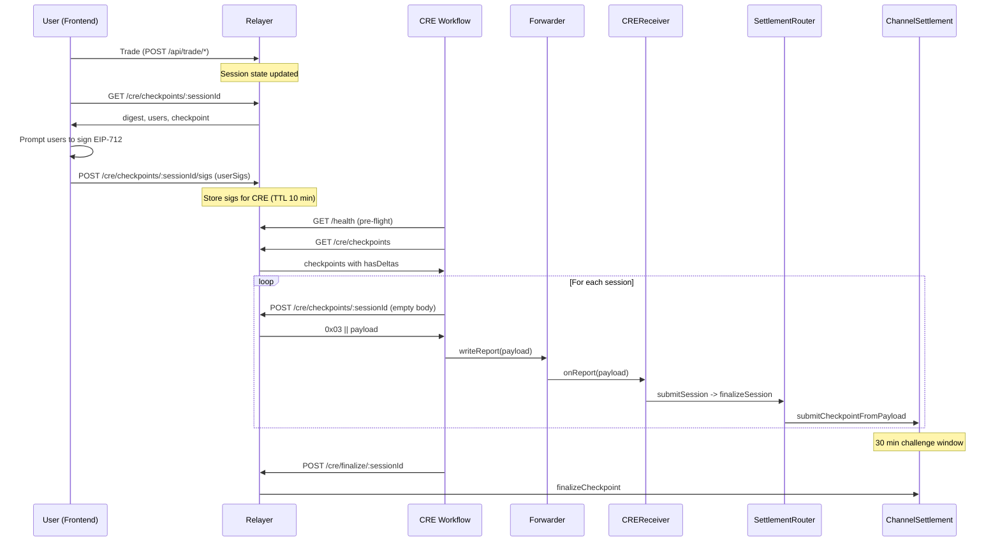
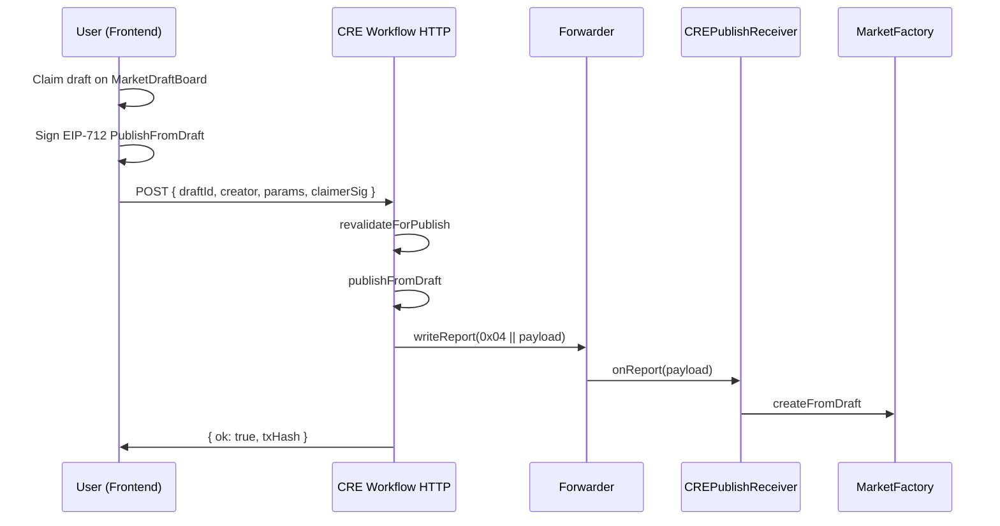
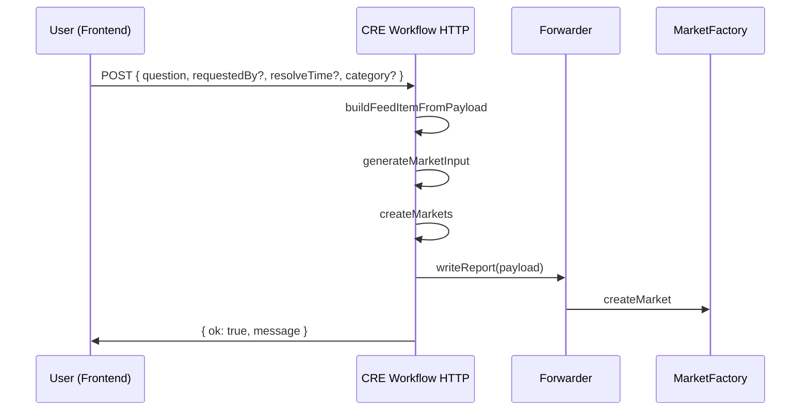
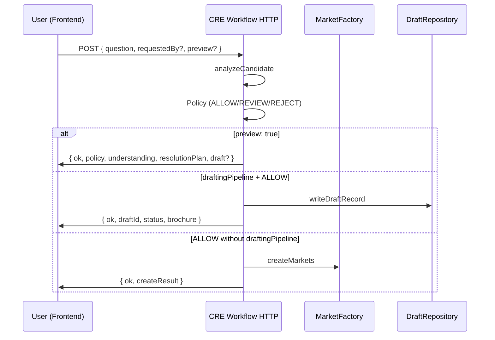
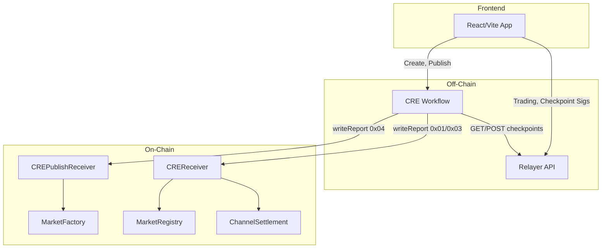

# Integration Sequence Diagrams

Mermaid diagrams for frontend integration flows. See [CheckpointFlow.md](../../docs/CheckpointFlow.md) and [CREWorkflowIntegration.md](../../../front-end-v2/docs/abi/docs/cre/CREWorkflowIntegration.md) for detailed specs.

---

## 1. Checkpoint Flow (Option A: Stored Sigs)

Frontend stores user signatures via `POST /cre/checkpoints/:sessionId/sigs` before the CRE cron runs. CRE fetches stored sigs and POSTs with empty body.

---

## 2. Publish-from-Draft Flow

Frontend has a claimed draft; user signs PublishFromDraft; frontend POSTs to workflow HTTP trigger.

---

## 3. Create Market (Direct) Flow

Frontend POSTs question to workflow HTTP trigger; workflow creates market via MarketFactory.

---

## 4. Create Market (Orchestration) Flow

When `orchestration.enabled` is true, workflow runs analysis (classify, risk, resolution plan) before creating or drafting.

---

## 5. Component Topology

High-level architecture of frontend, relayer, workflow, and on-chain components.

